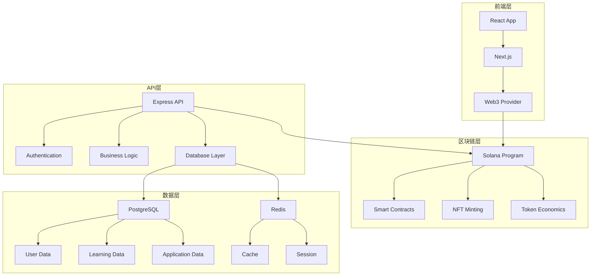

# EduBoost RWA 全栈式学业支持平台 - 详细需求文档

<div align="center">
  
</div>

## 目录
1. [项目概述](#1-项目概述)
2. [技术架构设计](#2-技术架构设计)
3. [核心功能模块](#3-核心功能模块)
4. [数据库设计](#4-数据库设计)
5. [API接口设计](#5-api接口设计)
6. [前端界面设计](#6-前端界面设计)
7. [部署与运维](#7-部署与运维)
8. [安全与合规](#8-安全与合规)
9. [测试策略](#9-测试策略)
10. [项目时间线](#10-项目时间线)

## 1. 项目概述

### 1.1 项目背景
EduBoost是一个基于RWA（Real World Asset）技术的全栈式学业支持平台，旨在为高中生提供学术提升、大学申请和心理健康支持的综合服务。

### 1.2 项目目标
- 构建去中心化的教育资产交易平台
- 提供智能化的学习路径推荐
- 建立透明的大学申请管理系统
- 实现心理健康数据的隐私保护

### 1.3 技术栈选择
```
前端技术栈：
- React 18 + TypeScript
- Next.js 14 (App Router)
- Tailwind CSS + Shadcn/ui
- Zustand (状态管理)
- React Query (数据获取)

后端技术栈：
- Node.js + Express.js
- TypeScript
- PostgreSQL (主数据库)
- Redis (缓存)
- Prisma (ORM)

区块链技术：
- Solana (主链)
- Anchor Framework
- Metaplex (NFT标准)
- Helius (RPC服务)

基础设施：
- Docker + Docker Compose
- AWS/Vercel (部署)
- GitHub Actions (CI/CD)
```

## 2. 技术架构设计

### 2.1 系统架构图


### 2.2 模块划分
```
src/
├── components/          # React组件
│   ├── ui/             # 基础UI组件
│   ├── forms/          # 表单组件
│   ├── charts/         # 图表组件
│   └── layout/         # 布局组件
├── pages/              # 页面组件
│   ├── dashboard/      # 仪表板
│   ├── learning/       # 学习模块
│   ├── application/    # 申请模块
│   └── health/         # 健康模块
├── hooks/              # 自定义Hooks
├── stores/             # 状态管理
├── services/           # API服务
├── utils/              # 工具函数
└── types/              # TypeScript类型
```

## 3. 核心功能模块

### 3.1 用户认证与授权模块

#### 3.1.1 功能需求
- 支持传统邮箱密码注册/登录
- 支持Web3钱包连接（Phantom, Solflare等）
- 支持Google/Apple OAuth登录
- 多因素认证（MFA）
- 角色权限管理（学生、家长、教师、管理员）

#### 3.1.2 技术实现
```typescript
// 用户认证服务
interface AuthService {
  register(email: string, password: string, walletAddress?: string): Promise<User>
  login(email: string, password: string): Promise<AuthToken>
  connectWallet(walletAddress: string): Promise<void>
  verifyMFA(token: string): Promise<boolean>
  refreshToken(refreshToken: string): Promise<AuthToken>
}

// 权限管理
enum UserRole {
  STUDENT = 'student',
  PARENT = 'parent',
  TEACHER = 'teacher',
  ADMIN = 'admin'
}

interface Permission {
  resource: string
  action: string
  conditions?: Record<string, any>
}
```

#### 3.1.3 数据库设计
```sql
-- 用户表
CREATE TABLE users (
  id UUID PRIMARY KEY DEFAULT gen_random_uuid(),
  email VARCHAR(255) UNIQUE NOT NULL,
  password_hash VARCHAR(255),
  wallet_address VARCHAR(44),
  role UserRole NOT NULL DEFAULT 'student',
  is_verified BOOLEAN DEFAULT FALSE,
  mfa_enabled BOOLEAN DEFAULT FALSE,
  created_at TIMESTAMP DEFAULT NOW(),
  updated_at TIMESTAMP DEFAULT NOW()
);

-- 用户会话表
CREATE TABLE user_sessions (
  id UUID PRIMARY KEY DEFAULT gen_random_uuid(),
  user_id UUID REFERENCES users(id),
  token_hash VARCHAR(255) NOT NULL,
  expires_at TIMESTAMP NOT NULL,
  created_at TIMESTAMP DEFAULT NOW()
);
```

### 3.2 智能学习系统模块

#### 3.2.1 功能需求
- 个性化学习路径推荐
- 智能题目生成与评估
- 学习进度跟踪
- 知识点图谱构建
- 学习效果预测

#### 3.2.2 技术实现
```typescript
// 学习路径推荐算法
interface LearningPathService {
  generatePath(userId: string, subject: string): Promise<LearningPath>
  updateProgress(userId: string, lessonId: string, score: number): Promise<void>
  predictPerformance(userId: string, subject: string): Promise<Prediction>
  recommendNextLesson(userId: string): Promise<Lesson>
}

// 知识点图谱
interface KnowledgeGraph {
  nodes: KnowledgeNode[]
  edges: KnowledgeEdge[]
}

interface KnowledgeNode {
  id: string
  name: string
  difficulty: number
  prerequisites: string[]
  estimatedTime: number
}
```

#### 3.2.3 数据库设计
```sql
-- 课程表
CREATE TABLE courses (
  id UUID PRIMARY KEY DEFAULT gen_random_uuid(),
  name VARCHAR(255) NOT NULL,
  subject VARCHAR(100) NOT NULL,
  difficulty_level INTEGER NOT NULL,
  estimated_hours INTEGER NOT NULL,
  created_at TIMESTAMP DEFAULT NOW()
);

-- 课程内容表
CREATE TABLE lessons (
  id UUID PRIMARY KEY DEFAULT gen_random_uuid(),
  course_id UUID REFERENCES courses(id),
  title VARCHAR(255) NOT NULL,
  content TEXT NOT NULL,
  order_index INTEGER NOT NULL,
  knowledge_points TEXT[],
  created_at TIMESTAMP DEFAULT NOW()
);

-- 用户学习进度表
CREATE TABLE user_progress (
  id UUID PRIMARY KEY DEFAULT gen_random_uuid(),
  user_id UUID REFERENCES users(id),
  lesson_id UUID REFERENCES lessons(id),
  completion_rate DECIMAL(5,2) DEFAULT 0,
  score INTEGER,
  time_spent INTEGER,
  completed_at TIMESTAMP,
  created_at TIMESTAMP DEFAULT NOW(),
  updated_at TIMESTAMP DEFAULT NOW()
);
```

### 3.3 大学申请管理系统模块

#### 3.3.1 功能需求
- 申请材料管理
- 申请进度跟踪
- 推荐信管理
- 申请费用支付（加密货币）
- 申请结果通知

#### 3.3.2 技术实现
```typescript
// 申请管理服务
interface ApplicationService {
  createApplication(userId: string, universityId: string): Promise<Application>
  uploadDocument(applicationId: string, documentType: string, file: File): Promise<Document>
  trackProgress(applicationId: string): Promise<ApplicationStatus>
  payFee(applicationId: string, amount: number): Promise<Payment>
  submitApplication(applicationId: string): Promise<void>
}

// 申请状态枚举
enum ApplicationStatus {
  DRAFT = 'draft',
  SUBMITTED = 'submitted',
  UNDER_REVIEW = 'under_review',
  INTERVIEW_SCHEDULED = 'interview_scheduled',
  ACCEPTED = 'accepted',
  REJECTED = 'rejected',
  WAITLISTED = 'waitlisted'
}
```

#### 3.3.3 数据库设计
```sql
-- 大学表
CREATE TABLE universities (
  id UUID PRIMARY KEY DEFAULT gen_random_uuid(),
  name VARCHAR(255) NOT NULL,
  country VARCHAR(100) NOT NULL,
  application_fee DECIMAL(10,2),
  deadline DATE,
  requirements TEXT,
  created_at TIMESTAMP DEFAULT NOW()
);

-- 申请表
CREATE TABLE applications (
  id UUID PRIMARY KEY DEFAULT gen_random_uuid(),
  user_id UUID REFERENCES users(id),
  university_id UUID REFERENCES universities(id),
  status ApplicationStatus DEFAULT 'draft',
  submitted_at TIMESTAMP,
  created_at TIMESTAMP DEFAULT NOW(),
  updated_at TIMESTAMP DEFAULT NOW()
);

-- 申请文档表
CREATE TABLE application_documents (
  id UUID PRIMARY KEY DEFAULT gen_random_uuid(),
  application_id UUID REFERENCES applications(id),
  document_type VARCHAR(100) NOT NULL,
  file_url VARCHAR(500) NOT NULL,
  uploaded_at TIMESTAMP DEFAULT NOW()
);
```

### 3.4 心理健康监护模块

#### 3.4.1 功能需求
- 心理健康评估问卷
- 情绪状态跟踪
- 隐私保护的数据存储
- 专业咨询师匹配
- 紧急情况预警

#### 3.4.2 技术实现
```typescript
// 心理健康服务
interface MentalHealthService {
  conductAssessment(userId: string, answers: AssessmentAnswer[]): Promise<AssessmentResult>
  trackMood(userId: string, mood: MoodData): Promise<void>
  getRecommendations(userId: string): Promise<Recommendation[]>
  scheduleConsultation(userId: string, counselorId: string): Promise<Appointment>
  detectCrisis(userId: string): Promise<CrisisAlert>
}

// 隐私保护
interface EncryptedHealthData {
  encryptedData: string
  iv: string
  userId: string
  timestamp: Date
}
```

#### 3.4.3 数据库设计
```sql
-- 心理健康评估表
CREATE TABLE mental_health_assessments (
  id UUID PRIMARY KEY DEFAULT gen_random_uuid(),
  user_id UUID REFERENCES users(id),
  assessment_type VARCHAR(100) NOT NULL,
  encrypted_data TEXT NOT NULL,
  score INTEGER,
  risk_level VARCHAR(50),
  conducted_at TIMESTAMP DEFAULT NOW()
);

-- 情绪跟踪表
CREATE TABLE mood_tracking (
  id UUID PRIMARY KEY DEFAULT gen_random_uuid(),
  user_id UUID REFERENCES users(id),
  mood_score INTEGER NOT NULL,
  notes TEXT,
  encrypted_data TEXT,
  tracked_at TIMESTAMP DEFAULT NOW()
);
```

### 3.5 RWA代币经济系统

#### 3.5.1 功能需求
- 学习成就NFT铸造
- 代币奖励机制
- 去中心化治理
- 流动性挖矿
- 质押与借贷

#### 3.5.2 技术实现
```typescript
// 代币经济服务
interface TokenEconomyService {
  mintAchievementNFT(userId: string, achievement: Achievement): Promise<NFT>
  distributeRewards(userId: string, amount: number, reason: string): Promise<Transaction>
  stakeTokens(userId: string, amount: number): Promise<StakePosition>
  borrowTokens(userId: string, amount: number, collateral: number): Promise<Loan>
  participateInGovernance(userId: string, proposalId: string, vote: Vote): Promise<void>
}

// Solana程序接口
interface EduBoostProgram {
  initialize(): Promise<void>
  mintAchievement(achievement: Achievement): Promise<PublicKey>
  transferTokens(from: PublicKey, to: PublicKey, amount: number): Promise<Transaction>
  createStake(amount: number, duration: number): Promise<StakePosition>
}
```

#### 3.5.3 智能合约设计
```rust
// Anchor程序示例
use anchor_lang::prelude::*;

declare_id!("EduBoostProgram111111111111111111111111111");

#[program]
pub mod eduboost {
    use super::*;

    pub fn initialize(ctx: Context<Initialize>) -> Result<()> {
        let global_state = &mut ctx.accounts.global_state;
        global_state.authority = ctx.accounts.authority.key();
        global_state.total_staked = 0;
        Ok(())
    }

    pub fn mint_achievement(
        ctx: Context<MintAchievement>,
        achievement_data: AchievementData,
    ) -> Result<()> {
        // NFT铸造逻辑
        Ok(())
    }

    pub fn stake_tokens(
        ctx: Context<StakeTokens>,
        amount: u64,
        duration: u64,
    ) -> Result<()> {
        // 质押逻辑
        Ok(())
    }
}

#[derive(Accounts)]
pub struct Initialize<'info> {
    #[account(init, payer = authority, space = 8 + GlobalState::LEN)]
    pub global_state: Account<'info, GlobalState>,
    #[account(mut)]
    pub authority: Signer<'info>,
    pub system_program: Program<'info, System>,
}

#[account]
pub struct GlobalState {
    pub authority: Pubkey,
    pub total_staked: u64,
}

impl GlobalState {
    pub const LEN: usize = 32 + 8;
}
``` 