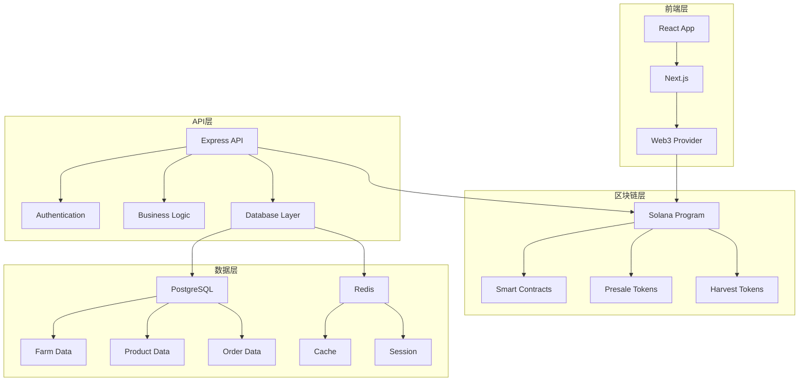

# FarmRWA 农产品预售平台 - 完整项目文档

<div align="center">
  
</div>

## 📋 目录
1. [项目概述](#1-项目概述)
2. [技术架构](#2-技术架构)
3. [核心功能模块](#3-核心功能模块)
4. [开发路线图](#4-开发路线图)
5. [技术实现指南](#5-技术实现指南)
6. [实施检查清单](#6-实施检查清单)
7. [项目总结](#7-项目总结)

---

## 1. 项目概述

### 1.1 项目背景
FarmRWA是一个基于RWA（Real World Asset）技术的农产品预售平台，旨在连接农场主和消费者，通过区块链技术实现农产品的预售、溯源和交易。

### 1.2 核心价值主张
- **农场主赋能**: 提前获得资金支持，降低市场风险
- **消费者保障**: 优质农产品预售，价格锁定
- **透明溯源**: 全链路区块链溯源，质量保证
- **智能合约**: 自动化风险管理和资金托管

### 1.3 技术栈选择
```
前端: React 18 + TypeScript + Next.js 14 + Tailwind CSS
后端: Node.js + Express.js + TypeScript + PostgreSQL + Redis
区块链: Solana + Anchor Framework + Metaplex
部署: Docker + AWS/Vercel + GitHub Actions
```

---

## 2. 技术架构

### 2.1 系统架构图


### 2.2 项目结构
```
farmrwa/
├── frontend/                 # Next.js前端
├── backend/                  # Express后端
├── blockchain/               # Solana程序
├── docs/                    # 项目文档
└── docker-compose.yml       # Docker配置
```

---

## 3. 核心功能模块

### 3.1 农场主管理系统

#### 功能特性
- 农场信息注册和管理
- 农产品信息发布
- 预售活动创建
- 订单管理和发货

#### 技术实现
```typescript
// 农场主服务
interface FarmerService {
  registerFarm(farmData: FarmData): Promise<Farm>
  createPresale(presaleData: PresaleData): Promise<Presale>
  updateProduct(productId: string, data: ProductData): Promise<Product>
  manageOrders(farmId: string): Promise<Order[]>
}

// 数据库设计
CREATE TABLE farms (
  id UUID PRIMARY KEY DEFAULT gen_random_uuid(),
  farmer_id UUID REFERENCES users(id),
  name VARCHAR(255) NOT NULL,
  location VARCHAR(500) NOT NULL,
  farm_type VARCHAR(100) NOT NULL,
  certification_status VARCHAR(50),
  created_at TIMESTAMP DEFAULT NOW()
);

CREATE TABLE products (
  id UUID PRIMARY KEY DEFAULT gen_random_uuid(),
  farm_id UUID REFERENCES farms(id),
  name VARCHAR(255) NOT NULL,
  category VARCHAR(100) NOT NULL,
  description TEXT,
  expected_harvest_date DATE,
  expected_quantity DECIMAL(10,2),
  presale_price DECIMAL(10,2),
  retail_price DECIMAL(10,2),
  created_at TIMESTAMP DEFAULT NOW()
);
```

### 3.2 消费者购买系统

#### 功能特性
- 农产品浏览和搜索
- 预售订单下单
- 支付和钱包管理
- 订单跟踪和收货

#### 技术实现
```typescript
// 消费者服务
interface ConsumerService {
  browseProducts(filters: ProductFilters): Promise<Product[]>
  placePresaleOrder(orderData: OrderData): Promise<Order>
  trackOrder(orderId: string): Promise<OrderStatus>
  manageWallet(walletData: WalletData): Promise<Wallet>
}

// 订单系统
CREATE TABLE presale_orders (
  id UUID PRIMARY KEY DEFAULT gen_random_uuid(),
  consumer_id UUID REFERENCES users(id),
  product_id UUID REFERENCES products(id),
  quantity DECIMAL(10,2) NOT NULL,
  total_amount DECIMAL(10,2) NOT NULL,
  presale_token_address VARCHAR(44),
  status OrderStatus DEFAULT 'pending',
  created_at TIMESTAMP DEFAULT NOW()
);
```

### 3.3 预售智能合约系统

#### 功能特性
- 预售代币创建
- 资金托管和释放
- 条件触发机制
- 自动退款处理

#### 技术实现
```rust
// Solana智能合约
#[program]
pub mod farmrwa {
    use super::*;

    pub fn create_presale(
        ctx: Context<CreatePresale>,
        presale_data: PresaleData,
    ) -> Result<()> {
        let presale = &mut ctx.accounts.presale;
        presale.farm = ctx.accounts.farm.key();
        presale.product = presale_data.product;
        presale.target_amount = presale_data.target_amount;
        presale.min_amount = presale_data.min_amount;
        presale.harvest_date = presale_data.harvest_date;
        presale.status = PresaleStatus::Active;
        Ok(())
    }

    pub fn purchase_presale(
        ctx: Context<PurchasePresale>,
        amount: u64,
    ) -> Result<()> {
        let presale = &mut ctx.accounts.presale;
        let buyer = &ctx.accounts.buyer;
        
        // 检查预售状态
        require!(presale.status == PresaleStatus::Active, ErrorCode::PresaleNotActive);
        
        // 转移资金
        let transfer_instruction = Transfer {
            from: buyer.to_account_info(),
            to: presale.to_account_info(),
            authority: buyer.to_account_info(),
        };
        transfer_instruction.invoke_signed(&[&[&[ctx.bumps.buyer]])?;
        
        // 铸造预售代币
        let presale_token = &mut ctx.accounts.presale_token;
        presale_token.owner = buyer.key();
        presale_token.amount = amount;
        presale_token.presale = presale.key();
        
        Ok(())
    }

    pub fn release_funds(
        ctx: Context<ReleaseFunds>,
        harvest_data: HarvestData,
    ) -> Result<()> {
        let presale = &mut ctx.accounts.presale;
        let farm = &ctx.accounts.farm;
        
        // 验证收获条件
        require!(harvest_data.actual_quantity >= presale.min_amount, ErrorCode::InsufficientHarvest);
        
        // 释放资金给农场主
        let transfer_instruction = Transfer {
            from: presale.to_account_info(),
            to: farm.to_account_info(),
            authority: presale.to_account_info(),
        };
        transfer_instruction.invoke_signed(&[&[&[ctx.bumps.presale]])?;
        
        presale.status = PresaleStatus::Completed;
        Ok(())
    }
}
```

### 3.4 溯源和认证系统

#### 功能特性
- 农产品溯源记录
- 质量认证上链
- 种植/养殖过程记录
- 运输配送追踪

#### 技术实现
```typescript
// 溯源服务
interface TraceabilityService {
  recordPlanting(plantingData: PlantingData): Promise<TraceRecord>
  recordGrowth(growthData: GrowthData): Promise<TraceRecord>
  recordHarvest(harvestData: HarvestData): Promise<TraceRecord>
  recordTransport(transportData: TransportData): Promise<TraceRecord>
  getTraceability(productId: string): Promise<TraceRecord[]>
}

// 溯源记录
CREATE TABLE traceability_records (
  id UUID PRIMARY KEY DEFAULT gen_random_uuid(),
  product_id UUID REFERENCES products(id),
  record_type VARCHAR(50) NOT NULL,
  data_hash VARCHAR(64) NOT NULL,
  blockchain_tx VARCHAR(44),
  recorded_at TIMESTAMP DEFAULT NOW()
);
```

### 3.5 RWA代币经济系统

#### 功能特性
- 农产品资产代币化
- 预售代币交易
- 流动性挖矿
- 质押和收益

#### 技术实现
```typescript
// 代币经济服务
interface TokenEconomyService {
  mintPresaleToken(presaleId: string, amount: number): Promise<Token>
  mintHarvestToken(harvestId: string, amount: number): Promise<Token>
  createLiquidityPool(tokenA: string, tokenB: string): Promise<Pool>
  stakeTokens(tokenId: string, amount: number): Promise<StakePosition>
  claimRewards(stakeId: string): Promise<Reward>
}
```

---

## 4. 开发路线图

### 4.1 总开发周期：18周

| 阶段 | 时间 | 主要任务 |
|------|------|----------|
| **阶段1** | 第1-2周 | 项目初始化与架构设计 |
| **阶段2** | 第3-4周 | 核心基础设施开发 |
| **阶段3** | 第5-6周 | 农场主管理系统 |
| **阶段4** | 第7-8周 | 消费者购买系统 |
| **阶段5** | 第9-10周 | 预售智能合约 |
| **阶段6** | 第11-12周 | 溯源和认证系统 |
| **阶段7** | 第13-14周 | RWA代币系统 |
| **阶段8** | 第15-16周 | 前端界面开发 |
| **阶段9** | 第17-18周 | 测试与部署 |

### 4.2 关键里程碑

| 里程碑 | 时间 | 交付物 |
|--------|------|--------|
| 项目架构完成 | 第2周末 | 完整的技术架构文档 |
| 农场主系统完成 | 第6周末 | 农场管理功能 |
| 消费者系统完成 | 第8周末 | 购买和支付功能 |
| 智能合约完成 | 第10周末 | 预售合约系统 |
| 溯源系统完成 | 第12周末 | 区块链溯源功能 |
| 代币系统完成 | 第14周末 | RWA代币经济 |
| 前端界面完成 | 第16周末 | 完整的用户界面 |
| 正式上线 | 第18周末 | 生产环境应用 |

---

## 5. 技术实现指南

### 5.1 项目初始化

#### 环境配置
```bash
# 创建项目目录
mkdir farmrwa
cd farmrwa

# 初始化前端项目
npx create-next-app@latest frontend --typescript --tailwind --eslint
cd frontend
npm install @solana/web3.js @solana/wallet-adapter-react @solana/wallet-adapter-wallets
npm install zustand @tanstack/react-query axios

# 初始化后端项目
cd ../backend
npm init -y
npm install express typescript @types/node @types/express
npm install prisma @prisma/client bcryptjs jsonwebtoken
npm install @solana/web3.js @project-serum/anchor
npm install redis ioredis

# 初始化数据库
npx prisma init
```

#### 数据库配置 (Prisma)
```prisma
// prisma/schema.prisma
generator client {
  provider = "prisma-client-js"
}

datasource db {
  provider = "postgresql"
  url      = env("DATABASE_URL")
}

model User {
  id            String   @id @default(cuid())
  email         String   @unique
  passwordHash  String?
  walletAddress String?
  role          UserRole @default(CONSUMER)
  isVerified    Boolean  @default(false)
  createdAt     DateTime @default(now())
  updatedAt     DateTime @updatedAt

  farms         Farm[]
  orders        PresaleOrder[]
  traceRecords  TraceabilityRecord[]
}

model Farm {
  id                String   @id @default(cuid())
  farmerId          String
  name              String
  location          String
  farmType          String
  certificationStatus String?
  createdAt         DateTime @default(now())

  farmer            User     @relation(fields: [farmerId], references: [id])
  products          Product[]
  presales          Presale[]
}

model Product {
  id                  String   @id @default(cuid())
  farmId              String
  name                String
  category            String
  description         String?
  expectedHarvestDate DateTime?
  expectedQuantity    Decimal
  presalePrice        Decimal
  retailPrice         Decimal
  createdAt           DateTime @default(now())

  farm                Farm     @relation(fields: [farmId], references: [id])
  presales            Presale[]
  orders              PresaleOrder[]
  traceRecords        TraceabilityRecord[]
}

enum UserRole {
  FARMER
  CONSUMER
  ADMIN
}
```

### 5.2 后端实现

#### 农场主服务
```typescript
// src/services/farmerService.ts
export class FarmerService {
  async registerFarm(farmerId: string, farmData: FarmData): Promise<Farm> {
    const farm = await prisma.farm.create({
      data: {
        farmerId,
        name: farmData.name,
        location: farmData.location,
        farmType: farmData.farmType,
        certificationStatus: farmData.certificationStatus
      }
    });

    return farm;
  }

  async createPresale(farmId: string, presaleData: PresaleData): Promise<Presale> {
    // 创建预售活动
    const presale = await prisma.presale.create({
      data: {
        farmId,
        productId: presaleData.productId,
        targetAmount: presaleData.targetAmount,
        minAmount: presaleData.minAmount,
        harvestDate: presaleData.harvestDate,
        status: 'ACTIVE'
      }
    });

    // 在区块链上创建预售代币
    const tokenAddress = await this.blockchainService.createPresaleToken(presale.id, presaleData);

    // 更新预售记录
    await prisma.presale.update({
      where: { id: presale.id },
      data: { tokenAddress }
    });

    return presale;
  }

  async updateProduct(productId: string, data: ProductData): Promise<Product> {
    const product = await prisma.product.update({
      where: { id: productId },
      data: {
        name: data.name,
        category: data.category,
        description: data.description,
        expectedHarvestDate: data.expectedHarvestDate,
        expectedQuantity: data.expectedQuantity,
        presalePrice: data.presalePrice,
        retailPrice: data.retailPrice
      }
    });

    return product;
  }
}
```

#### 消费者服务
```typescript
// src/services/consumerService.ts
export class ConsumerService {
  async browseProducts(filters: ProductFilters): Promise<Product[]> {
    const products = await prisma.product.findMany({
      where: {
        category: filters.category,
        farm: {
          certificationStatus: filters.certificationStatus
        }
      },
      include: {
        farm: true,
        presales: {
          where: { status: 'ACTIVE' }
        }
      }
    });

    return products;
  }

  async placePresaleOrder(consumerId: string, orderData: OrderData): Promise<PresaleOrder> {
    // 创建预售订单
    const order = await prisma.presaleOrder.create({
      data: {
        consumerId,
        productId: orderData.productId,
        quantity: orderData.quantity,
        totalAmount: orderData.totalAmount,
        status: 'PENDING'
      }
    });

    // 在区块链上购买预售代币
    const tokenAddress = await this.blockchainService.purchasePresaleToken(
      orderData.presaleId,
      orderData.amount,
      consumerId
    );

    // 更新订单
    await prisma.presaleOrder.update({
      where: { id: order.id },
      data: { presaleTokenAddress: tokenAddress, status: 'CONFIRMED' }
    });

    return order;
  }

  async trackOrder(orderId: string): Promise<OrderStatus> {
    const order = await prisma.presaleOrder.findUnique({
      where: { id: orderId },
      include: {
        product: {
          include: { farm: true }
        }
      }
    });

    return {
      orderId: order.id,
      status: order.status,
      product: order.product,
      farm: order.product.farm,
      estimatedDelivery: order.product.expectedHarvestDate
    };
  }
}
```

### 5.3 前端实现

#### 农场主仪表板
```typescript
// src/components/FarmerDashboard.tsx
export const FarmerDashboard: React.FC = () => {
  const { user } = useAuthStore();
  const [farms, setFarms] = useState<Farm[]>([]);
  const [presales, setPresales] = useState<Presale[]>([]);

  const { data: farmData } = useQuery({
    queryKey: ['farms', user?.id],
    queryFn: () => farmerService.getFarms(user?.id!),
    enabled: !!user?.id
  });

  const { data: presaleData } = useQuery({
    queryKey: ['presales', user?.id],
    queryFn: () => farmerService.getPresales(user?.id!),
    enabled: !!user?.id
  });

  return (
    <div className="max-w-7xl mx-auto p-6">
      <div className="mb-8">
        <h1 className="text-3xl font-bold">农场主仪表板</h1>
        <p className="text-gray-600">管理您的农场和预售活动</p>
      </div>

      <div className="grid grid-cols-1 lg:grid-cols-3 gap-6">
        {/* 农场概览 */}
        <div className="lg:col-span-2">
          <div className="bg-white rounded-lg shadow-md p-6">
            <h2 className="text-xl font-semibold mb-4">我的农场</h2>
            {farmData?.map(farm => (
              <div key={farm.id} className="border-b py-4">
                <h3 className="font-medium">{farm.name}</h3>
                <p className="text-gray-600">{farm.location}</p>
                <p className="text-sm text-gray-500">类型: {farm.farmType}</p>
              </div>
            ))}
            <button className="mt-4 px-4 py-2 bg-blue-600 text-white rounded">
              添加新农场
            </button>
          </div>
        </div>

        {/* 预售活动 */}
        <div>
          <div className="bg-white rounded-lg shadow-md p-6">
            <h2 className="text-xl font-semibold mb-4">预售活动</h2>
            {presaleData?.map(presale => (
              <div key={presale.id} className="border-b py-4">
                <h3 className="font-medium">{presale.product.name}</h3>
                <p className="text-gray-600">目标: {presale.targetAmount}</p>
                <p className="text-sm text-gray-500">状态: {presale.status}</p>
              </div>
            ))}
            <button className="mt-4 px-4 py-2 bg-green-600 text-white rounded">
              创建预售
            </button>
          </div>
        </div>
      </div>
    </div>
  );
};
```

#### 消费者购买界面
```typescript
// src/components/ProductMarketplace.tsx
export const ProductMarketplace: React.FC = () => {
  const [filters, setFilters] = useState<ProductFilters>({});
  const [selectedProduct, setSelectedProduct] = useState<Product | null>(null);

  const { data: products, isLoading } = useQuery({
    queryKey: ['products', filters],
    queryFn: () => consumerService.browseProducts(filters)
  });

  const purchaseMutation = useMutation({
    mutationFn: (orderData: OrderData) => consumerService.placePresaleOrder(orderData),
    onSuccess: () => {
      toast.success('预售订单创建成功！');
    }
  });

  const handlePurchase = async (product: Product, quantity: number) => {
    const orderData = {
      productId: product.id,
      quantity,
      totalAmount: product.presalePrice * quantity,
      presaleId: product.presales[0]?.id
    };

    await purchaseMutation.mutateAsync(orderData);
  };

  return (
    <div className="max-w-7xl mx-auto p-6">
      <div className="mb-8">
        <h1 className="text-3xl font-bold">农产品预售市场</h1>
        <p className="text-gray-600">发现优质农产品，提前预订</p>
      </div>

      {/* 筛选器 */}
      <div className="bg-white rounded-lg shadow-md p-6 mb-6">
        <div className="grid grid-cols-1 md:grid-cols-4 gap-4">
          <select 
            value={filters.category || ''} 
            onChange={(e) => setFilters({...filters, category: e.target.value})}
            className="border rounded px-3 py-2"
          >
            <option value="">所有类别</option>
            <option value="fruits">水果</option>
            <option value="vegetables">蔬菜</option>
            <option value="grains">谷物</option>
            <option value="livestock">畜牧产品</option>
          </select>
          
          <select 
            value={filters.certificationStatus || ''} 
            onChange={(e) => setFilters({...filters, certificationStatus: e.target.value})}
            className="border rounded px-3 py-2"
          >
            <option value="">所有认证</option>
            <option value="organic">有机认证</option>
            <option value="fair_trade">公平贸易</option>
            <option value="local">本地认证</option>
          </select>
        </div>
      </div>

      {/* 产品列表 */}
      <div className="grid grid-cols-1 md:grid-cols-2 lg:grid-cols-3 gap-6">
        {products?.map(product => (
          <div key={product.id} className="bg-white rounded-lg shadow-md overflow-hidden">
            <div className="p-6">
              <h3 className="text-lg font-semibold mb-2">{product.name}</h3>
              <p className="text-gray-600 mb-2">{product.description}</p>
              <p className="text-sm text-gray-500 mb-4">农场: {product.farm.name}</p>
              
              <div className="flex justify-between items-center mb-4">
                <div>
                  <p className="text-lg font-bold text-green-600">
                    ${product.presalePrice}
                  </p>
                  <p className="text-sm text-gray-500">
                    零售价: ${product.retailPrice}
                  </p>
                </div>
                <div className="text-right">
                  <p className="text-sm text-gray-500">预计收获</p>
                  <p className="text-sm font-medium">
                    {new Date(product.expectedHarvestDate!).toLocaleDateString()}
                  </p>
                </div>
              </div>

              <button 
                onClick={() => handlePurchase(product, 1)}
                disabled={purchaseMutation.isPending}
                className="w-full px-4 py-2 bg-blue-600 text-white rounded hover:bg-blue-700 disabled:opacity-50"
              >
                {purchaseMutation.isPending ? '处理中...' : '立即预订'}
              </button>
            </div>
          </div>
        ))}
      </div>
    </div>
  );
};
```

---

## 6. 实施检查清单

### 6.1 项目启动检查清单

#### 环境准备
- [ ] Node.js 18+ 已安装
- [ ] PostgreSQL 15+ 已安装
- [ ] Redis 7+ 已安装
- [ ] Docker & Docker Compose 已安装
- [ ] Solana CLI 工具已安装
- [ ] Anchor CLI 已安装

#### 项目初始化
- [ ] 项目仓库已创建
- [ ] 项目结构已建立
- [ ] 环境配置文件已创建
- [ ] 依赖包已安装
- [ ] 数据库连接已测试
- [ ] 开发服务器可正常启动

### 6.2 阶段检查清单

#### 阶段1: 项目初始化与架构设计 (第1-2周)
- [ ] 系统架构图已完成
- [ ] 数据库ER图已完成
- [ ] API接口文档已完成
- [ ] 智能合约架构设计已完成
- [ ] 需求文档已完成

#### 阶段2: 核心基础设施开发 (第3-4周)
- [ ] Express.js 框架已搭建
- [ ] TypeScript 配置已完成
- [ ] Prisma ORM 已配置
- [ ] Redis 缓存已集成
- [ ] Next.js 项目已搭建
- [ ] Solana 钱包已集成

#### 阶段3: 农场主管理系统 (第5-6周)
- [ ] 农场注册功能已实现
- [ ] 农产品管理已实现
- [ ] 预售活动创建已实现
- [ ] 订单管理已实现
- [ ] 农场主界面已开发

#### 阶段4: 消费者购买系统 (第7-8周)
- [ ] 产品浏览功能已实现
- [ ] 预售下单功能已实现
- [ ] 支付系统已集成
- [ ] 订单跟踪已实现
- [ ] 消费者界面已开发

#### 阶段5: 预售智能合约 (第9-10周)
- [ ] 预售合约已开发
- [ ] 代币铸造功能已实现
- [ ] 资金托管机制已实现
- [ ] 条件触发机制已实现
- [ ] 合约测试已完成

#### 阶段6: 溯源和认证系统 (第11-12周)
- [ ] 溯源记录功能已实现
- [ ] 质量认证上链已实现
- [ ] 过程记录功能已实现
- [ ] 运输追踪已实现
- [ ] 溯源界面已开发

#### 阶段7: RWA代币系统 (第13-14周)
- [ ] 代币经济模型已实现
- [ ] 流动性池已创建
- [ ] 质押机制已实现
- [ ] 收益分配已实现
- [ ] 代币界面已开发

#### 阶段8: 前端界面开发 (第15-16周)
- [ ] UI/UX设计已完成
- [ ] 响应式设计已实现
- [ ] 用户体验已优化
- [ ] 移动端适配已完成
- [ ] 性能优化已完成

#### 阶段9: 测试与部署 (第17-18周)
- [ ] 单元测试已编写
- [ ] 集成测试已完成
- [ ] 安全测试已完成
- [ ] 性能测试已完成
- [ ] 生产部署已完成

---

## 7. 项目总结

### 7.1 成功指标

#### 技术指标
- 系统可用性：99.9%
- API响应时间：< 200ms
- 并发用户支持：10,000+
- 数据准确性：99.99%

#### 业务指标
- 农场主注册：1,000+ 首年
- 消费者用户：50,000+ 首年
- 预售成功率：85%+
- 用户满意度：4.5/5

#### 财务指标
- 平台交易额：$5,000,000+ 首年
- 平台手续费收入：$250,000+ 首年
- 农场主资金支持：$2,000,000+ 首年
- 利润率：25%+

### 7.2 风险管理

#### 技术风险
- **区块链技术风险**: 选择成熟的Solana生态
- **智能合约风险**: 代码审计和形式化验证
- **性能风险**: 使用CDN、缓存策略

#### 业务风险
- **市场风险**: 农产品价格波动
- **天气风险**: 自然灾害影响
- **监管风险**: 农产品交易法规

#### 项目风险
- **进度风险**: 严格控制时间线
- **质量风险**: 代码审查、自动化测试
- **资源风险**: 确保团队技能匹配

### 7.3 商业模式

#### 收入来源
1. **平台手续费**: 预售交易手续费
2. **认证服务费**: 农场认证和溯源服务
3. **代币交易费**: 代币交易手续费
4. **增值服务费**: 数据分析、营销推广

#### 成本结构
1. **技术基础设施**: 30%
2. **运营成本**: 25%
3. **营销推广**: 20%
4. **团队成本**: 15%
5. **其他费用**: 10%

### 7.4 团队要求

#### 核心团队
- **项目经理**: 项目管理和协调
- **技术负责人**: 技术架构和开发
- **产品经理**: 产品设计和用户需求
- **UI/UX设计师**: 用户界面设计
- **前端开发**: React/Next.js开发
- **后端开发**: Node.js/Express开发
- **区块链开发**: Solana/Anchor开发
- **DevOps工程师**: 部署和运维
- **测试工程师**: 质量保证
- **农业专家**: 农产品行业顾问

### 7.5 投资回报分析

#### 投资需求
- **种子轮**: $500,000
- **A轮**: $2,000,000
- **B轮**: $5,000,000

#### 预期回报
- **3年ROI**: 300%
- **5年ROI**: 800%
- **退出估值**: $50M-100M

### 7.6 创新亮点

#### 1. 农产品RWA化
- 将农产品转化为可交易的数字资产
- 预售代币化，提前锁定收益
- 去中心化农产品交易

#### 2. 智能预售机制
- 基于天气和产量的条件触发
- 自动化的风险管理和补偿
- 透明的预售资金管理

#### 3. 全链路溯源
- 区块链上的农产品溯源
- 不可篡改的质量记录
- 透明的供应链管理

#### 4. 农场主赋能
- 提前获得资金支持
- 降低市场风险
- 建立稳定的客户关系

### 7.7 未来发展规划

#### 短期目标（6个月）
- 完成MVP开发
- 获得首批农场主和消费者
- 建立合作伙伴关系
- 获得种子轮融资

#### 中期目标（1-2年）
- 扩展到更多农产品类别
- 建立区域性农场网络
- 实现盈利
- 获得A轮融资

#### 长期目标（3-5年）
- 成为农产品预售平台领导者
- 建立全球农产品交易网络
- 推动农业金融创新
- 实现可持续发展

---

## 8. 快速开始指南

### 8.1 项目初始化
```bash
# 克隆项目
git clone https://github.com/zane0623/RWA.git
cd RWA

# 运行初始化脚本
chmod +x setup_project.sh
./setup_project.sh

# 配置环境变量
cp .env.example .env
# 编辑 .env 文件，填入相应的配置

# 启动开发环境
npm run dev
```

### 8.2 开发命令
```bash
# 启动开发服务器
npm run dev

# 构建项目
npm run build

# 运行测试
npm run test

# 数据库迁移
npm run db:migrate

# 启动Docker服务
npm run docker:up
```

### 8.3 部署命令
```bash
# 构建生产版本
npm run build

# 部署到生产环境
npm run deploy

# 监控系统状态
npm run monitor
```

---

## 9. 联系信息

### 项目团队
- **项目经理**: [Your Name]
- **技术负责人**: [Your Name]
- **产品负责人**: [Your Name]

### 联系方式
- **邮箱**: [your.email@example.com]
- **项目链接**: [https://github.com/zane0623/RWA]
- **文档链接**: [https://docs.farmrwa.com]

---

**文档版本**: v1.0  
**最后更新**: 2024年12月  
**负责人**: 项目经理  
**审核人**: 技术负责人、产品负责人、投资方代表

---

<div align="center">
  <p><strong>FarmRWA - 重新定义农产品交易</strong></p>
  <p>通过区块链技术，连接农场主和消费者，实现农产品的预售和溯源</p>
</div> 