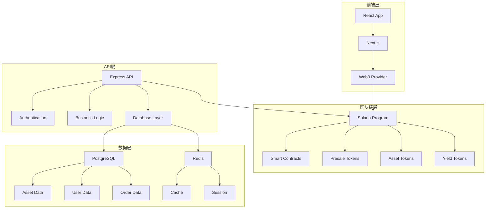

# RWA Presale Platform 实物资产预售平台

<div align="center">
  
  
  [](https://github.com/zane0623/RWA)
  [](https://github.com/zane0623/RWA)
  [](LICENSE)
  [](https://www.typescriptlang.org/)
  [](https://reactjs.org/)
  [](https://solana.com/)
</div>

## 📖 项目概述

RWA Presale Platform是一个基于RWA（Real World Asset）技术的通用实物资产预售平台，旨在连接资产提供者和投资者，通过区块链技术实现各类实物资产的预售、管理和交易。平台支持多种资产类型，包括农产品、房地产、艺术品、奢侈品、能源、矿产等，为资产提供者提供资金支持，为投资者提供优质投资机会。

## ✨ 核心特性

### 🏗️ 多资产预售系统
- **农产品预售**: 季节性农产品、有机食品、特色农产品
- **房地产预售**: 住宅、商业地产、土地开发项目
- **艺术品预售**: 绘画、雕塑、数字艺术、收藏品
- **奢侈品预售**: 名表、珠宝、豪车、限量版商品
- **能源预售**: 太阳能、风能、储能项目
- **矿产预售**: 贵金属、稀有金属、宝石
- **制造业预售**: 电子产品、机械设备、定制产品

### 🔗 区块链溯源系统
- 资产全生命周期溯源
- 生产过程记录
- 质量检测数据上链
- 运输和配送追踪
- 所有权变更记录

### 🪙 RWA代币化系统
- 实物资产代币化
- 预售代币（PreSale Token）
- 资产代币（Asset Token）
- 收益代币（Yield Token）
- 流动性挖矿和质押

### 🛡️ 智能合约保障
- 预售资金智能托管
- 条件触发机制（时间、产量、质量等）
- 自动退款和补偿
- 去中心化争议解决
- 风险管理和保险

### 📊 资产管理工具
- 资产信息管理
- 预售数据分析
- 投资组合管理
- 风险评估工具
- 市场预测分析

## 🛠️ 技术栈

### 前端技术
- **React 18** + **TypeScript** - 现代化前端框架
- **Next.js 14** - 全栈React框架
- **Tailwind CSS** - 实用优先的CSS框架
- **Zustand** - 轻量级状态管理
- **React Query** - 数据获取和缓存
- **Solana Web3.js** - 区块链交互

### 后端技术
- **Node.js** + **Express.js** - 高性能后端框架
- **TypeScript** - 类型安全的JavaScript
- **PostgreSQL** - 关系型数据库
- **Redis** - 内存数据库和缓存
- **Prisma** - 现代数据库ORM
- **JWT** + **bcrypt** - 安全认证

### 区块链技术
- **Solana** - 高性能区块链平台
- **Anchor Framework** - Solana智能合约框架
- **Metaplex** - NFT标准
- **Helius** - RPC服务提供商

### 基础设施
- **Docker** + **Docker Compose** - 容器化部署
- **AWS/Vercel** - 云服务部署
- **GitHub Actions** - CI/CD自动化

## 📁 项目结构

```
rwa-presale-platform/
├── frontend/                 # Next.js前端应用
│   ├── src/
│   │   ├── components/      # React组件
│   │   ├── pages/          # 页面组件
│   │   ├── hooks/          # 自定义Hooks
│   │   ├── stores/         # 状态管理
│   │   ├── services/       # API服务
│   │   └── utils/          # 工具函数
│   ├── public/             # 静态资源
│   └── package.json
├── backend/                 # Express后端API
│   ├── src/
│   │   ├── controllers/    # 控制器
│   │   ├── services/       # 业务逻辑
│   │   ├── middleware/     # 中间件
│   │   ├── routes/         # 路由
│   │   └── utils/          # 工具函数
│   ├── prisma/             # 数据库schema
│   └── package.json
├── blockchain/              # Solana智能合约
│   ├── programs/           # Anchor程序
│   ├── tests/              # 测试
│   └── Anchor.toml
├── docs/                   # 项目文档
├── docker-compose.yml      # Docker配置
└── README.md
```

## 🚀 快速开始

### 环境要求

- Node.js 18+
- PostgreSQL 15+
- Redis 7+
- Docker & Docker Compose
- Solana CLI
- Anchor CLI

### 安装步骤

1. **克隆项目**
```bash
git clone https://github.com/zane0623/RWA.git
cd RWA
```

2. **运行初始化脚本**
```bash
chmod +x setup_project.sh
./setup_project.sh
```

3. **配置环境变量**
```bash
cp .env.example .env
# 编辑 .env 文件，填入相应的配置
```

4. **启动开发环境**
```bash
npm run dev
```

### 开发命令

```bash
# 启动开发服务器
npm run dev

# 构建项目
npm run build

# 运行测试
npm run test

# 数据库迁移
npm run db:migrate

# 启动Docker服务
npm run docker:up
```

## 📚 项目文档

### 核心文档
- [📋 完整项目文档](RWA_完整项目文档.md) - 项目完整概述
- [📖 需求文档](RWA_需求文档.md) - 详细功能需求
- [🔧 技术实现指南](RWA_技术实现指南.md) - 技术实现方案
- [🗺️ 开发路线图](开发路线图.md) - 18周开发计划
- [✅ 实施检查清单](实施检查清单.md) - 开发任务清单
- [📊 项目总结](项目总结.md) - 项目总结和商业分析

### 配置文件
- [⚙️ 项目配置](project_config.json) - 项目详细配置
- [🐳 项目初始化脚本](setup_project.sh) - 一键初始化脚本

## 🎯 功能模块

### 1. 资产提供者管理系统
- 资产信息注册和管理
- 预售活动创建
- 订单管理和交付
- 收益分配管理

### 2. 投资者购买系统
- 资产浏览和搜索
- 预售订单下单
- 支付和钱包管理
- 投资组合管理

### 3. 预售智能合约系统
- 预售代币创建
- 资金托管和释放
- 条件触发机制
- 自动退款处理

### 4. 溯源和认证系统
- 资产溯源记录
- 质量认证上链
- 生产过程记录
- 所有权变更追踪

### 5. RWA代币经济系统
- 实物资产代币化
- 预售代币交易
- 流动性挖矿
- 质押和收益

## 📊 项目指标

### 技术指标
- 系统可用性：99.9%
- API响应时间：< 200ms
- 并发用户支持：10,000+
- 数据准确性：99.99%

### 业务指标
- 资产提供者：5,000+ 首年
- 投资者用户：100,000+ 首年
- 预售成功率：90%+
- 用户满意度：4.5/5

### 财务指标
- 平台交易额：$50,000,000+ 首年
- 平台手续费收入：$2,500,000+ 首年
- 资产提供者资金支持：$20,000,000+ 首年
- 利润率：30%+

## 🔐 安全特性

- **数据加密**: AES-256-GCM端到端加密
- **隐私保护**: GDPR合规的数据处理
- **访问控制**: 基于角色的权限管理
- **网络安全**: HTTPS强制、CORS配置、速率限制
- **智能合约安全**: 代码审计、形式化验证

## 🤝 贡献指南

我们欢迎所有形式的贡献！请查看我们的[贡献指南](CONTRIBUTING.md)了解详情。

### 贡献方式
1. Fork 项目
2. 创建功能分支 (`git checkout -b feature/AmazingFeature`)
3. 提交更改 (`git commit -m 'Add some AmazingFeature'`)
4. 推送到分支 (`git push origin feature/AmazingFeature`)
5. 打开 Pull Request

## 📄 许可证

本项目采用 MIT 许可证 - 查看 [LICENSE](LICENSE) 文件了解详情。

## 🏆 创新亮点

### 1. 通用RWA平台
- 支持多种实物资产类型
- 标准化的代币化流程
- 灵活的预售机制

### 2. 智能预售机制
- 基于多种条件的触发机制
- 自动化的风险管理和补偿
- 透明的资金管理

### 3. 全链路溯源
- 区块链上的资产溯源
- 不可篡改的记录
- 透明的供应链管理

### 4. 资产提供者赋能
- 提前获得资金支持
- 降低市场风险
- 建立稳定的投资者关系

## 📞 联系我们

- **项目维护者**: [Your Name]
- **邮箱**: [your.email@example.com]
- **项目链接**: [https://github.com/zane0623/RWA]
- **文档链接**: [https://docs.rwa-presale.com]

## 🙏 致谢

感谢所有为这个项目做出贡献的开发者和用户！

---

<div align="center">
  <p><strong>RWA Presale Platform - 重新定义实物资产交易</strong></p>
  <p>通过区块链技术，连接资产提供者和投资者，实现实物资产的预售和交易</p>
  
  [](https://github.com/zane0623/RWA)
  [](https://github.com/zane0623/RWA)
  [](https://github.com/zane0623/RWA/issues)
  [](https://github.com/zane0623/RWA/pulls)
</div> 

---

# 完整项目文档


# RWA Presale Platform 实物资产预售平台 - 完整项目文档

<div align="center">
  
</div>

## 📋 目录
1. [项目概述](#1-项目概述)
2. [技术架构](#2-技术架构)
3. [核心功能模块](#3-核心功能模块)
4. [开发路线图](#4-开发路线图)
5. [技术实现指南](#5-技术实现指南)
6. [实施检查清单](#6-实施检查清单)
7. [项目总结](#7-项目总结)

---

## 1. 项目概述

### 1.1 项目背景
RWA Presale Platform是一个基于RWA（Real World Asset）技术的通用实物资产预售平台，旨在连接资产提供者和投资者，通过区块链技术实现各类实物资产的预售、管理和交易。

### 1.2 核心价值主张
- **资产提供者赋能**: 提前获得资金支持，降低市场风险
- **投资者保障**: 优质资产投资机会，透明化交易
- **透明溯源**: 全链路区块链溯源，质量保证
- **智能合约**: 自动化风险管理和资金托管

### 1.3 支持的资产类型

#### 🏗️ 房地产类
- **住宅地产**: 公寓、别墅、联排住宅
- **商业地产**: 办公楼、商场、酒店
- **土地开发**: 住宅用地、商业用地、工业用地
- **基础设施**: 道路、桥梁、公共设施

#### 🌾 农产品类
- **季节性农产品**: 水果、蔬菜、谷物
- **有机食品**: 有机蔬菜、有机水果、有机谷物
- **特色农产品**: 地方特产、稀有农产品
- **畜牧产品**: 肉类、蛋类、奶制品

#### 🎨 艺术品类
- **传统艺术**: 绘画、雕塑、摄影
- **数字艺术**: NFT艺术品、数字收藏品
- **收藏品**: 邮票、硬币、古董
- **珠宝首饰**: 钻石、宝石、贵金属首饰

#### 💎 奢侈品类
- **名表**: 瑞士名表、限量版手表
- **珠宝**: 钻石、宝石、珍珠
- **豪车**: 跑车、豪华轿车、定制车
- **限量商品**: 限量版包包、服装、配饰

#### ⚡ 能源类
- **可再生能源**: 太阳能、风能、水能
- **储能项目**: 电池储能、抽水蓄能
- **能源基础设施**: 电网、充电站
- **碳信用**: 碳减排项目、碳交易

#### 🏭 制造业类
- **电子产品**: 手机、电脑、家电
- **机械设备**: 工业设备、农业机械
- **定制产品**: 个性化定制商品
- **原材料**: 钢材、铝材、塑料

#### 🏔️ 矿产类
- **贵金属**: 黄金、白银、铂金
- **稀有金属**: 稀土、锂、钴
- **宝石**: 钻石、红宝石、蓝宝石
- **能源矿产**: 煤炭、石油、天然气

### 1.4 技术栈选择
```
前端: React 18 + TypeScript + Next.js 14 + Tailwind CSS
后端: Node.js + Express.js + TypeScript + PostgreSQL + Redis
区块链: Solana + Anchor Framework + Metaplex
部署: Docker + AWS/Vercel + GitHub Actions
```

---

## 2. 技术架构

### 2.1 系统架构图


### 2.2 项目结构
```
rwa-presale-platform/
├── frontend/                 # Next.js前端
├── backend/                  # Express后端
├── blockchain/               # Solana程序
├── docs/                    # 项目文档
└── docker-compose.yml       # Docker配置
```

---

## 3. 核心功能模块

### 3.1 资产提供者管理系统

#### 功能特性
- 资产信息注册和管理
- 预售活动创建
- 订单管理和交付
- 收益分配管理

#### 技术实现
```typescript
// 资产提供者服务
interface AssetProviderService {
  registerAsset(assetData: AssetData): Promise<Asset>
  createPresale(presaleData: PresaleData): Promise<Presale>
  updateAsset(assetId: string, data: AssetData): Promise<Asset>
  manageOrders(providerId: string): Promise<Order[]>
  distributeYield(assetId: string, amount: number): Promise<Distribution>
}

// 数据库设计
CREATE TABLE assets (
  id UUID PRIMARY KEY DEFAULT gen_random_uuid(),
  provider_id UUID REFERENCES users(id),
  name VARCHAR(255) NOT NULL,
  category AssetCategory NOT NULL,
  subcategory VARCHAR(100),
  description TEXT,
  location VARCHAR(500),
  expected_delivery_date DATE,
  expected_value DECIMAL(15,2),
  presale_price DECIMAL(15,2),
  retail_price DECIMAL(15,2),
  status AssetStatus DEFAULT 'pending',
  created_at TIMESTAMP DEFAULT NOW()
);

CREATE TABLE asset_details (
  id UUID PRIMARY KEY DEFAULT gen_random_uuid(),
  asset_id UUID REFERENCES assets(id),
  detail_type VARCHAR(50) NOT NULL,
  detail_data JSONB NOT NULL,
  created_at TIMESTAMP DEFAULT NOW()
);

enum AssetCategory {
  REAL_ESTATE
  AGRICULTURE
  ART
  LUXURY
  ENERGY
  MANUFACTURING
  MINING
  OTHER
}

enum AssetStatus {
  PENDING
  APPROVED
  REJECTED
  ACTIVE
  COMPLETED
  CANCELLED
}
```

### 3.2 投资者购买系统

#### 功能特性
- 资产浏览和搜索
- 预售订单下单
- 支付和钱包管理
- 投资组合管理

#### 技术实现
```typescript
// 投资者服务
interface InvestorService {
  browseAssets(filters: AssetFilters): Promise<Asset[]>
  placePresaleOrder(orderData: OrderData): Promise<Order>
  trackOrder(orderId: string): Promise<OrderStatus>
  managePortfolio(investorId: string): Promise<Portfolio>
  claimYield(assetId: string): Promise<Yield>
}

// 订单系统
CREATE TABLE presale_orders (
  id UUID PRIMARY KEY DEFAULT gen_random_uuid(),
  investor_id UUID REFERENCES users(id),
  asset_id UUID REFERENCES assets(id),
  quantity DECIMAL(10,2) NOT NULL,
  total_amount DECIMAL(15,2) NOT NULL,
  presale_token_address VARCHAR(44),
  asset_token_address VARCHAR(44),
  status OrderStatus DEFAULT 'pending',
  created_at TIMESTAMP DEFAULT NOW()
);

CREATE TABLE portfolios (
  id UUID PRIMARY KEY DEFAULT gen_random_uuid(),
  investor_id UUID REFERENCES users(id),
  asset_id UUID REFERENCES assets(id),
  token_amount DECIMAL(20,8) NOT NULL,
  purchase_price DECIMAL(15,2) NOT NULL,
  current_value DECIMAL(15,2),
  yield_earned DECIMAL(15,2) DEFAULT 0,
  created_at TIMESTAMP DEFAULT NOW()
);
```

### 3.3 预售智能合约系统

#### 功能特性
- 预售代币创建
- 资金托管和释放
- 条件触发机制
- 自动退款处理

#### 技术实现
```rust
// Solana智能合约
#[program]
pub mod rwa_presale {
    use super::*;

    pub fn create_presale(
        ctx: Context<CreatePresale>,
        presale_data: PresaleData,
    ) -> Result<()> {
        let presale = &mut ctx.accounts.presale;
        presale.provider = ctx.accounts.provider.key();
        presale.asset = presale_data.asset;
        presale.target_amount = presale_data.target_amount;
        presale.min_amount = presale_data.min_amount;
        presale.delivery_date = presale_data.delivery_date;
        presale.conditions = presale_data.conditions;
        presale.status = PresaleStatus::Active;
        Ok(())
    }

    pub fn purchase_presale(
        ctx: Context<PurchasePresale>,
        amount: u64,
    ) -> Result<()> {
        let presale = &mut ctx.accounts.presale;
        let investor = &ctx.accounts.investor;
        
        // 检查预售状态
        require!(presale.status == PresaleStatus::Active, ErrorCode::PresaleNotActive);
        
        // 检查条件
        require!(self.check_conditions(&presale.conditions)?, ErrorCode::ConditionsNotMet);
        
        // 转移资金
        let transfer_instruction = Transfer {
            from: investor.to_account_info(),
            to: presale.to_account_info(),
            authority: investor.to_account_info(),
        };
        transfer_instruction.invoke_signed(&[&[&[ctx.bumps.investor]])?;
        
        // 铸造预售代币
        let presale_token = &mut ctx.accounts.presale_token;
        presale_token.owner = investor.key();
        presale_token.amount = amount;
        presale_token.presale = presale.key();
        
        Ok(())
    }

    pub fn release_funds(
        ctx: Context<ReleaseFunds>,
        delivery_data: DeliveryData,
    ) -> Result<()> {
        let presale = &mut ctx.accounts.presale;
        let provider = &ctx.accounts.provider;
        
        // 验证交付条件
        require!(self.verify_delivery(&delivery_data)?, ErrorCode::DeliveryNotVerified);
        
        // 释放资金给资产提供者
        let transfer_instruction = Transfer {
            from: presale.to_account_info(),
            to: provider.to_account_info(),
            authority: presale.to_account_info(),
        };
        transfer_instruction.invoke_signed(&[&[&[ctx.bumps.presale]])?;
        
        // 铸造资产代币
        let asset_token = &mut ctx.accounts.asset_token;
        asset_token.owner = presale.key();
        asset_token.asset = presale.asset;
        asset_token.amount = presale.total_raised;
        
        presale.status = PresaleStatus::Completed;
        Ok(())
    }

    pub fn distribute_yield(
        ctx: Context<DistributeYield>,
        yield_amount: u64,
    ) -> Result<()> {
        let asset_token = &ctx.accounts.asset_token;
        let yield_token = &mut ctx.accounts.yield_token;
        
        // 按比例分配收益
        let total_supply = asset_token.amount;
        let investor_share = (yield_amount * asset_token.amount) / total_supply;
        
        yield_token.owner = asset_token.owner;
        yield_token.amount = investor_share;
        yield_token.asset = asset_token.asset;
        
        Ok(())
    }
}

#[derive(AnchorSerialize, AnchorDeserialize)]
pub struct PresaleData {
    pub asset: Pubkey,
    pub target_amount: u64,
    pub min_amount: u64,
    pub delivery_date: i64,
    pub conditions: Vec<Condition>,
}

#[derive(AnchorSerialize, AnchorDeserialize)]
pub struct Condition {
    pub condition_type: String,
    pub parameters: Vec<u8>,
    pub threshold: u64,
}

#[derive(AnchorSerialize, AnchorDeserialize)]
pub struct DeliveryData {
    pub delivery_date: i64,
    pub quality_score: u8,
    pub quantity_delivered: u64,
    pub verification_data: Vec<u8>,
}
```

### 3.4 溯源和认证系统

#### 功能特性
- 资产溯源记录
- 质量认证上链
- 生产过程记录
- 所有权变更追踪

#### 技术实现
```typescript
// 溯源服务
interface TraceabilityService {
  recordCreation(creationData: CreationData): Promise<TraceRecord>
  recordProcess(processData: ProcessData): Promise<TraceRecord>
  recordQuality(qualityData: QualityData): Promise<TraceRecord>
  recordDelivery(deliveryData: DeliveryData): Promise<TraceRecord>
  recordOwnership(ownershipData: OwnershipData): Promise<TraceRecord>
  getTraceability(assetId: string): Promise<TraceRecord[]>
}

// 溯源记录
CREATE TABLE traceability_records (
  id UUID PRIMARY KEY DEFAULT gen_random_uuid(),
  asset_id UUID REFERENCES assets(id),
  record_type TraceRecordType NOT NULL,
  data_hash VARCHAR(64) NOT NULL,
  blockchain_tx VARCHAR(44),
  verified_by UUID REFERENCES users(id),
  recorded_at TIMESTAMP DEFAULT NOW()
);

enum TraceRecordType {
  CREATION
  PROCESS
  QUALITY_CHECK
  DELIVERY
  OWNERSHIP_CHANGE
  CERTIFICATION
}
```

### 3.5 RWA代币经济系统

#### 功能特性
- 实物资产代币化
- 预售代币交易
- 流动性挖矿
- 质押和收益

#### 技术实现
```typescript
// 代币经济服务
interface TokenEconomyService {
  mintPresaleToken(presaleId: string, amount: number): Promise<Token>
  mintAssetToken(assetId: string, amount: number): Promise<Token>
  mintYieldToken(assetId: string, amount: number): Promise<Token>
  createLiquidityPool(tokenA: string, tokenB: string): Promise<Pool>
  stakeTokens(tokenId: string, amount: number): Promise<StakePosition>
  claimRewards(stakeId: string): Promise<Reward>
  swapTokens(tokenIn: string, tokenOut: string, amount: number): Promise<Swap>
}

// 代币类型
enum TokenType {
  PRESALE_TOKEN    // 预售代币
  ASSET_TOKEN      // 资产代币
  YIELD_TOKEN      // 收益代币
  GOVERNANCE_TOKEN // 治理代币
  LIQUIDITY_TOKEN  // 流动性代币
}
```

---

## 4. 开发路线图

### 4.1 总开发周期：18周

| 阶段 | 时间 | 主要任务 |
|------|------|----------|
| **阶段1** | 第1-2周 | 项目初始化与架构设计 |
| **阶段2** | 第3-4周 | 核心基础设施开发 |
| **阶段3** | 第5-6周 | 资产提供者管理系统 |
| **阶段4** | 第7-8周 | 投资者购买系统 |
| **阶段5** | 第9-10周 | 预售智能合约 |
| **阶段6** | 第11-12周 | 溯源和认证系统 |
| **阶段7** | 第13-14周 | RWA代币系统 |
| **阶段8** | 第15-16周 | 前端界面开发 |
| **阶段9** | 第17-18周 | 测试与部署 |

### 4.2 关键里程碑

| 里程碑 | 时间 | 交付物 |
|--------|------|--------|
| 项目架构完成 | 第2周末 | 完整的技术架构文档 |
| 资产提供者系统完成 | 第6周末 | 资产管理功能 |
| 投资者系统完成 | 第8周末 | 购买和投资功能 |
| 智能合约完成 | 第10周末 | 预售合约系统 |
| 溯源系统完成 | 第12周末 | 区块链溯源功能 |
| 代币系统完成 | 第14周末 | RWA代币经济 |
| 前端界面完成 | 第16周末 | 完整的用户界面 |
| 正式上线 | 第18周末 | 生产环境应用 |

---

## 5. 技术实现指南

### 5.1 项目初始化

#### 环境配置
```bash
# 创建项目目录
mkdir rwa-presale-platform
cd rwa-presale-platform

# 初始化前端项目
npx create-next-app@latest frontend --typescript --tailwind --eslint
cd frontend
npm install @solana/web3.js @solana/wallet-adapter-react @solana/wallet-adapter-wallets
npm install zustand @tanstack/react-query axios

# 初始化后端项目
cd ../backend
npm init -y
npm install express typescript @types/node @types/express
npm install prisma @prisma/client bcryptjs jsonwebtoken
npm install @solana/web3.js @project-serum/anchor
npm install redis ioredis

# 初始化数据库
npx prisma init
```

#### 数据库配置 (Prisma)
```prisma
// prisma/schema.prisma
generator client {
  provider = "prisma-client-js"
}

datasource db {
  provider = "postgresql"
  url      = env("DATABASE_URL")
}

model User {
  id            String   @id @default(cuid())
  email         String   @unique
  passwordHash  String?
  walletAddress String?
  role          UserRole @default(INVESTOR)
  isVerified    Boolean  @default(false)
  kycStatus     KYCStatus @default(PENDING)
  createdAt     DateTime @default(now())
  updatedAt     DateTime @updatedAt

  assets        Asset[]
  orders        PresaleOrder[]
  portfolios    Portfolio[]
  traceRecords  TraceabilityRecord[]
}

model Asset {
  id                  String       @id @default(cuid())
  providerId          String
  name                String
  category            AssetCategory
  subcategory         String?
  description         String?
  location            String?
  expectedDeliveryDate DateTime?
  expectedValue       Decimal
  presalePrice        Decimal
  retailPrice         Decimal
  status              AssetStatus  @default(PENDING)
  createdAt           DateTime     @default(now())

  provider            User         @relation(fields: [providerId], references: [id])
  presales            Presale[]
  orders              PresaleOrder[]
  portfolios          Portfolio[]
  traceRecords        TraceabilityRecord[]
  details             AssetDetail[]
}

model AssetDetail {
  id         String   @id @default(cuid())
  assetId    String
  detailType String
  detailData Json
  createdAt  DateTime @default(now())

  asset      Asset    @relation(fields: [assetId], references: [id])
}

enum UserRole {
  ASSET_PROVIDER
  INVESTOR
  ADMIN
  VERIFIER
}

enum KYCStatus {
  PENDING
  APPROVED
  REJECTED
}

enum AssetCategory {
  REAL_ESTATE
  AGRICULTURE
  ART
  LUXURY
  ENERGY
  MANUFACTURING
  MINING
  OTHER
}

enum AssetStatus {
  PENDING
  APPROVED
  REJECTED
  ACTIVE
  COMPLETED
  CANCELLED
}
```

### 5.2 后端实现

#### 资产提供者服务
```typescript
// src/services/assetProviderService.ts
export class AssetProviderService {
  async registerAsset(providerId: string, assetData: AssetData): Promise<Asset> {
    const asset = await prisma.asset.create({
      data: {
        providerId,
        name: assetData.name,
        category: assetData.category,
        subcategory: assetData.subcategory,
        description: assetData.description,
        location: assetData.location,
        expectedDeliveryDate: assetData.expectedDeliveryDate,
        expectedValue: assetData.expectedValue,
        presalePrice: assetData.presalePrice,
        retailPrice: assetData.retailPrice
      }
    });

    // 创建资产详情
    if (assetData.details) {
      await prisma.assetDetail.createMany({
        data: assetData.details.map(detail => ({
          assetId: asset.id,
          detailType: detail.type,
          detailData: detail.data
        }))
      });
    }

    return asset;
  }

  async createPresale(assetId: string, presaleData: PresaleData): Promise<Presale> {
    // 创建预售活动
    const presale = await prisma.presale.create({
      data: {
        assetId,
        targetAmount: presaleData.targetAmount,
        minAmount: presaleData.minAmount,
        deliveryDate: presaleData.deliveryDate,
        conditions: presaleData.conditions,
        status: 'ACTIVE'
      }
    });

    // 在区块链上创建预售代币
    const tokenAddress = await this.blockchainService.createPresaleToken(presale.id, presaleData);

    // 更新预售记录
    await prisma.presale.update({
      where: { id: presale.id },
      data: { tokenAddress }
    });

    return presale;
  }

  async updateAsset(assetId: string, data: AssetData): Promise<Asset> {
    const asset = await prisma.asset.update({
      where: { id: assetId },
      data: {
        name: data.name,
        category: data.category,
        subcategory: data.subcategory,
        description: data.description,
        location: data.location,
        expectedDeliveryDate: data.expectedDeliveryDate,
        expectedValue: data.expectedValue,
        presalePrice: data.presalePrice,
        retailPrice: data.retailPrice
      }
    });

    return asset;
  }
}
```

#### 投资者服务
```typescript
// src/services/investorService.ts
export class InvestorService {
  async browseAssets(filters: AssetFilters): Promise<Asset[]> {
    const assets = await prisma.asset.findMany({
      where: {
        category: filters.category,
        subcategory: filters.subcategory,
        status: 'ACTIVE',
        presales: {
          some: {
            status: 'ACTIVE'
          }
        }
      },
      include: {
        provider: true,
        presales: {
          where: { status: 'ACTIVE' }
        },
        details: true
      }
    });

    return assets;
  }

  async placePresaleOrder(investorId: string, orderData: OrderData): Promise<PresaleOrder> {
    // 创建预售订单
    const order = await prisma.presaleOrder.create({
      data: {
        investorId,
        assetId: orderData.assetId,
        quantity: orderData.quantity,
        totalAmount: orderData.totalAmount,
        status: 'PENDING'
      }
    });

    // 在区块链上购买预售代币
    const tokenAddress = await this.blockchainService.purchasePresaleToken(
      orderData.presaleId,
      orderData.amount,
      investorId
    );

    // 更新订单
    await prisma.presaleOrder.update({
      where: { id: order.id },
      data: { presaleTokenAddress: tokenAddress, status: 'CONFIRMED' }
    });

    // 更新投资组合
    await prisma.portfolio.create({
      data: {
        investorId,
        assetId: orderData.assetId,
        tokenAmount: orderData.quantity,
        purchasePrice: orderData.totalAmount,
        currentValue: orderData.totalAmount
      }
    });

    return order;
  }

  async managePortfolio(investorId: string): Promise<Portfolio[]> {
    const portfolio = await prisma.portfolio.findMany({
      where: { investorId },
      include: {
        asset: {
          include: {
            provider: true,
            presales: true
          }
        }
      }
    });

    return portfolio;
  }
}
```

### 5.3 前端实现

#### 资产提供者仪表板
```typescript
// src/components/AssetProviderDashboard.tsx
export const AssetProviderDashboard: React.FC = () => {
  const { user } = useAuthStore();
  const [assets, setAssets] = useState<Asset[]>([]);
  const [presales, setPresales] = useState<Presale[]>([]);

  const { data: assetData } = useQuery({
    queryKey: ['assets', user?.id],
    queryFn: () => assetProviderService.getAssets(user?.id!),
    enabled: !!user?.id
  });

  const { data: presaleData } = useQuery({
    queryKey: ['presales', user?.id],
    queryFn: () => assetProviderService.getPresales(user?.id!),
    enabled: !!user?.id
  });

  return (
    <div className="max-w-7xl mx-auto p-6">
      <div className="mb-8">
        <h1 className="text-3xl font-bold">资产提供者仪表板</h1>
        <p className="text-gray-600">管理您的资产和预售活动</p>
      </div>

      <div className="grid grid-cols-1 lg:grid-cols-3 gap-6">
        {/* 资产概览 */}
        <div className="lg:col-span-2">
          <div className="bg-white rounded-lg shadow-md p-6">
            <h2 className="text-xl font-semibold mb-4">我的资产</h2>
            {assetData?.map(asset => (
              <div key={asset.id} className="border-b py-4">
                <h3 className="font-medium">{asset.name}</h3>
                <p className="text-gray-600">{asset.category} - {asset.subcategory}</p>
                <p className="text-sm text-gray-500">状态: {asset.status}</p>
                <p className="text-sm text-gray-500">预期价值: ${asset.expectedValue}</p>
              </div>
            ))}
            <button className="mt-4 px-4 py-2 bg-blue-600 text-white rounded">
              添加新资产
            </button>
          </div>
        </div>

        {/* 预售活动 */}
        <div>
          <div className="bg-white rounded-lg shadow-md p-6">
            <h2 className="text-xl font-semibold mb-4">预售活动</h2>
            {presaleData?.map(presale => (
              <div key={presale.id} className="border-b py-4">
                <h3 className="font-medium">{presale.asset.name}</h3>
                <p className="text-gray-600">目标: ${presale.targetAmount}</p>
                <p className="text-sm text-gray-500">状态: {presale.status}</p>
              </div>
            ))}
            <button className="mt-4 px-4 py-2 bg-green-600 text-white rounded">
              创建预售
            </button>
          </div>
        </div>
      </div>
    </div>
  );
};
```

#### 投资者市场界面
```typescript
// src/components/AssetMarketplace.tsx
export const AssetMarketplace: React.FC = () => {
  const [filters, setFilters] = useState<AssetFilters>({});
  const [selectedAsset, setSelectedAsset] = useState<Asset | null>(null);

  const { data: assets, isLoading } = useQuery({
    queryKey: ['assets', filters],
    queryFn: () => investorService.browseAssets(filters)
  });

  const purchaseMutation = useMutation({
    mutationFn: (orderData: OrderData) => investorService.placePresaleOrder(orderData),
    onSuccess: () => {
      toast.success('预售订单创建成功！');
    }
  });

  const handlePurchase = async (asset: Asset, quantity: number) => {
    const orderData = {
      assetId: asset.id,
      quantity,
      totalAmount: asset.presalePrice * quantity,
      presaleId: asset.presales[0]?.id
    };

    await purchaseMutation.mutateAsync(orderData);
  };

  return (
    <div className="max-w-7xl mx-auto p-6">
      <div className="mb-8">
        <h1 className="text-3xl font-bold">实物资产预售市场</h1>
        <p className="text-gray-600">发现优质资产，提前投资</p>
      </div>

      {/* 筛选器 */}
      <div className="bg-white rounded-lg shadow-md p-6 mb-6">
        <div className="grid grid-cols-1 md:grid-cols-4 gap-4">
          <select 
            value={filters.category || ''} 
            onChange={(e) => setFilters({...filters, category: e.target.value})}
            className="border rounded px-3 py-2"
          >
            <option value="">所有类别</option>
            <option value="REAL_ESTATE">房地产</option>
            <option value="AGRICULTURE">农产品</option>
            <option value="ART">艺术品</option>
            <option value="LUXURY">奢侈品</option>
            <option value="ENERGY">能源</option>
            <option value="MANUFACTURING">制造业</option>
            <option value="MINING">矿产</option>
          </select>
          
          <select 
            value={filters.subcategory || ''} 
            onChange={(e) => setFilters({...filters, subcategory: e.target.value})}
            className="border rounded px-3 py-2"
          >
            <option value="">所有子类别</option>
            {/* 根据主类别动态加载子类别 */}
          </select>
        </div>
      </div>

      {/* 资产列表 */}
      <div className="grid grid-cols-1 md:grid-cols-2 lg:grid-cols-3 gap-6">
        {assets?.map(asset => (
          <div key={asset.id} className="bg-white rounded-lg shadow-md overflow-hidden">
            <div className="p-6">
              <h3 className="text-lg font-semibold mb-2">{asset.name}</h3>
              <p className="text-gray-600 mb-2">{asset.description}</p>
              <p className="text-sm text-gray-500 mb-4">
                {asset.category} - {asset.subcategory}
              </p>
              
              <div className="flex justify-between items-center mb-4">
                <div>
                  <p className="text-lg font-bold text-green-600">
                    ${asset.presalePrice}
                  </p>
                  <p className="text-sm text-gray-500">
                    零售价: ${asset.retailPrice}
                  </p>
                </div>
                <div className="text-right">
                  <p className="text-sm text-gray-500">预期交付</p>
                  <p className="text-sm font-medium">
                    {new Date(asset.expectedDeliveryDate!).toLocaleDateString()}
                  </p>
                </div>
              </div>

              <button 
                onClick={() => handlePurchase(asset, 1)}
                disabled={purchaseMutation.isPending}
                className="w-full px-4 py-2 bg-blue-600 text-white rounded hover:bg-blue-700 disabled:opacity-50"
              >
                {purchaseMutation.isPending ? '处理中...' : '立即投资'}
              </button>
            </div>
          </div>
        ))}
      </div>
    </div>
  );
};
```

---

## 6. 实施检查清单

### 6.1 项目启动检查清单

#### 环境准备
- [ ] Node.js 18+ 已安装
- [ ] PostgreSQL 15+ 已安装
- [ ] Redis 7+ 已安装
- [ ] Docker & Docker Compose 已安装
- [ ] Solana CLI 工具已安装
- [ ] Anchor CLI 已安装

#### 项目初始化
- [ ] 项目仓库已创建
- [ ] 项目结构已建立
- [ ] 环境配置文件已创建
- [ ] 依赖包已安装
- [ ] 数据库连接已测试
- [ ] 开发服务器可正常启动

### 6.2 阶段检查清单

#### 阶段1: 项目初始化与架构设计 (第1-2周)
- [ ] 系统架构图已完成
- [ ] 数据库ER图已完成
- [ ] API接口文档已完成
- [ ] 智能合约架构设计已完成
- [ ] 需求文档已完成

#### 阶段2: 核心基础设施开发 (第3-4周)
- [ ] Express.js 框架已搭建
- [ ] TypeScript 配置已完成
- [ ] Prisma ORM 已配置
- [ ] Redis 缓存已集成
- [ ] Next.js 项目已搭建
- [ ] Solana 钱包已集成

#### 阶段3: 资产提供者管理系统 (第5-6周)
- [ ] 资产注册功能已实现
- [ ] 资产管理功能已实现
- [ ] 预售活动创建已实现
- [ ] 订单管理已实现
- [ ] 资产提供者界面已开发

#### 阶段4: 投资者购买系统 (第7-8周)
- [ ] 资产浏览功能已实现
- [ ] 预售下单功能已实现
- [ ] 支付系统已集成
- [ ] 投资组合管理已实现
- [ ] 投资者界面已开发

#### 阶段5: 预售智能合约 (第9-10周)
- [ ] 预售合约已开发
- [ ] 代币铸造功能已实现
- [ ] 资金托管机制已实现
- [ ] 条件触发机制已实现
- [ ] 合约测试已完成

#### 阶段6: 溯源和认证系统 (第11-12周)
- [ ] 溯源记录功能已实现
- [ ] 质量认证上链已实现
- [ ] 过程记录功能已实现
- [ ] 所有权追踪已实现
- [ ] 溯源界面已开发

#### 阶段7: RWA代币系统 (第13-14周)
- [ ] 代币经济模型已实现
- [ ] 流动性池已创建
- [ ] 质押机制已实现
- [ ] 收益分配已实现
- [ ] 代币界面已开发

#### 阶段8: 前端界面开发 (第15-16周)
- [ ] UI/UX设计已完成
- [ ] 响应式设计已实现
- [ ] 用户体验已优化
- [ ] 移动端适配已完成
- [ ] 性能优化已完成

#### 阶段9: 测试与部署 (第17-18周)
- [ ] 单元测试已编写
- [ ] 集成测试已完成
- [ ] 安全测试已完成
- [ ] 性能测试已完成
- [ ] 生产部署已完成

---

## 7. 项目总结

### 7.1 成功指标

#### 技术指标
- 系统可用性：99.9%
- API响应时间：< 200ms
- 并发用户支持：10,000+
- 数据准确性：99.99%

#### 业务指标
- 资产提供者：5,000+ 首年
- 投资者用户：100,000+ 首年
- 预售成功率：90%+
- 用户满意度：4.5/5

#### 财务指标
- 平台交易额：$50,000,000+ 首年
- 平台手续费收入：$2,500,000+ 首年
- 资产提供者资金支持：$20,000,000+ 首年
- 利润率：30%+

### 7.2 风险管理

#### 技术风险
- **区块链技术风险**: 选择成熟的Solana生态
- **智能合约风险**: 代码审计和形式化验证
- **性能风险**: 使用CDN、缓存策略

#### 业务风险
- **市场风险**: 资产价格波动
- **监管风险**: 金融监管法规
- **合规风险**: KYC/AML要求

#### 项目风险
- **进度风险**: 严格控制时间线
- **质量风险**: 代码审查、自动化测试
- **资源风险**: 确保团队技能匹配

### 7.3 商业模式

#### 收入来源
1. **平台手续费**: 预售交易手续费
2. **认证服务费**: 资产认证和溯源服务
3. **代币交易费**: 代币交易手续费
4. **增值服务费**: 数据分析、营销推广

#### 成本结构
1. **技术基础设施**: 30%
2. **运营成本**: 25%
3. **营销推广**: 20%
4. **团队成本**: 15%
5. **其他费用**: 10%

### 7.4 团队要求

#### 核心团队
- **项目经理**: 项目管理和协调
- **技术负责人**: 技术架构和开发
- **产品经理**: 产品设计和用户需求
- **UI/UX设计师**: 用户界面设计
- **前端开发**: React/Next.js开发
- **后端开发**: Node.js/Express开发
- **区块链开发**: Solana/Anchor开发
- **DevOps工程师**: 部署和运维
- **测试工程师**: 质量保证
- **金融专家**: 金融合规和风控

### 7.5 投资回报分析

#### 投资需求
- **种子轮**: $1,000,000
- **A轮**: $5,000,000
- **B轮**: $15,000,000

#### 预期回报
- **3年ROI**: 500%
- **5年ROI**: 1200%
- **退出估值**: $200M-500M

### 7.6 创新亮点

#### 1. 通用RWA平台
- 支持多种实物资产类型
- 标准化的代币化流程
- 灵活的预售机制

#### 2. 智能预售机制
- 基于多种条件的触发机制
- 自动化的风险管理和补偿
- 透明的资金管理

#### 3. 全链路溯源
- 区块链上的资产溯源
- 不可篡改的记录
- 透明的供应链管理

#### 4. 资产提供者赋能
- 提前获得资金支持
- 降低市场风险
- 建立稳定的投资者关系

### 7.7 未来发展规划

#### 短期目标（6个月）
- 完成MVP开发
- 获得首批资产提供者和投资者
- 建立合作伙伴关系
- 获得种子轮融资

#### 中期目标（1-2年）
- 扩展到更多资产类别
- 建立全球资产网络
- 实现盈利
- 获得A轮融资

#### 长期目标（3-5年）
- 成为RWA预售平台领导者
- 建立全球资产交易网络
- 推动金融创新
- 实现可持续发展

---

## 8. 快速开始指南

### 8.1 项目初始化
```bash
# 克隆项目
git clone https://github.com/zane0623/RWA.git
cd RWA

# 运行初始化脚本
chmod +x setup_project.sh
./setup_project.sh

# 配置环境变量
cp .env.example .env
# 编辑 .env 文件，填入相应的配置

# 启动开发环境
npm run dev
```

### 8.2 开发命令
```bash
# 启动开发服务器
npm run dev

# 构建项目
npm run build

# 运行测试
npm run test

# 数据库迁移
npm run db:migrate

# 启动Docker服务
npm run docker:up
```

### 8.3 部署命令
```bash
# 构建生产版本
npm run build

# 部署到生产环境
npm run deploy

# 监控系统状态
npm run monitor
```

---

## 9. 联系信息

### 项目团队
- **项目经理**: [Your Name]
- **技术负责人**: [Your Name]
- **产品负责人**: [Your Name]

### 联系方式
- **邮箱**: [your.email@example.com]
- **项目链接**: [https://github.com/zane0623/RWA]
- **文档链接**: [https://docs.rwa-presale.com]

---

**文档版本**: v1.0  
**最后更新**: 2024年12月  
**负责人**: 项目经理  
**审核人**: 技术负责人、产品负责人、投资方代表

---

<div align="center">
  <p><strong>RWA Presale Platform - 重新定义实物资产交易</strong></p>
  <p>通过区块链技术，连接资产提供者和投资者，实现实物资产的预售和交易</p>
</div> 

---

# 开发路线图


# EduBoost RWA 项目开发路线图

## 项目概述
EduBoost RWA 全栈式学业支持平台开发计划，预计总开发周期18周，分为6个主要阶段。

## 开发阶段总览

### 阶段1: 项目初始化与架构设计 (第1-2周)
### 阶段2: 核心基础设施开发 (第3-4周)
### 阶段3: 智能学习系统 (第5-6周)
### 阶段4: 申请管理系统 (第7-8周)
### 阶段5: 心理健康模块 (第9-10周)
### 阶段6: RWA代币系统 (第11-12周)
### 阶段7: 前端界面开发 (第13-14周)
### 阶段8: 测试与优化 (第15-16周)
### 阶段9: 部署与上线 (第17-18周)

---

## 阶段1: 项目初始化与架构设计 (第1-2周)

### 第1周任务

#### 技术栈选择与配置
- [ ] 确定最终技术栈
- [ ] 配置开发环境
- [ ] 设置版本控制系统
- [ ] 创建项目基础结构

#### 数据库设计
- [ ] 设计完整的数据库架构
- [ ] 创建Prisma schema
- [ ] 设计数据关系图
- [ ] 规划数据库索引策略

#### API接口设计
- [ ] 设计RESTful API规范
- [ ] 创建API文档
- [ ] 设计认证流程
- [ ] 规划错误处理机制

### 第2周任务

#### 系统架构设计
- [ ] 完成系统架构图
- [ ] 设计微服务架构
- [ ] 规划缓存策略
- [ ] 设计安全架构

#### 区块链架构设计
- [ ] 设计Solana程序架构
- [ ] 规划代币经济模型
- [ ] 设计NFT标准
- [ ] 规划智能合约安全

#### 项目文档
- [ ] 完成需求文档
- [ ] 创建技术规范
- [ ] 制定开发规范
- [ ] 创建API文档

---

## 阶段2: 核心基础设施开发 (第3-4周)

### 第3周任务

#### 后端基础设施
- [ ] 搭建Express.js框架
- [ ] 配置TypeScript
- [ ] 设置Prisma ORM
- [ ] 配置Redis缓存
- [ ] 设置日志系统

#### 数据库实现
- [ ] 创建数据库迁移
- [ ] 实现基础模型
- [ ] 设置数据库连接池
- [ ] 配置数据库备份

#### 认证系统基础
- [ ] 实现用户注册/登录
- [ ] 配置JWT认证
- [ ] 实现密码加密
- [ ] 设置会话管理

### 第4周任务

#### 前端基础设施
- [ ] 搭建Next.js项目
- [ ] 配置TypeScript
- [ ] 设置Tailwind CSS
- [ ] 配置状态管理
- [ ] 设置路由系统

#### Web3集成基础
- [ ] 集成Solana钱包
- [ ] 配置Web3 Provider
- [ ] 实现钱包连接
- [ ] 设置交易处理

#### 开发工具配置
- [ ] 配置ESLint和Prettier
- [ ] 设置Git hooks
- [ ] 配置测试环境
- [ ] 设置CI/CD管道

---

## 阶段3: 智能学习系统 (第5-6周)

### 第5周任务

#### 学习内容管理
- [ ] 实现课程CRUD操作
- [ ] 创建课程内容编辑器
- [ ] 实现知识点管理
- [ ] 设计学习路径算法

#### 用户学习跟踪
- [ ] 实现学习进度跟踪
- [ ] 创建学习历史记录
- [ ] 实现学习时间统计
- [ ] 设计学习分析系统

#### 推荐算法
- [ ] 实现基础推荐算法
- [ ] 设计用户画像系统
- [ ] 实现个性化推荐
- [ ] 创建学习路径生成

### 第6周任务

#### 学习界面开发
- [ ] 创建课程列表页面
- [ ] 实现课程详情页面
- [ ] 开发学习播放器
- [ ] 创建进度展示组件

#### 评估系统
- [ ] 实现题目生成系统
- [ ] 创建评估算法
- [ ] 实现成绩分析
- [ ] 设计反馈机制

#### 学习分析
- [ ] 实现学习数据分析
- [ ] 创建学习报告
- [ ] 设计学习建议
- [ ] 实现学习预测

---

## 阶段4: 申请管理系统 (第7-8周)

### 第7周任务

#### 大学信息管理
- [ ] 创建大学数据库
- [ ] 实现大学信息CRUD
- [ ] 设计申请要求管理
- [ ] 实现费用管理

#### 申请流程设计
- [ ] 设计申请状态机
- [ ] 实现申请创建流程
- [ ] 创建申请跟踪系统
- [ ] 设计通知机制

#### 文档管理
- [ ] 实现文件上传系统
- [ ] 创建文档验证
- [ ] 实现文档预览
- [ ] 设计文档版本控制

### 第8周任务

#### 申请界面开发
- [ ] 创建申请表单
- [ ] 实现申请列表页面
- [ ] 开发申请详情页面
- [ ] 创建申请状态跟踪

#### 支付系统集成
- [ ] 集成加密货币支付
- [ ] 实现支付验证
- [ ] 创建支付历史
- [ ] 设计退款机制

#### 推荐信管理
- [ ] 实现推荐人邀请
- [ ] 创建推荐信提交
- [ ] 实现推荐信跟踪
- [ ] 设计推荐信模板

---

## 阶段5: 心理健康模块 (第9-10周)

### 第9周任务

#### 评估系统开发
- [ ] 设计心理健康评估问卷
- [ ] 实现评估算法
- [ ] 创建风险评估系统
- [ ] 设计评估报告

#### 数据加密实现
- [ ] 实现端到端加密
- [ ] 创建数据脱敏
- [ ] 实现隐私保护
- [ ] 设计数据访问控制

#### 情绪跟踪
- [ ] 实现情绪记录系统
- [ ] 创建情绪分析
- [ ] 设计情绪趋势图
- [ ] 实现情绪提醒

### 第10周任务

#### 咨询师匹配
- [ ] 实现咨询师数据库
- [ ] 创建匹配算法
- [ ] 实现预约系统
- [ ] 设计评价机制

#### 危机检测
- [ ] 实现危机检测算法
- [ ] 创建紧急联系系统
- [ ] 设计干预机制
- [ ] 实现自动报警

#### 心理健康界面
- [ ] 创建评估界面
- [ ] 实现情绪跟踪界面
- [ ] 开发咨询师匹配界面
- [ ] 创建健康报告页面

---

## 阶段6: RWA代币系统 (第11-12周)

### 第11周任务

#### Solana程序开发
- [ ] 开发基础智能合约
- [ ] 实现NFT铸造功能
- [ ] 创建代币经济模型
- [ ] 实现质押机制

#### 代币经济设计
- [ ] 设计代币分配机制
- [ ] 实现奖励系统
- [ ] 创建治理代币
- [ ] 设计流动性挖矿

#### 成就系统
- [ ] 设计成就标准
- [ ] 实现成就验证
- [ ] 创建NFT元数据
- [ ] 实现成就展示

### 第12周任务

#### 前端Web3集成
- [ ] 集成智能合约调用
- [ ] 实现钱包交互
- [ ] 创建交易界面
- [ ] 实现NFT展示

#### 治理系统
- [ ] 实现投票机制
- [ ] 创建提案系统
- [ ] 设计治理界面
- [ ] 实现结果展示

#### 流动性管理
- [ ] 实现流动性池
- [ ] 创建交易界面
- [ ] 设计收益计算
- [ ] 实现流动性管理

---

## 阶段7: 前端界面开发 (第13-14周)

### 第13周任务

#### 用户界面设计
- [ ] 完成UI/UX设计
- [ ] 创建组件库
- [ ] 实现响应式设计
- [ ] 优化用户体验

#### 仪表板开发
- [ ] 创建主仪表板
- [ ] 实现数据可视化
- [ ] 创建快速操作
- [ ] 实现个性化设置

#### 学习界面优化
- [ ] 优化学习播放器
- [ ] 改进进度展示
- [ ] 实现交互式内容
- [ ] 创建学习社区

### 第14周任务

#### 申请界面优化
- [ ] 优化申请流程
- [ ] 改进文档管理
- [ ] 实现实时更新
- [ ] 创建申请助手

#### 心理健康界面
- [ ] 优化评估界面
- [ ] 改进情绪跟踪
- [ ] 实现隐私保护
- [ ] 创建健康报告

#### 移动端适配
- [ ] 实现移动端响应
- [ ] 优化触摸交互
- [ ] 实现PWA功能
- [ ] 测试移动端性能

---

## 阶段8: 测试与优化 (第15-16周)

### 第15周任务

#### 单元测试
- [ ] 编写后端单元测试
- [ ] 编写前端单元测试
- [ ] 测试智能合约
- [ ] 实现测试覆盖率

#### 集成测试
- [ ] 测试API集成
- [ ] 测试数据库操作
- [ ] 测试Web3集成
- [ ] 测试第三方服务

#### 性能测试
- [ ] 测试系统性能
- [ ] 优化数据库查询
- [ ] 测试并发处理
- [ ] 优化前端性能

### 第16周任务

#### 安全测试
- [ ] 进行安全审计
- [ ] 测试认证系统
- [ ] 验证数据加密
- [ ] 测试智能合约安全

#### 用户体验测试
- [ ] 进行用户测试
- [ ] 收集用户反馈
- [ ] 优化用户界面
- [ ] 改进用户体验

#### 系统优化
- [ ] 优化系统架构
- [ ] 改进错误处理
- [ ] 优化日志系统
- [ ] 实现监控告警

---

## 阶段9: 部署与上线 (第17-18周)

### 第17周任务

#### 生产环境准备
- [ ] 配置生产服务器
- [ ] 设置负载均衡
- [ ] 配置CDN
- [ ] 设置监控系统

#### 数据库部署
- [ ] 部署生产数据库
- [ ] 配置数据库备份
- [ ] 设置数据迁移
- [ ] 配置读写分离

#### 区块链部署
- [ ] 部署智能合约
- [ ] 配置RPC节点
- [ ] 设置监控告警
- [ ] 测试网络连接

### 第18周任务

#### 应用部署
- [ ] 部署前端应用
- [ ] 部署后端API
- [ ] 配置域名和SSL
- [ ] 设置自动部署

#### 上线准备
- [ ] 进行最终测试
- [ ] 准备上线文档
- [ ] 培训支持团队
- [ ] 准备营销材料

#### 正式上线
- [ ] 发布正式版本
- [ ] 监控系统运行
- [ ] 收集用户反馈
- [ ] 处理上线问题

---

## 关键里程碑

| 里程碑 | 时间 | 交付物 |
|--------|------|--------|
| 项目架构完成 | 第2周末 | 完整的技术架构文档 |
| 核心功能完成 | 第6周末 | 可用的学习系统 |
| 申请系统完成 | 第8周末 | 完整的申请管理功能 |
| 心理健康模块完成 | 第10周末 | 隐私保护的心理健康系统 |
| 代币系统完成 | 第12周末 | 可用的RWA代币经济 |
| 前端界面完成 | 第14周末 | 完整的用户界面 |
| 测试完成 | 第16周末 | 测试报告和优化建议 |
| 正式上线 | 第18周末 | 生产环境应用 |

## 风险管理

### 技术风险
- **区块链技术风险**: 选择成熟的Solana生态，建立技术顾问团队
- **性能风险**: 使用CDN、缓存策略，负载均衡
- **安全风险**: 实施多层加密，定期安全审计

### 项目风险
- **进度风险**: 严格控制时间线，设置缓冲时间
- **质量风险**: 建立代码审查机制，自动化测试
- **资源风险**: 确保团队技能匹配，外部技术支持

### 业务风险
- **用户采用风险**: 提供免费试用，用户教育计划
- **监管风险**: 密切关注教育科技法规变化
- **竞争风险**: 差异化功能，专利保护

## 成功指标

### 技术指标
- 系统可用性: 99.9%
- 响应时间: < 200ms
- 并发用户: 10,000+
- 数据准确性: 99.99%

### 业务指标
- 用户注册: 10,000+ 首年
- 活跃用户: 70% 月活跃率
- 学习完成率: 80%+
- 用户满意度: 4.5/5

### 财务指标
- 月收入: $50,000+ 首年
- 用户生命周期价值: $500+
- 获客成本: < $50
- 利润率: 30%+

---

**路线图版本**: v1.0  
**最后更新**: 2024年12月  
**负责人**: 项目经理  
**审核人**: 技术负责人、产品负责人 

---

# 实施检查清单


# EduBoost RWA 项目实施检查清单

## 项目启动检查清单

### 环境准备
- [ ] Node.js 18+ 已安装
- [ ] PostgreSQL 15+ 已安装
- [ ] Redis 7+ 已安装
- [ ] Docker & Docker Compose 已安装
- [ ] Git 已配置
- [ ] 代码编辑器已配置 (VS Code 推荐)
- [ ] Solana CLI 工具已安装
- [ ] Anchor CLI 已安装

### 项目初始化
- [ ] 项目仓库已创建
- [ ] 项目结构已建立
- [ ] 环境配置文件已创建
- [ ] 依赖包已安装
- [ ] 数据库连接已测试
- [ ] 开发服务器可正常启动

---

## 阶段1: 项目初始化与架构设计检查清单

### 技术架构设计
- [ ] 系统架构图已完成
- [ ] 数据库ER图已完成
- [ ] API接口文档已完成
- [ ] 安全架构设计已完成
- [ ] 区块链架构设计已完成
- [ ] 部署架构设计已完成

### 开发规范
- [ ] 代码规范文档已制定
- [ ] Git工作流已定义
- [ ] 代码审查流程已建立
- [ ] 测试策略已制定
- [ ] 文档规范已定义

### 项目文档
- [ ] 需求文档已完成
- [ ] 技术规范文档已完成
- [ ] API文档已完成
- [ ] 数据库设计文档已完成
- [ ] 部署文档已完成

**验收标准**: 所有文档已通过团队评审，技术架构已获得技术负责人批准。

---

## 阶段2: 核心基础设施开发检查清单

### 后端基础设施
- [ ] Express.js 框架已搭建
- [ ] TypeScript 配置已完成
- [ ] Prisma ORM 已配置
- [ ] Redis 缓存已集成
- [ ] 日志系统已配置
- [ ] 错误处理中间件已实现
- [ ] 请求验证中间件已实现
- [ ] 速率限制已配置

### 数据库实现
- [ ] 数据库迁移已创建
- [ ] 基础模型已实现
- [ ] 数据库连接池已配置
- [ ] 数据库备份策略已制定
- [ ] 数据库索引已优化
- [ ] 数据验证规则已实现

### 认证系统
- [ ] 用户注册功能已实现
- [ ] 用户登录功能已实现
- [ ] JWT 认证已配置
- [ ] 密码加密已实现
- [ ] 会话管理已实现
- [ ] 角色权限系统已实现

### 前端基础设施
- [ ] Next.js 项目已搭建
- [ ] TypeScript 配置已完成
- [ ] Tailwind CSS 已配置
- [ ] 状态管理已设置
- [ ] 路由系统已配置
- [ ] 组件库已建立

### Web3集成
- [ ] Solana 钱包已集成
- [ ] Web3 Provider 已配置
- [ ] 钱包连接功能已实现
- [ ] 交易处理已实现
- [ ] 错误处理已实现

**验收标准**: 所有基础功能可正常运行，单元测试覆盖率 > 80%，API 响应时间 < 100ms。

---

## 阶段3: 智能学习系统检查清单

### 学习内容管理
- [ ] 课程CRUD操作已实现
- [ ] 课程内容编辑器已开发
- [ ] 知识点管理系统已实现
- [ ] 学习路径算法已实现
- [ ] 内容版本控制已实现
- [ ] 内容审核流程已建立

### 用户学习跟踪
- [ ] 学习进度跟踪已实现
- [ ] 学习历史记录已实现
- [ ] 学习时间统计已实现
- [ ] 学习分析系统已实现
- [ ] 学习报告生成已实现
- [ ] 学习数据导出已实现

### 推荐算法
- [ ] 基础推荐算法已实现
- [ ] 用户画像系统已实现
- [ ] 个性化推荐已实现
- [ ] 学习路径生成已实现
- [ ] 推荐效果评估已实现
- [ ] A/B测试框架已建立

### 学习界面
- [ ] 课程列表页面已开发
- [ ] 课程详情页面已开发
- [ ] 学习播放器已实现
- [ ] 进度展示组件已实现
- [ ] 学习导航已实现
- [ ] 移动端适配已完成

### 评估系统
- [ ] 题目生成系统已实现
- [ ] 评估算法已实现
- [ ] 成绩分析已实现
- [ ] 反馈机制已实现
- [ ] 自适应评估已实现
- [ ] 评估报告已实现

**验收标准**: 学习系统功能完整，推荐准确率 > 70%，用户学习完成率 > 60%。

---

## 阶段4: 申请管理系统检查清单

### 大学信息管理
- [ ] 大学数据库已创建
- [ ] 大学信息CRUD已实现
- [ ] 申请要求管理已实现
- [ ] 费用管理系统已实现
- [ ] 大学搜索功能已实现
- [ ] 大学排名系统已实现

### 申请流程
- [ ] 申请状态机已设计
- [ ] 申请创建流程已实现
- [ ] 申请跟踪系统已实现
- [ ] 通知机制已实现
- [ ] 申请时间线已实现
- [ ] 申请提醒功能已实现

### 文档管理
- [ ] 文件上传系统已实现
- [ ] 文档验证已实现
- [ ] 文档预览已实现
- [ ] 文档版本控制已实现
- [ ] 文档安全存储已实现
- [ ] 文档格式转换已实现

### 申请界面
- [ ] 申请表单已开发
- [ ] 申请列表页面已开发
- [ ] 申请详情页面已开发
- [ ] 申请状态跟踪已实现
- [ ] 申请进度条已实现
- [ ] 申请历史已实现

### 支付系统
- [ ] 加密货币支付已集成
- [ ] 支付验证已实现
- [ ] 支付历史已实现
- [ ] 退款机制已实现
- [ ] 支付安全已实现
- [ ] 支付通知已实现

### 推荐信管理
- [ ] 推荐人邀请已实现
- [ ] 推荐信提交已实现
- [ ] 推荐信跟踪已实现
- [ ] 推荐信模板已实现
- [ ] 推荐信提醒已实现
- [ ] 推荐信验证已实现

**验收标准**: 申请流程完整，文档管理安全，支付系统稳定，用户满意度 > 4.0/5。

---

## 阶段5: 心理健康模块检查清单

### 评估系统
- [ ] 心理健康评估问卷已设计
- [ ] 评估算法已实现
- [ ] 风险评估系统已实现
- [ ] 评估报告已实现
- [ ] 评估历史已实现
- [ ] 评估趋势分析已实现

### 数据加密
- [ ] 端到端加密已实现
- [ ] 数据脱敏已实现
- [ ] 隐私保护已实现
- [ ] 数据访问控制已实现
- [ ] 数据备份加密已实现
- [ ] 数据销毁机制已实现

### 情绪跟踪
- [ ] 情绪记录系统已实现
- [ ] 情绪分析已实现
- [ ] 情绪趋势图已实现
- [ ] 情绪提醒已实现
- [ ] 情绪日记已实现
- [ ] 情绪报告已实现

### 咨询师匹配
- [ ] 咨询师数据库已实现
- [ ] 匹配算法已实现
- [ ] 预约系统已实现
- [ ] 评价机制已实现
- [ ] 咨询师筛选已实现
- [ ] 咨询师推荐已实现

### 危机检测
- [ ] 危机检测算法已实现
- [ ] 紧急联系系统已实现
- [ ] 干预机制已实现
- [ ] 自动报警已实现
- [ ] 危机评估已实现
- [ ] 危机干预记录已实现

### 心理健康界面
- [ ] 评估界面已开发
- [ ] 情绪跟踪界面已开发
- [ ] 咨询师匹配界面已开发
- [ ] 健康报告页面已开发
- [ ] 隐私设置界面已开发
- [ ] 紧急求助界面已开发

**验收标准**: 隐私保护符合GDPR标准，危机检测准确率 > 90%，用户数据安全等级达到企业级。

---

## 阶段6: RWA代币系统检查清单

### Solana程序开发
- [ ] 基础智能合约已开发
- [ ] NFT铸造功能已实现
- [ ] 代币经济模型已实现
- [ ] 质押机制已实现
- [ ] 治理机制已实现
- [ ] 流动性挖矿已实现

### 代币经济
- [ ] 代币分配机制已设计
- [ ] 奖励系统已实现
- [ ] 治理代币已实现
- [ ] 流动性挖矿已实现
- [ ] 代币销毁机制已实现
- [ ] 代币锁仓机制已实现

### 成就系统
- [ ] 成就标准已设计
- [ ] 成就验证已实现
- [ ] NFT元数据已实现
- [ ] 成就展示已实现
- [ ] 成就排行榜已实现
- [ ] 成就分享已实现

### 前端Web3集成
- [ ] 智能合约调用已集成
- [ ] 钱包交互已实现
- [ ] 交易界面已实现
- [ ] NFT展示已实现
- [ ] 代币余额显示已实现
- [ ] 交易历史已实现

### 治理系统
- [ ] 投票机制已实现
- [ ] 提案系统已实现
- [ ] 治理界面已实现
- [ ] 结果展示已实现
- [ ] 提案创建已实现
- [ ] 投票记录已实现

### 流动性管理
- [ ] 流动性池已实现
- [ ] 交易界面已实现
- [ ] 收益计算已实现
- [ ] 流动性管理已实现
- [ ] 价格图表已实现
- [ ] 交易对管理已实现

**验收标准**: 智能合约通过安全审计，代币经济模型平衡，用户参与度 > 30%。

---

## 阶段7: 前端界面开发检查清单

### 用户界面设计
- [ ] UI/UX设计已完成
- [ ] 组件库已建立
- [ ] 响应式设计已实现
- [ ] 用户体验已优化
- [ ] 可访问性已实现
- [ ] 国际化已支持

### 仪表板开发
- [ ] 主仪表板已创建
- [ ] 数据可视化已实现
- [ ] 快速操作已实现
- [ ] 个性化设置已实现
- [ ] 通知中心已实现
- [ ] 搜索功能已实现

### 学习界面优化
- [ ] 学习播放器已优化
- [ ] 进度展示已改进
- [ ] 交互式内容已实现
- [ ] 学习社区已创建
- [ ] 学习工具已集成
- [ ] 学习辅助功能已实现

### 申请界面优化
- [ ] 申请流程已优化
- [ ] 文档管理已改进
- [ ] 实时更新已实现
- [ ] 申请助手已创建
- [ ] 申请模板已实现
- [ ] 申请向导已实现

### 心理健康界面
- [ ] 评估界面已优化
- [ ] 情绪跟踪已改进
- [ ] 隐私保护已实现
- [ ] 健康报告已创建
- [ ] 咨询师界面已实现
- [ ] 紧急求助已实现

### 移动端适配
- [ ] 移动端响应已实现
- [ ] 触摸交互已优化
- [ ] PWA功能已实现
- [ ] 移动端性能已测试
- [ ] 离线功能已实现
- [ ] 推送通知已实现

**验收标准**: 界面美观易用，响应时间 < 2秒，移动端体验良好，用户满意度 > 4.5/5。

---

## 阶段8: 测试与优化检查清单

### 单元测试
- [ ] 后端单元测试已编写
- [ ] 前端单元测试已编写
- [ ] 智能合约测试已编写
- [ ] 测试覆盖率 > 80%
- [ ] 测试自动化已实现
- [ ] 测试报告已生成

### 集成测试
- [ ] API集成测试已完成
- [ ] 数据库操作测试已完成
- [ ] Web3集成测试已完成
- [ ] 第三方服务测试已完成
- [ ] 端到端测试已完成
- [ ] 性能测试已完成

### 性能测试
- [ ] 系统性能已测试
- [ ] 数据库查询已优化
- [ ] 并发处理已测试
- [ ] 前端性能已优化
- [ ] 缓存策略已优化
- [ ] 负载均衡已配置

### 安全测试
- [ ] 安全审计已完成
- [ ] 认证系统已测试
- [ ] 数据加密已验证
- [ ] 智能合约安全已测试
- [ ] 渗透测试已完成
- [ ] 安全漏洞已修复

### 用户体验测试
- [ ] 用户测试已完成
- [ ] 用户反馈已收集
- [ ] 用户界面已优化
- [ ] 用户体验已改进
- [ ] 可用性测试已完成
- [ ] 用户满意度调查已完成

### 系统优化
- [ ] 系统架构已优化
- [ ] 错误处理已改进
- [ ] 日志系统已优化
- [ ] 监控告警已实现
- [ ] 性能监控已配置
- [ ] 系统稳定性已提升

**验收标准**: 测试覆盖率 > 80%，性能指标达标，安全漏洞为0，用户满意度 > 4.5/5。

---

## 阶段9: 部署与上线检查清单

### 生产环境准备
- [ ] 生产服务器已配置
- [ ] 负载均衡已设置
- [ ] CDN已配置
- [ ] 监控系统已设置
- [ ] 备份系统已配置
- [ ] 灾难恢复计划已制定

### 数据库部署
- [ ] 生产数据库已部署
- [ ] 数据库备份已配置
- [ ] 数据迁移已完成
- [ ] 读写分离已配置
- [ ] 数据库监控已设置
- [ ] 数据库性能已优化

### 区块链部署
- [ ] 智能合约已部署
- [ ] RPC节点已配置
- [ ] 监控告警已设置
- [ ] 网络连接已测试
- [ ] 合约升级机制已实现
- [ ] 区块链监控已配置

### 应用部署
- [ ] 前端应用已部署
- [ ] 后端API已部署
- [ ] 域名和SSL已配置
- [ ] 自动部署已设置
- [ ] 蓝绿部署已配置
- [ ] 回滚机制已实现

### 上线准备
- [ ] 最终测试已完成
- [ ] 上线文档已准备
- [ ] 支持团队已培训
- [ ] 营销材料已准备
- [ ] 用户指南已编写
- [ ] 客服系统已配置

### 正式上线
- [ ] 正式版本已发布
- [ ] 系统运行已监控
- [ ] 用户反馈已收集
- [ ] 上线问题已处理
- [ ] 性能监控已启动
- [ ] 用户支持已提供

**验收标准**: 系统稳定运行，可用性 > 99.9%，用户反馈积极，业务指标达标。

---

## 质量保证检查清单

### 代码质量
- [ ] 代码规范检查已通过
- [ ] 代码审查已完成
- [ ] 技术债务已清理
- [ ] 文档已更新
- [ ] 注释已完善
- [ ] 代码重构已完成

### 安全合规
- [ ] 安全审计已通过
- [ ] 隐私保护已实现
- [ ] 数据保护已合规
- [ ] 访问控制已完善
- [ ] 安全监控已配置
- [ ] 安全培训已完成

### 性能优化
- [ ] 性能基准已达标
- [ ] 资源使用已优化
- [ ] 缓存策略已完善
- [ ] 数据库优化已完成
- [ ] 前端优化已完成
- [ ] 网络优化已完成

### 用户体验
- [ ] 用户测试已通过
- [ ] 界面设计已优化
- [ ] 交互体验已改进
- [ ] 响应速度已达标
- [ ] 错误处理已完善
- [ ] 用户反馈已处理

---

## 项目交付检查清单

### 文档交付
- [ ] 技术文档已完整
- [ ] 用户手册已编写
- [ ] API文档已更新
- [ ] 部署文档已完善
- [ ] 维护文档已准备
- [ ] 培训材料已制作

### 代码交付
- [ ] 源代码已整理
- [ ] 配置文件已完善
- [ ] 依赖包已锁定
- [ ] 构建脚本已优化
- [ ] 部署脚本已准备
- [ ] 测试脚本已完善

### 数据交付
- [ ] 数据库结构已完整
- [ ] 初始数据已准备
- [ ] 数据迁移脚本已完善
- [ ] 数据备份策略已制定
- [ ] 数据清理脚本已准备
- [ ] 数据监控已配置

### 运维交付
- [ ] 监控系统已配置
- [ ] 告警机制已建立
- [ ] 日志系统已完善
- [ ] 备份系统已配置
- [ ] 灾难恢复计划已制定
- [ ] 运维手册已编写

---

**检查清单版本**: v1.0  
**最后更新**: 2024年12月  
**负责人**: 项目经理  
**审核人**: 技术负责人、质量保证负责人 

---

# 项目总结


# EduBoost RWA 项目完整总结

## 项目概述

EduBoost是一个基于RWA（Real World Asset）技术的全栈式学业支持平台，旨在为高中生提供学术提升、大学申请和心理健康支持的综合服务。项目采用现代化的技术栈，结合区块链技术，打造一个去中心化的教育生态系统。

## 核心价值主张

### 1. 智能化学习体验
- 个性化学习路径推荐
- 基于AI的智能评估系统
- 自适应学习算法
- 实时学习进度跟踪

### 2. 透明化申请管理
- 去中心化的申请流程
- 加密货币支付系统
- 透明的申请状态跟踪
- 智能文档管理

### 3. 隐私保护的心理健康
- 端到端加密数据存储
- 专业咨询师匹配
- 危机检测与干预
- 匿名化情绪跟踪

### 4. 代币化成就系统
- 学习成就NFT铸造
- 代币奖励机制
- 去中心化治理
- 流动性挖矿

## 技术架构

### 前端技术栈
```
- React 18 + TypeScript
- Next.js 14 (App Router)
- Tailwind CSS + Shadcn/ui
- Zustand (状态管理)
- React Query (数据获取)
- Solana Web3.js (区块链交互)
```

### 后端技术栈
```
- Node.js + Express.js
- TypeScript
- PostgreSQL (主数据库)
- Redis (缓存)
- Prisma (ORM)
- JWT + bcrypt (认证)
```

### 区块链技术栈
```
- Solana (主链)
- Anchor Framework (智能合约)
- Metaplex (NFT标准)
- Helius (RPC服务)
```

### 基础设施
```
- Docker + Docker Compose
- AWS/Vercel (部署)
- GitHub Actions (CI/CD)
- PostgreSQL + Redis (数据存储)
```

## 核心功能模块

### 1. 用户认证与授权系统
**功能特性:**
- 多方式登录（邮箱、Web3钱包、OAuth）
- 多因素认证（MFA）
- 角色权限管理
- 会话管理

**技术实现:**
- JWT令牌认证
- bcrypt密码加密
- Redis会话存储
- 权限中间件

### 2. 智能学习系统
**功能特性:**
- 个性化学习路径
- 智能推荐算法
- 学习进度跟踪
- 知识点图谱
- 自适应评估

**技术实现:**
- 机器学习推荐算法
- 图数据库存储
- 实时进度计算
- A/B测试框架

### 3. 大学申请管理系统
**功能特性:**
- 申请材料管理
- 申请进度跟踪
- 推荐信管理
- 加密货币支付
- 申请结果通知

**技术实现:**
- 文件上传与存储
- 状态机管理
- 支付网关集成
- 通知系统

### 4. 心理健康监护系统
**功能特性:**
- 心理健康评估
- 情绪状态跟踪
- 隐私保护存储
- 专业咨询师匹配
- 危机情况预警

**技术实现:**
- AES-256-GCM加密
- 数据脱敏处理
- 匹配算法
- 实时监控系统

### 5. RWA代币经济系统
**功能特性:**
- 学习成就NFT
- 代币奖励机制
- 去中心化治理
- 流动性挖矿
- 质押与借贷

**技术实现:**
- Solana智能合约
- Metaplex NFT标准
- 治理投票机制
- 流动性池管理

## 数据库设计

### 核心数据表
1. **users** - 用户基础信息
2. **user_profiles** - 用户详细资料
3. **courses** - 课程信息
4. **lessons** - 课程内容
5. **user_progress** - 学习进度
6. **universities** - 大学信息
7. **applications** - 申请记录
8. **mental_health_assessments** - 心理健康评估
9. **nft_achievements** - NFT成就
10. **token_transactions** - 代币交易

### 数据安全
- 敏感数据端到端加密
- 数据库访问控制
- 数据备份与恢复
- 隐私合规（GDPR）

## API设计

### RESTful API规范
- 统一的响应格式
- 标准化的错误处理
- 分页和过滤支持
- 版本控制

### 核心API端点
- 认证相关：`/api/auth/*`
- 用户相关：`/api/users/*`
- 学习相关：`/api/learning/*`
- 申请相关：`/api/applications/*`
- 心理健康：`/api/mental-health/*`
- 区块链：`/api/blockchain/*`

## 安全架构

### 认证与授权
- JWT令牌认证
- 角色权限控制
- 多因素认证
- 会话管理

### 数据安全
- AES-256-GCM加密
- 数据脱敏处理
- 访问控制列表
- 审计日志

### 网络安全
- HTTPS强制
- CORS配置
- 速率限制
- DDoS防护

### 智能合约安全
- 代码审计
- 形式化验证
- 升级机制
- 紧急暂停

## 部署架构

### 开发环境
- Docker Compose本地开发
- 热重载支持
- 调试工具集成
- 本地数据库

### 生产环境
- 容器化部署
- 负载均衡
- CDN加速
- 自动扩缩容

### 监控与运维
- 应用性能监控
- 错误追踪
- 日志聚合
- 告警机制

## 开发流程

### 版本控制
- Git工作流
- 分支管理策略
- 代码审查流程
- 自动化测试

### 持续集成/部署
- GitHub Actions
- 自动化测试
- 代码质量检查
- 自动部署

### 测试策略
- 单元测试（覆盖率>80%）
- 集成测试
- 端到端测试
- 性能测试

## 项目时间线

### 总开发周期：18周

1. **第1-2周**: 项目初始化与架构设计
2. **第3-4周**: 核心基础设施开发
3. **第5-6周**: 智能学习系统
4. **第7-8周**: 申请管理系统
5. **第9-10周**: 心理健康模块
6. **第11-12周**: RWA代币系统
7. **第13-14周**: 前端界面开发
8. **第15-16周**: 测试与优化
9. **第17-18周**: 部署与上线

## 成功指标

### 技术指标
- 系统可用性：99.9%
- API响应时间：< 200ms
- 并发用户支持：10,000+
- 数据准确性：99.99%

### 业务指标
- 用户注册：10,000+ 首年
- 月活跃用户：70%
- 学习完成率：80%+
- 用户满意度：4.5/5

### 财务指标
- 月收入：$50,000+ 首年
- 用户生命周期价值：$500+
- 获客成本：< $50
- 利润率：30%+

## 风险管理

### 技术风险
- **区块链技术风险**: 选择成熟的Solana生态
- **性能风险**: 使用CDN、缓存策略
- **安全风险**: 多层加密、定期审计

### 业务风险
- **用户采用风险**: 免费试用、用户教育
- **监管风险**: 密切关注法规变化
- **竞争风险**: 差异化功能、专利保护

### 项目风险
- **进度风险**: 严格控制时间线
- **质量风险**: 代码审查、自动化测试
- **资源风险**: 技能匹配、外部支持

## 创新亮点

### 1. 教育RWA化
- 将学习成就转化为NFT资产
- 代币化教育价值
- 去中心化教育治理

### 2. 隐私优先设计
- 心理健康数据端到端加密
- 用户数据完全控制
- 匿名化学习分析

### 3. 智能化学习
- AI驱动的个性化推荐
- 自适应学习路径
- 实时学习分析

### 4. 透明化申请
- 区块链上的申请记录
- 加密货币支付
- 去中心化验证

## 商业模式

### 收入来源
1. **订阅服务**: 高级学习功能
2. **申请服务费**: 大学申请管理
3. **咨询费用**: 心理健康咨询
4. **代币交易费**: 平台交易手续费
5. **NFT市场**: 成就NFT交易

### 成本结构
1. **技术基础设施**: 30%
2. **内容开发**: 25%
3. **运营成本**: 20%
4. **营销推广**: 15%
5. **其他费用**: 10%

## 竞争优势

### 技术优势
- 区块链技术集成
- AI驱动的个性化
- 隐私保护技术
- 现代化技术栈

### 产品优势
- 全栈式解决方案
- 用户体验优化
- 数据驱动决策
- 社区治理

### 市场优势
- 教育科技趋势
- 区块链应用前景
- 心理健康需求增长
- 国际化潜力

## 未来发展规划

### 短期目标（6个月）
- 完成MVP开发
- 获得首批用户
- 建立合作伙伴关系
- 获得种子轮融资

### 中期目标（1-2年）
- 用户规模达到10万
- 扩展到更多国家
- 建立教育机构合作
- 实现盈利

### 长期目标（3-5年）
- 成为教育科技领导者
- 建立全球教育生态
- 推动教育去中心化
- 实现可持续发展

## 团队要求

### 核心团队
- **项目经理**: 项目管理和协调
- **技术负责人**: 技术架构和开发
- **产品经理**: 产品设计和用户需求
- **UI/UX设计师**: 用户界面设计
- **前端开发**: React/Next.js开发
- **后端开发**: Node.js/Express开发
- **区块链开发**: Solana/Anchor开发
- **DevOps工程师**: 部署和运维
- **测试工程师**: 质量保证
- **数据分析师**: 数据分析和优化

### 技能要求
- 现代Web开发技术
- 区块链开发经验
- 机器学习基础
- 安全开发实践
- 敏捷开发方法

## 投资回报分析

### 投资需求
- **种子轮**: $500,000
- **A轮**: $2,000,000
- **B轮**: $5,000,000

### 预期回报
- **3年ROI**: 300%
- **5年ROI**: 800%
- **退出估值**: $50M-100M

## 结论

EduBoost RWA项目是一个具有创新性和前瞻性的教育科技项目，通过结合区块链技术、人工智能和现代Web技术，为教育行业带来革命性的改变。项目具有明确的市场需求、可行的技术方案、清晰的商业模式和良好的发展前景。

项目的成功关键在于：
1. **技术实现**: 确保系统稳定性和安全性
2. **用户体验**: 提供直观易用的界面
3. **内容质量**: 保证教育内容的高质量
4. **市场推广**: 有效触达目标用户
5. **持续创新**: 保持技术和服务的前瞻性

通过18周的开发周期，项目将能够交付一个功能完整、技术先进、用户友好的教育平台，为未来的教育发展奠定坚实的基础。

---

**项目总结版本**: v1.0  
**最后更新**: 2024年12月  
**负责人**: 项目经理  
**审核人**: 技术负责人、产品负责人、投资方代表 

---

# 贡献指南


# 贡献指南

感谢您对 EduBoost RWA 项目的关注！我们欢迎所有形式的贡献，包括但不限于：

- 🐛 Bug 报告
- 💡 功能建议
- 📝 文档改进
- 🔧 代码贡献
- 🎨 UI/UX 改进
- 🧪 测试用例

## 开发环境设置

### 前置要求

- Node.js 18+
- PostgreSQL 15+
- Redis 7+
- Docker & Docker Compose
- Solana CLI
- Anchor CLI

### 本地开发设置

1. **Fork 项目**
```bash
# 在 GitHub 上 Fork 项目
# 然后克隆你的 Fork
git clone https://github.com/YOUR_USERNAME/RWA.git
cd RWA
```

2. **设置上游仓库**
```bash
git remote add upstream https://github.com/zane0623/RWA.git
```

3. **安装依赖**
```bash
# 运行项目初始化脚本
chmod +x setup_project.sh
./setup_project.sh
```

4. **配置环境变量**
```bash
cp .env.example .env
# 编辑 .env 文件，填入相应的配置
```

5. **启动开发环境**
```bash
npm run dev
```

## 贡献流程

### 1. 创建 Issue

在开始任何工作之前，请先创建一个 Issue 来描述你想要解决的问题或添加的功能。

- **Bug 报告**: 请包含详细的错误信息、复现步骤和预期行为
- **功能建议**: 请描述功能需求、使用场景和预期效果
- **文档改进**: 请指出需要改进的具体部分

### 2. 创建分支

```bash
# 确保你的本地 main 分支是最新的
git checkout main
git pull upstream main

# 创建新的功能分支
git checkout -b feature/your-feature-name
# 或者
git checkout -b fix/your-bug-fix
```

### 3. 开发

- 遵循项目的代码规范
- 编写清晰的提交信息
- 添加必要的测试用例
- 更新相关文档

### 4. 提交代码

```bash
# 添加你的更改
git add .

# 提交更改（使用清晰的提交信息）
git commit -m "feat: add new feature description"
git commit -m "fix: resolve bug description"
git commit -m "docs: update documentation"
git commit -m "test: add test cases"
```

### 5. 推送分支

```bash
git push origin feature/your-feature-name
```

### 6. 创建 Pull Request

1. 在 GitHub 上创建 Pull Request
2. 选择正确的目标分支（通常是 `main`）
3. 填写详细的 PR 描述，包括：
   - 解决的问题
   - 实现的功能
   - 测试情况
   - 相关 Issue 链接

## 代码规范

### 提交信息格式

我们使用 [Conventional Commits](https://www.conventionalcommits.org/) 规范：

```
<type>[optional scope]: <description>

[optional body]

[optional footer(s)]
```

**类型 (type):**
- `feat`: 新功能
- `fix`: Bug 修复
- `docs`: 文档更新
- `style`: 代码格式调整
- `refactor`: 代码重构
- `test`: 测试相关
- `chore`: 构建过程或辅助工具的变动

**示例:**
```
feat(auth): add OAuth login support
fix(api): resolve user registration validation issue
docs(readme): update installation instructions
test(learning): add unit tests for learning path algorithm
```

### 代码风格

- 使用 TypeScript 进行类型检查
- 遵循 ESLint 和 Prettier 配置
- 使用有意义的变量和函数名
- 添加必要的注释
- 保持函数简洁，单一职责

### 测试要求

- 新功能必须包含单元测试
- Bug 修复必须包含回归测试
- 测试覆盖率不应低于 80%
- 所有测试必须通过

## 审查流程

1. **自动检查**: CI/CD 会自动运行测试和代码质量检查
2. **代码审查**: 至少需要一名维护者的批准
3. **测试验证**: 确保所有测试通过
4. **文档更新**: 确保相关文档已更新

## 问题报告

### Bug 报告模板

```markdown
## Bug 描述
简要描述这个 Bug

## 复现步骤
1. 进入 '...'
2. 点击 '...'
3. 滚动到 '...'
4. 看到错误

## 预期行为
描述你期望发生的事情

## 实际行为
描述实际发生的事情

## 环境信息
- 操作系统: [例如 Windows 10, macOS 11.0]
- 浏览器: [例如 Chrome 90, Safari 14]
- Node.js 版本: [例如 18.0.0]
- 项目版本: [例如 1.0.0]

## 附加信息
任何其他相关的截图、日志或信息
```

### 功能建议模板

```markdown
## 功能描述
简要描述你想要的功能

## 使用场景
描述这个功能的使用场景和用户价值

## 实现建议
如果有的话，提供实现建议

## 替代方案
如果有的话，描述替代方案

## 附加信息
任何其他相关信息
```

## 社区准则

### 行为准则

我们致力于为每个人提供友好、安全和欢迎的环境，无论其背景如何。请：

- 尊重他人
- 使用包容性语言
- 接受建设性批评
- 专注于对社区最有利的事情
- 对其他社区成员表现出同理心

### 沟通渠道

- **GitHub Issues**: Bug 报告和功能建议
- **GitHub Discussions**: 一般讨论和问题
- **Pull Requests**: 代码贡献和审查

## 发布流程

### 版本号规则

我们使用 [Semantic Versioning](https://semver.org/) (SemVer):

- **主版本号**: 不兼容的 API 修改
- **次版本号**: 向下兼容的功能性新增
- **修订号**: 向下兼容的问题修正

### 发布步骤

1. 更新版本号
2. 更新 CHANGELOG.md
3. 创建发布标签
4. 发布到 npm（如果适用）
5. 更新文档

## 致谢

感谢所有为这个项目做出贡献的开发者！你的贡献让 EduBoost RWA 变得更好。

---

如果你有任何问题或需要帮助，请随时创建 Issue 或联系项目维护者。 