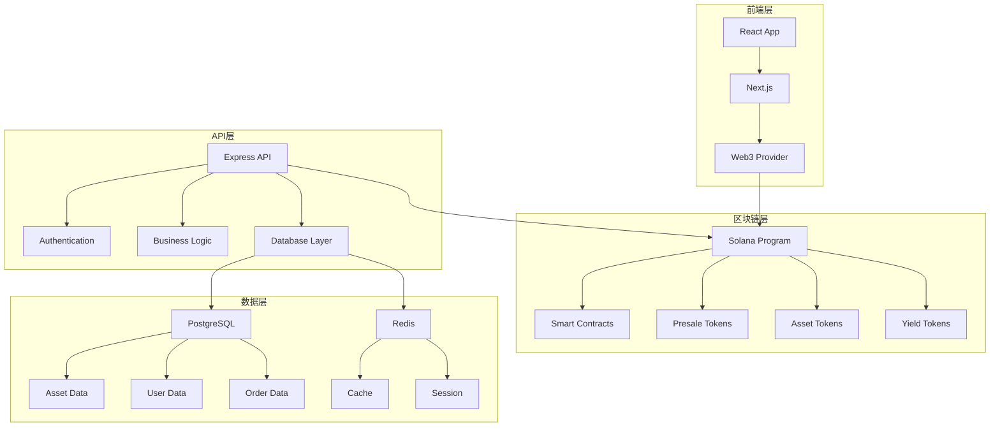

# RWA Presale Platform 实物资产预售平台 - 完整项目文档

<div align="center">
  
</div>

## 📋 目录
1. [项目概述](#1-项目概述)
2. [技术架构](#2-技术架构)
3. [核心功能模块](#3-核心功能模块)
4. [开发路线图](#4-开发路线图)
5. [技术实现指南](#5-技术实现指南)
6. [实施检查清单](#6-实施检查清单)
7. [项目总结](#7-项目总结)

---

## 1. 项目概述

### 1.1 项目背景
RWA Presale Platform是一个基于RWA（Real World Asset）技术的通用实物资产预售平台，旨在连接资产提供者和投资者，通过区块链技术实现各类实物资产的预售、管理和交易。

### 1.2 核心价值主张
- **资产提供者赋能**: 提前获得资金支持，降低市场风险
- **投资者保障**: 优质资产投资机会，透明化交易
- **透明溯源**: 全链路区块链溯源，质量保证
- **智能合约**: 自动化风险管理和资金托管

### 1.3 支持的资产类型

#### 🏗️ 房地产类
- **住宅地产**: 公寓、别墅、联排住宅
- **商业地产**: 办公楼、商场、酒店
- **土地开发**: 住宅用地、商业用地、工业用地
- **基础设施**: 道路、桥梁、公共设施

#### 🌾 农产品类
- **季节性农产品**: 水果、蔬菜、谷物
- **有机食品**: 有机蔬菜、有机水果、有机谷物
- **特色农产品**: 地方特产、稀有农产品
- **畜牧产品**: 肉类、蛋类、奶制品

#### 🎨 艺术品类
- **传统艺术**: 绘画、雕塑、摄影
- **数字艺术**: NFT艺术品、数字收藏品
- **收藏品**: 邮票、硬币、古董
- **珠宝首饰**: 钻石、宝石、贵金属首饰

#### 💎 奢侈品类
- **名表**: 瑞士名表、限量版手表
- **珠宝**: 钻石、宝石、珍珠
- **豪车**: 跑车、豪华轿车、定制车
- **限量商品**: 限量版包包、服装、配饰

#### ⚡ 能源类
- **可再生能源**: 太阳能、风能、水能
- **储能项目**: 电池储能、抽水蓄能
- **能源基础设施**: 电网、充电站
- **碳信用**: 碳减排项目、碳交易

#### 🏭 制造业类
- **电子产品**: 手机、电脑、家电
- **机械设备**: 工业设备、农业机械
- **定制产品**: 个性化定制商品
- **原材料**: 钢材、铝材、塑料

#### 🏔️ 矿产类
- **贵金属**: 黄金、白银、铂金
- **稀有金属**: 稀土、锂、钴
- **宝石**: 钻石、红宝石、蓝宝石
- **能源矿产**: 煤炭、石油、天然气

### 1.4 技术栈选择
```
前端: React 18 + TypeScript + Next.js 14 + Tailwind CSS
后端: Node.js + Express.js + TypeScript + PostgreSQL + Redis
区块链: Solana + Anchor Framework + Metaplex
部署: Docker + AWS/Vercel + GitHub Actions
```

---

## 2. 技术架构

### 2.1 系统架构图


### 2.2 项目结构
```
rwa-presale-platform/
├── frontend/                 # Next.js前端
├── backend/                  # Express后端
├── blockchain/               # Solana程序
├── docs/                    # 项目文档
└── docker-compose.yml       # Docker配置
```

---

## 3. 核心功能模块

### 3.1 资产提供者管理系统

#### 功能特性
- 资产信息注册和管理
- 预售活动创建
- 订单管理和交付
- 收益分配管理

#### 技术实现
```typescript
// 资产提供者服务
interface AssetProviderService {
  registerAsset(assetData: AssetData): Promise<Asset>
  createPresale(presaleData: PresaleData): Promise<Presale>
  updateAsset(assetId: string, data: AssetData): Promise<Asset>
  manageOrders(providerId: string): Promise<Order[]>
  distributeYield(assetId: string, amount: number): Promise<Distribution>
}

// 数据库设计
CREATE TABLE assets (
  id UUID PRIMARY KEY DEFAULT gen_random_uuid(),
  provider_id UUID REFERENCES users(id),
  name VARCHAR(255) NOT NULL,
  category AssetCategory NOT NULL,
  subcategory VARCHAR(100),
  description TEXT,
  location VARCHAR(500),
  expected_delivery_date DATE,
  expected_value DECIMAL(15,2),
  presale_price DECIMAL(15,2),
  retail_price DECIMAL(15,2),
  status AssetStatus DEFAULT 'pending',
  created_at TIMESTAMP DEFAULT NOW()
);

CREATE TABLE asset_details (
  id UUID PRIMARY KEY DEFAULT gen_random_uuid(),
  asset_id UUID REFERENCES assets(id),
  detail_type VARCHAR(50) NOT NULL,
  detail_data JSONB NOT NULL,
  created_at TIMESTAMP DEFAULT NOW()
);

enum AssetCategory {
  REAL_ESTATE
  AGRICULTURE
  ART
  LUXURY
  ENERGY
  MANUFACTURING
  MINING
  OTHER
}

enum AssetStatus {
  PENDING
  APPROVED
  REJECTED
  ACTIVE
  COMPLETED
  CANCELLED
}
```

### 3.2 投资者购买系统

#### 功能特性
- 资产浏览和搜索
- 预售订单下单
- 支付和钱包管理
- 投资组合管理

#### 技术实现
```typescript
// 投资者服务
interface InvestorService {
  browseAssets(filters: AssetFilters): Promise<Asset[]>
  placePresaleOrder(orderData: OrderData): Promise<Order>
  trackOrder(orderId: string): Promise<OrderStatus>
  managePortfolio(investorId: string): Promise<Portfolio>
  claimYield(assetId: string): Promise<Yield>
}

// 订单系统
CREATE TABLE presale_orders (
  id UUID PRIMARY KEY DEFAULT gen_random_uuid(),
  investor_id UUID REFERENCES users(id),
  asset_id UUID REFERENCES assets(id),
  quantity DECIMAL(10,2) NOT NULL,
  total_amount DECIMAL(15,2) NOT NULL,
  presale_token_address VARCHAR(44),
  asset_token_address VARCHAR(44),
  status OrderStatus DEFAULT 'pending',
  created_at TIMESTAMP DEFAULT NOW()
);

CREATE TABLE portfolios (
  id UUID PRIMARY KEY DEFAULT gen_random_uuid(),
  investor_id UUID REFERENCES users(id),
  asset_id UUID REFERENCES assets(id),
  token_amount DECIMAL(20,8) NOT NULL,
  purchase_price DECIMAL(15,2) NOT NULL,
  current_value DECIMAL(15,2),
  yield_earned DECIMAL(15,2) DEFAULT 0,
  created_at TIMESTAMP DEFAULT NOW()
);
```

### 3.3 预售智能合约系统

#### 功能特性
- 预售代币创建
- 资金托管和释放
- 条件触发机制
- 自动退款处理

#### 技术实现
```rust
// Solana智能合约
#[program]
pub mod rwa_presale {
    use super::*;

    pub fn create_presale(
        ctx: Context<CreatePresale>,
        presale_data: PresaleData,
    ) -> Result<()> {
        let presale = &mut ctx.accounts.presale;
        presale.provider = ctx.accounts.provider.key();
        presale.asset = presale_data.asset;
        presale.target_amount = presale_data.target_amount;
        presale.min_amount = presale_data.min_amount;
        presale.delivery_date = presale_data.delivery_date;
        presale.conditions = presale_data.conditions;
        presale.status = PresaleStatus::Active;
        Ok(())
    }

    pub fn purchase_presale(
        ctx: Context<PurchasePresale>,
        amount: u64,
    ) -> Result<()> {
        let presale = &mut ctx.accounts.presale;
        let investor = &ctx.accounts.investor;
        
        // 检查预售状态
        require!(presale.status == PresaleStatus::Active, ErrorCode::PresaleNotActive);
        
        // 检查条件
        require!(self.check_conditions(&presale.conditions)?, ErrorCode::ConditionsNotMet);
        
        // 转移资金
        let transfer_instruction = Transfer {
            from: investor.to_account_info(),
            to: presale.to_account_info(),
            authority: investor.to_account_info(),
        };
        transfer_instruction.invoke_signed(&[&[&[ctx.bumps.investor]])?;
        
        // 铸造预售代币
        let presale_token = &mut ctx.accounts.presale_token;
        presale_token.owner = investor.key();
        presale_token.amount = amount;
        presale_token.presale = presale.key();
        
        Ok(())
    }

    pub fn release_funds(
        ctx: Context<ReleaseFunds>,
        delivery_data: DeliveryData,
    ) -> Result<()> {
        let presale = &mut ctx.accounts.presale;
        let provider = &ctx.accounts.provider;
        
        // 验证交付条件
        require!(self.verify_delivery(&delivery_data)?, ErrorCode::DeliveryNotVerified);
        
        // 释放资金给资产提供者
        let transfer_instruction = Transfer {
            from: presale.to_account_info(),
            to: provider.to_account_info(),
            authority: presale.to_account_info(),
        };
        transfer_instruction.invoke_signed(&[&[&[ctx.bumps.presale]])?;
        
        // 铸造资产代币
        let asset_token = &mut ctx.accounts.asset_token;
        asset_token.owner = presale.key();
        asset_token.asset = presale.asset;
        asset_token.amount = presale.total_raised;
        
        presale.status = PresaleStatus::Completed;
        Ok(())
    }

    pub fn distribute_yield(
        ctx: Context<DistributeYield>,
        yield_amount: u64,
    ) -> Result<()> {
        let asset_token = &ctx.accounts.asset_token;
        let yield_token = &mut ctx.accounts.yield_token;
        
        // 按比例分配收益
        let total_supply = asset_token.amount;
        let investor_share = (yield_amount * asset_token.amount) / total_supply;
        
        yield_token.owner = asset_token.owner;
        yield_token.amount = investor_share;
        yield_token.asset = asset_token.asset;
        
        Ok(())
    }
}

#[derive(AnchorSerialize, AnchorDeserialize)]
pub struct PresaleData {
    pub asset: Pubkey,
    pub target_amount: u64,
    pub min_amount: u64,
    pub delivery_date: i64,
    pub conditions: Vec<Condition>,
}

#[derive(AnchorSerialize, AnchorDeserialize)]
pub struct Condition {
    pub condition_type: String,
    pub parameters: Vec<u8>,
    pub threshold: u64,
}

#[derive(AnchorSerialize, AnchorDeserialize)]
pub struct DeliveryData {
    pub delivery_date: i64,
    pub quality_score: u8,
    pub quantity_delivered: u64,
    pub verification_data: Vec<u8>,
}
```

### 3.4 溯源和认证系统

#### 功能特性
- 资产溯源记录
- 质量认证上链
- 生产过程记录
- 所有权变更追踪

#### 技术实现
```typescript
// 溯源服务
interface TraceabilityService {
  recordCreation(creationData: CreationData): Promise<TraceRecord>
  recordProcess(processData: ProcessData): Promise<TraceRecord>
  recordQuality(qualityData: QualityData): Promise<TraceRecord>
  recordDelivery(deliveryData: DeliveryData): Promise<TraceRecord>
  recordOwnership(ownershipData: OwnershipData): Promise<TraceRecord>
  getTraceability(assetId: string): Promise<TraceRecord[]>
}

// 溯源记录
CREATE TABLE traceability_records (
  id UUID PRIMARY KEY DEFAULT gen_random_uuid(),
  asset_id UUID REFERENCES assets(id),
  record_type TraceRecordType NOT NULL,
  data_hash VARCHAR(64) NOT NULL,
  blockchain_tx VARCHAR(44),
  verified_by UUID REFERENCES users(id),
  recorded_at TIMESTAMP DEFAULT NOW()
);

enum TraceRecordType {
  CREATION
  PROCESS
  QUALITY_CHECK
  DELIVERY
  OWNERSHIP_CHANGE
  CERTIFICATION
}
```

### 3.5 RWA代币经济系统

#### 功能特性
- 实物资产代币化
- 预售代币交易
- 流动性挖矿
- 质押和收益

#### 技术实现
```typescript
// 代币经济服务
interface TokenEconomyService {
  mintPresaleToken(presaleId: string, amount: number): Promise<Token>
  mintAssetToken(assetId: string, amount: number): Promise<Token>
  mintYieldToken(assetId: string, amount: number): Promise<Token>
  createLiquidityPool(tokenA: string, tokenB: string): Promise<Pool>
  stakeTokens(tokenId: string, amount: number): Promise<StakePosition>
  claimRewards(stakeId: string): Promise<Reward>
  swapTokens(tokenIn: string, tokenOut: string, amount: number): Promise<Swap>
}

// 代币类型
enum TokenType {
  PRESALE_TOKEN    // 预售代币
  ASSET_TOKEN      // 资产代币
  YIELD_TOKEN      // 收益代币
  GOVERNANCE_TOKEN // 治理代币
  LIQUIDITY_TOKEN  // 流动性代币
}
```

---

## 4. 开发路线图

### 4.1 总开发周期：18周

| 阶段 | 时间 | 主要任务 |
|------|------|----------|
| **阶段1** | 第1-2周 | 项目初始化与架构设计 |
| **阶段2** | 第3-4周 | 核心基础设施开发 |
| **阶段3** | 第5-6周 | 资产提供者管理系统 |
| **阶段4** | 第7-8周 | 投资者购买系统 |
| **阶段5** | 第9-10周 | 预售智能合约 |
| **阶段6** | 第11-12周 | 溯源和认证系统 |
| **阶段7** | 第13-14周 | RWA代币系统 |
| **阶段8** | 第15-16周 | 前端界面开发 |
| **阶段9** | 第17-18周 | 测试与部署 |

### 4.2 关键里程碑

| 里程碑 | 时间 | 交付物 |
|--------|------|--------|
| 项目架构完成 | 第2周末 | 完整的技术架构文档 |
| 资产提供者系统完成 | 第6周末 | 资产管理功能 |
| 投资者系统完成 | 第8周末 | 购买和投资功能 |
| 智能合约完成 | 第10周末 | 预售合约系统 |
| 溯源系统完成 | 第12周末 | 区块链溯源功能 |
| 代币系统完成 | 第14周末 | RWA代币经济 |
| 前端界面完成 | 第16周末 | 完整的用户界面 |
| 正式上线 | 第18周末 | 生产环境应用 |

---

## 5. 技术实现指南

### 5.1 项目初始化

#### 环境配置
```bash
# 创建项目目录
mkdir rwa-presale-platform
cd rwa-presale-platform

# 初始化前端项目
npx create-next-app@latest frontend --typescript --tailwind --eslint
cd frontend
npm install @solana/web3.js @solana/wallet-adapter-react @solana/wallet-adapter-wallets
npm install zustand @tanstack/react-query axios

# 初始化后端项目
cd ../backend
npm init -y
npm install express typescript @types/node @types/express
npm install prisma @prisma/client bcryptjs jsonwebtoken
npm install @solana/web3.js @project-serum/anchor
npm install redis ioredis

# 初始化数据库
npx prisma init
```

#### 数据库配置 (Prisma)
```prisma
// prisma/schema.prisma
generator client {
  provider = "prisma-client-js"
}

datasource db {
  provider = "postgresql"
  url      = env("DATABASE_URL")
}

model User {
  id            String   @id @default(cuid())
  email         String   @unique
  passwordHash  String?
  walletAddress String?
  role          UserRole @default(INVESTOR)
  isVerified    Boolean  @default(false)
  kycStatus     KYCStatus @default(PENDING)
  createdAt     DateTime @default(now())
  updatedAt     DateTime @updatedAt

  assets        Asset[]
  orders        PresaleOrder[]
  portfolios    Portfolio[]
  traceRecords  TraceabilityRecord[]
}

model Asset {
  id                  String       @id @default(cuid())
  providerId          String
  name                String
  category            AssetCategory
  subcategory         String?
  description         String?
  location            String?
  expectedDeliveryDate DateTime?
  expectedValue       Decimal
  presalePrice        Decimal
  retailPrice         Decimal
  status              AssetStatus  @default(PENDING)
  createdAt           DateTime     @default(now())

  provider            User         @relation(fields: [providerId], references: [id])
  presales            Presale[]
  orders              PresaleOrder[]
  portfolios          Portfolio[]
  traceRecords        TraceabilityRecord[]
  details             AssetDetail[]
}

model AssetDetail {
  id         String   @id @default(cuid())
  assetId    String
  detailType String
  detailData Json
  createdAt  DateTime @default(now())

  asset      Asset    @relation(fields: [assetId], references: [id])
}

enum UserRole {
  ASSET_PROVIDER
  INVESTOR
  ADMIN
  VERIFIER
}

enum KYCStatus {
  PENDING
  APPROVED
  REJECTED
}

enum AssetCategory {
  REAL_ESTATE
  AGRICULTURE
  ART
  LUXURY
  ENERGY
  MANUFACTURING
  MINING
  OTHER
}

enum AssetStatus {
  PENDING
  APPROVED
  REJECTED
  ACTIVE
  COMPLETED
  CANCELLED
}
```

### 5.2 后端实现

#### 资产提供者服务
```typescript
// src/services/assetProviderService.ts
export class AssetProviderService {
  async registerAsset(providerId: string, assetData: AssetData): Promise<Asset> {
    const asset = await prisma.asset.create({
      data: {
        providerId,
        name: assetData.name,
        category: assetData.category,
        subcategory: assetData.subcategory,
        description: assetData.description,
        location: assetData.location,
        expectedDeliveryDate: assetData.expectedDeliveryDate,
        expectedValue: assetData.expectedValue,
        presalePrice: assetData.presalePrice,
        retailPrice: assetData.retailPrice
      }
    });

    // 创建资产详情
    if (assetData.details) {
      await prisma.assetDetail.createMany({
        data: assetData.details.map(detail => ({
          assetId: asset.id,
          detailType: detail.type,
          detailData: detail.data
        }))
      });
    }

    return asset;
  }

  async createPresale(assetId: string, presaleData: PresaleData): Promise<Presale> {
    // 创建预售活动
    const presale = await prisma.presale.create({
      data: {
        assetId,
        targetAmount: presaleData.targetAmount,
        minAmount: presaleData.minAmount,
        deliveryDate: presaleData.deliveryDate,
        conditions: presaleData.conditions,
        status: 'ACTIVE'
      }
    });

    // 在区块链上创建预售代币
    const tokenAddress = await this.blockchainService.createPresaleToken(presale.id, presaleData);

    // 更新预售记录
    await prisma.presale.update({
      where: { id: presale.id },
      data: { tokenAddress }
    });

    return presale;
  }

  async updateAsset(assetId: string, data: AssetData): Promise<Asset> {
    const asset = await prisma.asset.update({
      where: { id: assetId },
      data: {
        name: data.name,
        category: data.category,
        subcategory: data.subcategory,
        description: data.description,
        location: data.location,
        expectedDeliveryDate: data.expectedDeliveryDate,
        expectedValue: data.expectedValue,
        presalePrice: data.presalePrice,
        retailPrice: data.retailPrice
      }
    });

    return asset;
  }
}
```

#### 投资者服务
```typescript
// src/services/investorService.ts
export class InvestorService {
  async browseAssets(filters: AssetFilters): Promise<Asset[]> {
    const assets = await prisma.asset.findMany({
      where: {
        category: filters.category,
        subcategory: filters.subcategory,
        status: 'ACTIVE',
        presales: {
          some: {
            status: 'ACTIVE'
          }
        }
      },
      include: {
        provider: true,
        presales: {
          where: { status: 'ACTIVE' }
        },
        details: true
      }
    });

    return assets;
  }

  async placePresaleOrder(investorId: string, orderData: OrderData): Promise<PresaleOrder> {
    // 创建预售订单
    const order = await prisma.presaleOrder.create({
      data: {
        investorId,
        assetId: orderData.assetId,
        quantity: orderData.quantity,
        totalAmount: orderData.totalAmount,
        status: 'PENDING'
      }
    });

    // 在区块链上购买预售代币
    const tokenAddress = await this.blockchainService.purchasePresaleToken(
      orderData.presaleId,
      orderData.amount,
      investorId
    );

    // 更新订单
    await prisma.presaleOrder.update({
      where: { id: order.id },
      data: { presaleTokenAddress: tokenAddress, status: 'CONFIRMED' }
    });

    // 更新投资组合
    await prisma.portfolio.create({
      data: {
        investorId,
        assetId: orderData.assetId,
        tokenAmount: orderData.quantity,
        purchasePrice: orderData.totalAmount,
        currentValue: orderData.totalAmount
      }
    });

    return order;
  }

  async managePortfolio(investorId: string): Promise<Portfolio[]> {
    const portfolio = await prisma.portfolio.findMany({
      where: { investorId },
      include: {
        asset: {
          include: {
            provider: true,
            presales: true
          }
        }
      }
    });

    return portfolio;
  }
}
```

### 5.3 前端实现

#### 资产提供者仪表板
```typescript
// src/components/AssetProviderDashboard.tsx
export const AssetProviderDashboard: React.FC = () => {
  const { user } = useAuthStore();
  const [assets, setAssets] = useState<Asset[]>([]);
  const [presales, setPresales] = useState<Presale[]>([]);

  const { data: assetData } = useQuery({
    queryKey: ['assets', user?.id],
    queryFn: () => assetProviderService.getAssets(user?.id!),
    enabled: !!user?.id
  });

  const { data: presaleData } = useQuery({
    queryKey: ['presales', user?.id],
    queryFn: () => assetProviderService.getPresales(user?.id!),
    enabled: !!user?.id
  });

  return (
    <div className="max-w-7xl mx-auto p-6">
      <div className="mb-8">
        <h1 className="text-3xl font-bold">资产提供者仪表板</h1>
        <p className="text-gray-600">管理您的资产和预售活动</p>
      </div>

      <div className="grid grid-cols-1 lg:grid-cols-3 gap-6">
        {/* 资产概览 */}
        <div className="lg:col-span-2">
          <div className="bg-white rounded-lg shadow-md p-6">
            <h2 className="text-xl font-semibold mb-4">我的资产</h2>
            {assetData?.map(asset => (
              <div key={asset.id} className="border-b py-4">
                <h3 className="font-medium">{asset.name}</h3>
                <p className="text-gray-600">{asset.category} - {asset.subcategory}</p>
                <p className="text-sm text-gray-500">状态: {asset.status}</p>
                <p className="text-sm text-gray-500">预期价值: ${asset.expectedValue}</p>
              </div>
            ))}
            <button className="mt-4 px-4 py-2 bg-blue-600 text-white rounded">
              添加新资产
            </button>
          </div>
        </div>

        {/* 预售活动 */}
        <div>
          <div className="bg-white rounded-lg shadow-md p-6">
            <h2 className="text-xl font-semibold mb-4">预售活动</h2>
            {presaleData?.map(presale => (
              <div key={presale.id} className="border-b py-4">
                <h3 className="font-medium">{presale.asset.name}</h3>
                <p className="text-gray-600">目标: ${presale.targetAmount}</p>
                <p className="text-sm text-gray-500">状态: {presale.status}</p>
              </div>
            ))}
            <button className="mt-4 px-4 py-2 bg-green-600 text-white rounded">
              创建预售
            </button>
          </div>
        </div>
      </div>
    </div>
  );
};
```

#### 投资者市场界面
```typescript
// src/components/AssetMarketplace.tsx
export const AssetMarketplace: React.FC = () => {
  const [filters, setFilters] = useState<AssetFilters>({});
  const [selectedAsset, setSelectedAsset] = useState<Asset | null>(null);

  const { data: assets, isLoading } = useQuery({
    queryKey: ['assets', filters],
    queryFn: () => investorService.browseAssets(filters)
  });

  const purchaseMutation = useMutation({
    mutationFn: (orderData: OrderData) => investorService.placePresaleOrder(orderData),
    onSuccess: () => {
      toast.success('预售订单创建成功！');
    }
  });

  const handlePurchase = async (asset: Asset, quantity: number) => {
    const orderData = {
      assetId: asset.id,
      quantity,
      totalAmount: asset.presalePrice * quantity,
      presaleId: asset.presales[0]?.id
    };

    await purchaseMutation.mutateAsync(orderData);
  };

  return (
    <div className="max-w-7xl mx-auto p-6">
      <div className="mb-8">
        <h1 className="text-3xl font-bold">实物资产预售市场</h1>
        <p className="text-gray-600">发现优质资产，提前投资</p>
      </div>

      {/* 筛选器 */}
      <div className="bg-white rounded-lg shadow-md p-6 mb-6">
        <div className="grid grid-cols-1 md:grid-cols-4 gap-4">
          <select 
            value={filters.category || ''} 
            onChange={(e) => setFilters({...filters, category: e.target.value})}
            className="border rounded px-3 py-2"
          >
            <option value="">所有类别</option>
            <option value="REAL_ESTATE">房地产</option>
            <option value="AGRICULTURE">农产品</option>
            <option value="ART">艺术品</option>
            <option value="LUXURY">奢侈品</option>
            <option value="ENERGY">能源</option>
            <option value="MANUFACTURING">制造业</option>
            <option value="MINING">矿产</option>
          </select>
          
          <select 
            value={filters.subcategory || ''} 
            onChange={(e) => setFilters({...filters, subcategory: e.target.value})}
            className="border rounded px-3 py-2"
          >
            <option value="">所有子类别</option>
            {/* 根据主类别动态加载子类别 */}
          </select>
        </div>
      </div>

      {/* 资产列表 */}
      <div className="grid grid-cols-1 md:grid-cols-2 lg:grid-cols-3 gap-6">
        {assets?.map(asset => (
          <div key={asset.id} className="bg-white rounded-lg shadow-md overflow-hidden">
            <div className="p-6">
              <h3 className="text-lg font-semibold mb-2">{asset.name}</h3>
              <p className="text-gray-600 mb-2">{asset.description}</p>
              <p className="text-sm text-gray-500 mb-4">
                {asset.category} - {asset.subcategory}
              </p>
              
              <div className="flex justify-between items-center mb-4">
                <div>
                  <p className="text-lg font-bold text-green-600">
                    ${asset.presalePrice}
                  </p>
                  <p className="text-sm text-gray-500">
                    零售价: ${asset.retailPrice}
                  </p>
                </div>
                <div className="text-right">
                  <p className="text-sm text-gray-500">预期交付</p>
                  <p className="text-sm font-medium">
                    {new Date(asset.expectedDeliveryDate!).toLocaleDateString()}
                  </p>
                </div>
              </div>

              <button 
                onClick={() => handlePurchase(asset, 1)}
                disabled={purchaseMutation.isPending}
                className="w-full px-4 py-2 bg-blue-600 text-white rounded hover:bg-blue-700 disabled:opacity-50"
              >
                {purchaseMutation.isPending ? '处理中...' : '立即投资'}
              </button>
            </div>
          </div>
        ))}
      </div>
    </div>
  );
};
```

---

## 6. 实施检查清单

### 6.1 项目启动检查清单

#### 环境准备
- [ ] Node.js 18+ 已安装
- [ ] PostgreSQL 15+ 已安装
- [ ] Redis 7+ 已安装
- [ ] Docker & Docker Compose 已安装
- [ ] Solana CLI 工具已安装
- [ ] Anchor CLI 已安装

#### 项目初始化
- [ ] 项目仓库已创建
- [ ] 项目结构已建立
- [ ] 环境配置文件已创建
- [ ] 依赖包已安装
- [ ] 数据库连接已测试
- [ ] 开发服务器可正常启动

### 6.2 阶段检查清单

#### 阶段1: 项目初始化与架构设计 (第1-2周)
- [ ] 系统架构图已完成
- [ ] 数据库ER图已完成
- [ ] API接口文档已完成
- [ ] 智能合约架构设计已完成
- [ ] 需求文档已完成

#### 阶段2: 核心基础设施开发 (第3-4周)
- [ ] Express.js 框架已搭建
- [ ] TypeScript 配置已完成
- [ ] Prisma ORM 已配置
- [ ] Redis 缓存已集成
- [ ] Next.js 项目已搭建
- [ ] Solana 钱包已集成

#### 阶段3: 资产提供者管理系统 (第5-6周)
- [ ] 资产注册功能已实现
- [ ] 资产管理功能已实现
- [ ] 预售活动创建已实现
- [ ] 订单管理已实现
- [ ] 资产提供者界面已开发

#### 阶段4: 投资者购买系统 (第7-8周)
- [ ] 资产浏览功能已实现
- [ ] 预售下单功能已实现
- [ ] 支付系统已集成
- [ ] 投资组合管理已实现
- [ ] 投资者界面已开发

#### 阶段5: 预售智能合约 (第9-10周)
- [ ] 预售合约已开发
- [ ] 代币铸造功能已实现
- [ ] 资金托管机制已实现
- [ ] 条件触发机制已实现
- [ ] 合约测试已完成

#### 阶段6: 溯源和认证系统 (第11-12周)
- [ ] 溯源记录功能已实现
- [ ] 质量认证上链已实现
- [ ] 过程记录功能已实现
- [ ] 所有权追踪已实现
- [ ] 溯源界面已开发

#### 阶段7: RWA代币系统 (第13-14周)
- [ ] 代币经济模型已实现
- [ ] 流动性池已创建
- [ ] 质押机制已实现
- [ ] 收益分配已实现
- [ ] 代币界面已开发

#### 阶段8: 前端界面开发 (第15-16周)
- [ ] UI/UX设计已完成
- [ ] 响应式设计已实现
- [ ] 用户体验已优化
- [ ] 移动端适配已完成
- [ ] 性能优化已完成

#### 阶段9: 测试与部署 (第17-18周)
- [ ] 单元测试已编写
- [ ] 集成测试已完成
- [ ] 安全测试已完成
- [ ] 性能测试已完成
- [ ] 生产部署已完成

---

## 7. 项目总结

### 7.1 成功指标

#### 技术指标
- 系统可用性：99.9%
- API响应时间：< 200ms
- 并发用户支持：10,000+
- 数据准确性：99.99%

#### 业务指标
- 资产提供者：5,000+ 首年
- 投资者用户：100,000+ 首年
- 预售成功率：90%+
- 用户满意度：4.5/5

#### 财务指标
- 平台交易额：$50,000,000+ 首年
- 平台手续费收入：$2,500,000+ 首年
- 资产提供者资金支持：$20,000,000+ 首年
- 利润率：30%+

### 7.2 风险管理

#### 技术风险
- **区块链技术风险**: 选择成熟的Solana生态
- **智能合约风险**: 代码审计和形式化验证
- **性能风险**: 使用CDN、缓存策略

#### 业务风险
- **市场风险**: 资产价格波动
- **监管风险**: 金融监管法规
- **合规风险**: KYC/AML要求

#### 项目风险
- **进度风险**: 严格控制时间线
- **质量风险**: 代码审查、自动化测试
- **资源风险**: 确保团队技能匹配

### 7.3 商业模式

#### 收入来源
1. **平台手续费**: 预售交易手续费
2. **认证服务费**: 资产认证和溯源服务
3. **代币交易费**: 代币交易手续费
4. **增值服务费**: 数据分析、营销推广

#### 成本结构
1. **技术基础设施**: 30%
2. **运营成本**: 25%
3. **营销推广**: 20%
4. **团队成本**: 15%
5. **其他费用**: 10%

### 7.4 团队要求

#### 核心团队
- **项目经理**: 项目管理和协调
- **技术负责人**: 技术架构和开发
- **产品经理**: 产品设计和用户需求
- **UI/UX设计师**: 用户界面设计
- **前端开发**: React/Next.js开发
- **后端开发**: Node.js/Express开发
- **区块链开发**: Solana/Anchor开发
- **DevOps工程师**: 部署和运维
- **测试工程师**: 质量保证
- **金融专家**: 金融合规和风控

### 7.5 投资回报分析

#### 投资需求
- **种子轮**: $1,000,000
- **A轮**: $5,000,000
- **B轮**: $15,000,000

#### 预期回报
- **3年ROI**: 500%
- **5年ROI**: 1200%
- **退出估值**: $200M-500M

### 7.6 创新亮点

#### 1. 通用RWA平台
- 支持多种实物资产类型
- 标准化的代币化流程
- 灵活的预售机制

#### 2. 智能预售机制
- 基于多种条件的触发机制
- 自动化的风险管理和补偿
- 透明的资金管理

#### 3. 全链路溯源
- 区块链上的资产溯源
- 不可篡改的记录
- 透明的供应链管理

#### 4. 资产提供者赋能
- 提前获得资金支持
- 降低市场风险
- 建立稳定的投资者关系

### 7.7 未来发展规划

#### 短期目标（6个月）
- 完成MVP开发
- 获得首批资产提供者和投资者
- 建立合作伙伴关系
- 获得种子轮融资

#### 中期目标（1-2年）
- 扩展到更多资产类别
- 建立全球资产网络
- 实现盈利
- 获得A轮融资

#### 长期目标（3-5年）
- 成为RWA预售平台领导者
- 建立全球资产交易网络
- 推动金融创新
- 实现可持续发展

---

## 8. 快速开始指南

### 8.1 项目初始化
```bash
# 克隆项目
git clone https://github.com/zane0623/RWA.git
cd RWA

# 运行初始化脚本
chmod +x setup_project.sh
./setup_project.sh

# 配置环境变量
cp .env.example .env
# 编辑 .env 文件，填入相应的配置

# 启动开发环境
npm run dev
```

### 8.2 开发命令
```bash
# 启动开发服务器
npm run dev

# 构建项目
npm run build

# 运行测试
npm run test

# 数据库迁移
npm run db:migrate

# 启动Docker服务
npm run docker:up
```

### 8.3 部署命令
```bash
# 构建生产版本
npm run build

# 部署到生产环境
npm run deploy

# 监控系统状态
npm run monitor
```

---

## 9. 联系信息

### 项目团队
- **项目经理**: [Your Name]
- **技术负责人**: [Your Name]
- **产品负责人**: [Your Name]

### 联系方式
- **邮箱**: [your.email@example.com]
- **项目链接**: [https://github.com/zane0623/RWA]
- **文档链接**: [https://docs.rwa-presale.com]

---

**文档版本**: v1.0  
**最后更新**: 2024年12月  
**负责人**: 项目经理  
**审核人**: 技术负责人、产品负责人、投资方代表

---

<div align="center">
  <p><strong>RWA Presale Platform - 重新定义实物资产交易</strong></p>
  <p>通过区块链技术，连接资产提供者和投资者，实现实物资产的预售和交易</p>
</div> 