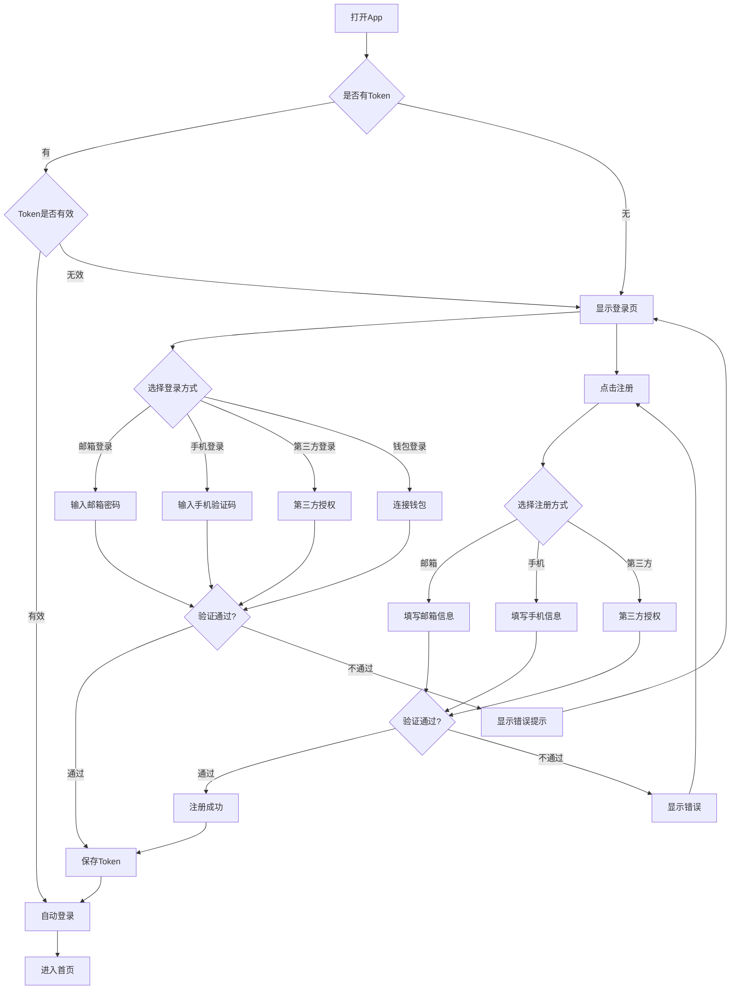
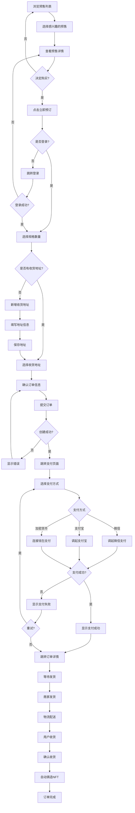
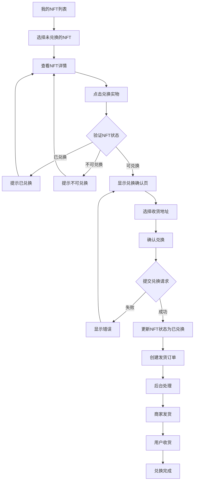
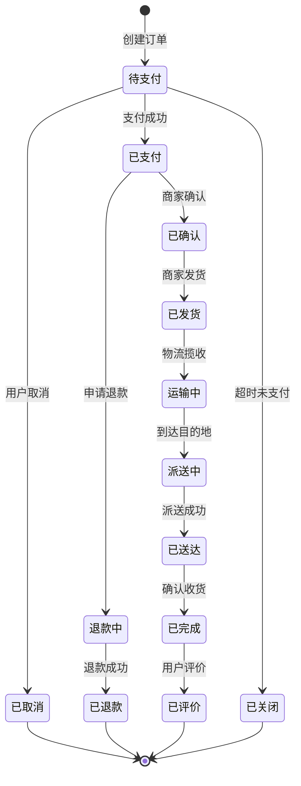
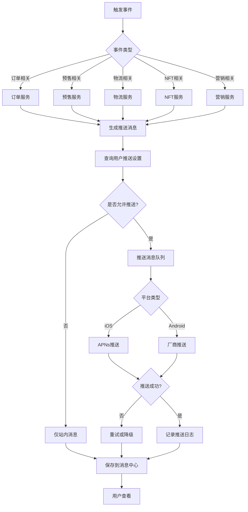

# 钜园农业NFT预售平台 - 移动端应用PRD
## Product Requirements Document

---

**文档版本**: V3.0  
**文档状态**: 评审中  
**创建日期**: 2025年10月28日  
**最后更新**: 2025年10月31日  

**文档所有者**: 产品团队  
**项目代号**: Lychee Mobile  
**优先级**: P0（高优先级）  
**项目周期**: 预计2-3个月  
**项目预算**: 待评估  
**ROI预期**: 6个月内收回投资

---

## 📑 目录

1. [项目概述](#一项目概述)
2. [市场分析](#二市场分析)
3. [产品定位](#三产品定位)
4. [功能需求](#四功能需求)
5. [技术方案](#五技术方案)
6. [设计规范](#六设计规范)
7. [非功能性需求](#七非功能性需求)
8. [数据埋点](#八数据埋点)
9. [风险评估](#九风险评估)
10. [项目规划](#十项目规划)
11. [用户故事](#十一用户故事)
12. [业务流程](#十二业务流程)
13. [测试策略](#十三测试策略)
14. [运营策略](#十四运营策略)
15. [附录](#十五附录)
16. [竞品深度分析](#十六竞品深度分析)
17. [数据指标体系](#十七数据指标体系)
18. [上线Checklist](#十八上线checklist)
19. [应急预案](#十九应急预案)
20. [A/B测试方案](#二十ab测试方案)
21. [用户反馈机制](#二十一用户反馈机制)
22. [版本迭代历史](#二十二版本迭代历史)

---

## 📄 文档修订历史

| 版本 | 日期 | 修订内容 | 修订人 | 审核人 | 状态 |
|------|------|----------|--------|--------|------|
| 0.1  | 2025-10-20 | 初始草稿创建 | 产品经理 | - | 草稿 |
| 0.5  | 2025-10-25 | 补充功能细节和用户流程 | 产品经理 | 技术负责人 | 评审中 |
| 1.0  | 2025-10-28 | 正式版本发布 | 产品经理 | 全体 | 已评审 |
| 2.0  | 2025-10-30 | 完善用户故事、业务流程、测试用例等 | 产品经理 | - | 已评审 |
| 3.0  | 2025-10-31 | 新增竞品分析、数据指标、上线Checklist、应急预案、A/B测试、反馈机制、市场推广等 | 产品经理 | - | 评审中 |

---

## 一、项目概述

### 1.1 项目背景

钜园农业NFT预售平台于2024年Q4上线Web端，通过区块链技术实现农产品的数字化预售、溯源和NFT凭证发行。经过3个月的运营，平台取得了初步成果：

**现状数据**（截至2025年1月）：
- 注册用户：3,200+
- 完成预售项目：6个
- 累计交易额：¥120万+
- 用户满意度：4.3/5.0

**市场趋势**：
- 农产品电商移动端交易占比达75%以上
- NFT/Web3应用用户中82%通过移动端访问
- 85%的目标用户表示更倾向使用移动App
- 竞品纷纷推出移动端应用

**用户反馈**：
通过用户调研（样本量：500人），我们发现：
- 68%的用户希望有移动端应用
- 主要诉求：随时随地浏览预售、接收通知提醒、便捷支付
- 痛点：Web端在手机浏览器体验不佳、操作不便

**战略意义**：
- 抢占移动端市场先机
- 提升用户粘性和活跃度
- 扩大品牌影响力
- 完善产品生态闭环

### 1.2 项目目标

#### 1.2.1 业务目标

**核心指标（3个月内）**：

| 指标 | 当前值 | 目标值 | 增长率 |
|------|--------|--------|--------|
| 注册用户数 | 3,200 | 13,200+ | +312% |
| DAU（日活） | 200 | 800+ | +300% |
| 移动端交易额占比 | 0% | 60%+ | - |
| 订单转化率 | 8% | 10%+ | +25% |
| 用户留存率（7日） | 32% | 45%+ | +40% |

**长期目标（12个月内）**：
- 移动端用户占比达到80%
- App Store评分 > 4.5
- 应用商店自然下载量 > 5万
- 移动端GMV占比 > 70%

#### 1.2.2 产品目标

**MVP版本（V1.0）目标**：
- ✅ 完整复刻Web端核心功能
- ✅ 提供流畅的移动端原生体验
- ✅ 实现iOS和Android双端上架
- ✅ 支持消息推送和离线缓存
- ✅ 通过应用商店审核

**迭代版本目标**：
- V1.1：增加社交分享、收藏、评价功能
- V1.2：优化支付流程，接入更多支付方式
- V2.0：社区功能、直播功能、优惠券系统

#### 1.2.3 技术目标

**性能指标**：
- 冷启动时间 < 3秒
- 热启动时间 < 1秒
- 页面加载时间 < 2秒
- 页面流畅度 ≥ 60fps
- 内存占用 < 200MB
- 崩溃率 < 0.1%
- ANR率 < 0.1%

**架构目标**：
- 100%复用现有后端API
- 代码复用率 > 90%（iOS和Android）
- 模块化设计，便于维护和扩展
- 完善的错误处理和日志系统

### 1.3 项目范围

#### 1.3.1 包含范围 ✅

**平台支持**：
- iOS平台（iOS 13.0+）
- Android平台（Android 6.0+）

**核心功能**：
- 用户认证系统（注册、登录、找回密码）
- 预售浏览和购买
- 订单管理
- NFT资产管理
- 个人中心
- 消息推送

**移动端特性**：
- 下拉刷新、上拉加载
- 手势交互
- 推送通知
- 扫码功能
- 相机调用
- 生物识别

**交付物**：
- iOS和Android应用包
- 应用商店上架资料
- 用户手册
- 技术文档

#### 1.3.2 不包含范围 ❌

**后端相关**：
- 后端API开发或修改（完全复用现有）
- 数据库结构调整
- 智能合约开发或修改

**Web端**：
- Web端功能修改
- Web端性能优化

**运营相关**：
- 运营活动策划
- 用户增长策略
- 营销推广方案

**后期迭代**：
- 社区功能（V2.0）
- 直播功能（V2.0）
- 更多第三方支付集成（V1.2）
- 国际化多语言（V1.3）

### 1.4 成功标准

**上线标准**：
- [ ] 所有P0功能开发完成并测试通过
- [ ] iOS App Store审核通过并上架
- [ ] 至少3个国内主流Android应用商店上架
- [ ] 性能指标达标
- [ ] 安全测试通过

**成功指标（上线后3个月）**：
- [ ] 新增用户 > 10,000
- [ ] 日活用户 > 800
- [ ] App Store评分 > 4.0
- [ ] 崩溃率 < 0.1%
- [ ] 订单转化率提升 > 20%

---

## 二、市场分析

### 2.1 市场规模

**农产品电商市场**：
- 2024年中国农产品电商市场规模：8,000亿+
- 移动端交易占比：75%+
- 年复合增长率：25%+

**NFT市场**：
- 全球NFT市场规模：150亿美元（2024）
- 移动端用户占比：82%
- RWA（现实世界资产）NFT是新兴趋势

**目标市场**：
- 一二线城市高端农产品消费者
- Web3用户群体
- 关注食品安全的家庭用户
- 预计潜在用户规模：500万+

### 2.2 竞争分析

#### 2.2.1 直接竞品

**传统农产品电商（淘宝、京东、拼多多）**

| 维度 | 竞品情况 | 我们的优势 |
|------|----------|-----------|
| 用户规模 | 亿级用户 | 垂直细分市场 |
| 产品品类 | 品类丰富 | 高端精选 |
| 价格 | 价格竞争激烈 | 溯源保真，品质保证 |
| 技术 | 传统电商模式 | NFT+区块链溯源 |
| 移动端 | 成熟的App | 创新的用户体验 |

**差异化策略**：
- NFT数字凭证，具有收藏价值
- 区块链溯源，保证产品真实性
- 预售模式，产地直供
- Web3社区运营

#### 2.2.2 间接竞品

**NFT交易平台（OpenSea、Rarible）**

| 维度 | 竞品情况 | 我们的优势 |
|------|----------|-----------|
| NFT类型 | 纯数字资产 | NFT+实物结合 |
| 使用场景 | 交易、收藏 | 实用+收藏 |
| 用户门槛 | 较高（Web3知识） | 较低（传统电商+Web3） |
| 移动端 | 部分有App | 原生移动体验 |

**差异化策略**：
- RWA场景，NFT与实物挂钩
- 降低Web3使用门槛
- 农产品垂直领域深耕

#### 2.2.3 竞争优势总结

**核心竞争力**：
1. **技术创新**：区块链+NFT在农产品领域的应用
2. **品质保证**：产地直供，全程溯源
3. **用户体验**：Web2+Web3无缝结合
4. **先发优势**：农产品NFT预售领域的先行者

### 2.3 用户画像

#### 2.3.1 主要用户群体

**用户群体1：品质消费者**（占比：45%）

```
基本信息：
- 年龄：28-45岁
- 性别：女性为主（65%）
- 职业：城市白领、企业管理者、自由职业者
- 收入：月收入 1万-3万
- 地域：一二线城市

消费特征：
- 注重食品安全和品质
- 愿意为优质产品支付溢价
- 关注产品来源和生产过程
- 有一定消费能力

行为特征：
- 移动端购物频繁
- 喜欢在社交媒体分享
- 重视产品评价和口碑
- 对新技术接受度中等

痛点：
- 担心买到假冒伪劣产品
- 希望了解产品真实来源
- 需要便捷的购物体验

需求：
- 可靠的产品溯源信息
- 便捷的移动端购物
- 及时的物流和订单提醒
```

**用户群体2：科技尝鲜者**（占比：30%）

```
基本信息：
- 年龄：20-35岁
- 性别：男性为主（60%）
- 职业：互联网从业者、投资者、学生
- 收入：月收入 0.8万-2万
- 地域：一二线城市

消费特征：
- 对新技术充满好奇
- 有Web3/NFT使用经验
- 追求创新和独特性
- 消费决策快

行为特征：
- 重度移动互联网用户
- 活跃在Web3社区
- 喜欢尝试新应用
- 愿意分享和推荐

痛点：
- NFT应用场景单一
- 缺少实用价值的NFT
- 传统农产品电商缺乏创新

需求：
- 结合实物的NFT应用
- 区块链技术应用
- 社交和展示功能
- 便捷的钱包连接
```

**用户群体3：送礼需求者**（占比：25%）

```
基本信息：
- 年龄：30-55岁
- 性别：男性为主（55%）
- 职业：企业中高层、政府机关、商务人士
- 收入：月收入 2万-5万+
- 地域：全国各地，以一二线为主

消费特征：
- 有送礼需求
- 注重礼品的独特性和档次
- 价格敏感度低
- 重视包装和服务

行为特征：
- 购买频次低但客单价高
- 重视品牌和品质
- 需要礼盒定制服务
- 看重产品故事和文化

痛点：
- 传统礼品缺乏特色
- 难以体现心意和品味
- 需要高端有面子的礼品

需求：
- 高端、有特色的产品
- 完善的礼盒包装
- NFT凭证增加独特性
- 便捷的配送服务
```

#### 2.3.2 用户使用场景

**场景1：通勤时浏览预售**
```
时间：早晚通勤（7:00-9:00，18:00-20:00）
地点：地铁、公交、打车途中
行为：打开App → 浏览首页推荐 → 查看感兴趣的预售 → 收藏或加入购物车
需求：快速加载、流畅浏览、一键收藏
```

**场景2：午休时下单购买**
```
时间：午休时间（12:00-14:00）
地点：办公室、餐厅
行为：查看收藏的预售 → 阅读详情 → 下单 → 支付
需求：详细的产品信息、便捷的支付、订单确认提醒
```

**场景3：收到预售开始通知**
```
时间：随时
地点：任意
行为：收到推送通知 → 点击通知 → 进入预售详情 → 立即下单
需求：及时的推送、快速跳转、抢购流程顺畅
```

**场景4：查看订单物流**
```
时间：下单后
地点：任意
行为：打开App → 我的订单 → 查看物流信息 → 确认收货
需求：实时物流更新、物流地图、一键联系客服
```

**场景5：展示NFT资产**
```
时间：与朋友聚会
地点：咖啡厅、餐厅
行为：打开App → 我的NFT → 展示NFT详情和图片 → 分享给朋友
需求：精美的NFT展示、便捷的分享功能、社交属性
```

---

## 三、产品定位

### 3.1 产品定位

**一句话描述**：  
中国首个农产品RWA（现实世界资产）NFT预售平台的移动端应用，让优质农产品通过区块链技术走进千家万户。

**核心价值主张**：
1. **真实可信**：区块链溯源，每个环节可查
2. **高端品质**：产地直供，严选优质农产品
3. **创新体验**：NFT数字凭证，实物+数字双重价值
4. **便捷高效**：随时随地，一键预订

### 3.2 产品slogan

**主slogan**：  
"链上溯源，鲜达未来"

**备选slogan**：
- "一键预订，品质到家"
- "NFT守护，舌尖安全"
- "区块链种植，放心享用"

### 3.3 产品特色

**三大特色**：

1. **区块链溯源**  
   从种植、采摘、加工到配送，全流程上链记录，消费者可随时查询。

2. **NFT数字凭证**  
   每份农产品对应唯一NFT，既是所有权证明，也具有收藏价值。

3. **预售直供**  
   预售模式减少中间环节，产地直达，保证新鲜度和价格优势。

---

## 四、功能需求

### 4.1 功能架构图

```
钜园农业NFT移动端应用
│
├── 启动层
│   ├── 启动页（品牌展示）
│   ├── 引导页（首次安装）
│   └── 权限请求
│
├── 用户认证模块 [P0]
│   ├── 注册
│   │   ├── 邮箱注册
│   │   ├── 手机注册
│   │   └── 第三方注册（微信、Apple）
│   ├── 登录
│   │   ├── 邮箱登录
│   │   ├── 手机登录
│   │   ├── 第三方登录
│   │   ├── 钱包登录
│   │   └── 生物识别登录
│   └── 密码管理
│       ├── 找回密码
│       └── 修改密码
│
├── 首页模块 [P0]
│   ├── Banner轮播
│   ├── 分类导航
│   ├── 热门预售
│   ├── 即将开始
│   ├── 平台数据展示
│   └── 下拉刷新
│
├── 预售模块 [P0]
│   ├── 预售列表
│   │   ├── 状态筛选（进行中/即将开始/已结束）
│   │   ├── 排序（最新/最热/价格）
│   │   ├── 搜索
│   │   └── 上拉加载更多
│   ├── 预售详情
│   │   ├── 图片轮播
│   │   ├── 产品信息
│   │   ├── 价格和库存
│   │   ├── 倒计时
│   │   ├── 产品描述
│   │   ├── 溯源信息
│   │   ├── 收藏
│   │   ├── 分享
│   │   └── 立即预订
│   └── 购买流程
│       ├── 选择规格
│       ├── 填写地址
│       ├── 确认订单
│       └── 支付
│
├── 订单模块 [P0]
│   ├── 订单列表
│   │   ├── 全部订单
│   │   ├── 待支付
│   │   ├── 待发货
│   │   ├── 待收货
│   │   └── 已完成
│   ├── 订单详情
│   │   ├── 订单信息
│   │   ├── 商品信息
│   │   ├── 物流信息
│   │   ├── 订单状态
│   │   └── 订单操作（取消、支付、确认收货、评价）
│   └── 售后服务
│       ├── 退款
│       └── 客服咨询
│
├── NFT模块 [P0]
│   ├── NFT列表
│   │   ├── 我的NFT
│   │   ├── 筛选（已兑换/未兑换）
│   │   └── 搜索
│   ├── NFT详情
│   │   ├── NFT图片
│   │   ├── 元数据
│   │   ├── 区块链记录
│   │   ├── 兑换状态
│   │   ├── 转账
│   │   ├── 兑换实物
│   │   └── 分享
│   └── NFT操作
│       ├── NFT转账
│       └── NFT兑换
│
├── 个人中心模块 [P0]
│   ├── 用户信息
│   │   ├── 头像和昵称
│   │   ├── 个人资料编辑
│   │   └── 实名认证
│   ├── 资产信息
│   │   ├── 我的订单
│   │   ├── 我的NFT
│   │   ├── 我的收藏
│   │   └── 优惠券（V1.1）
│   ├── 地址管理
│   │   ├── 地址列表
│   │   ├── 新增地址
│   │   ├── 编辑地址
│   │   └── 删除地址
│   ├── 账号安全
│   │   ├── 修改密码
│   │   ├── 绑定手机
│   │   ├── 钱包管理
│   │   └── 登录设备管理
│   ├── 系统设置
│   │   ├── 通知设置
│   │   ├── 隐私设置
│   │   ├── 语言设置
│   │   ├── 主题切换（深色模式）
│   │   └── 清除缓存
│   └── 帮助中心
│       ├── 常见问题
│       ├── 使用帮助
│       ├── 联系客服
│       ├── 关于我们
│       ├── 用户协议
│       └── 隐私政策
│
└── 通知模块 [P1]
    ├── 消息中心
    │   ├── 系统通知
    │   ├── 订单通知
    │   ├── 活动通知
    │   └── 消息已读/未读
    ├── 推送通知
    │   ├── 预售开始提醒
    │   ├── 订单状态变更
    │   ├── 物流更新
    │   └── 营销活动
    └── 通知设置
        ├── 推送开关
        └── 通知类型设置
```

### 4.2 核心功能详细说明

#### 4.2.1 用户认证系统

**功能优先级**: P0

**功能目标**:  
提供安全、便捷的多种登录方式，降低用户注册登录门槛，提升转化率。

**功能列表**:

| 功能点 | 优先级 | 说明 | 复用API | 前端工作量 |
|-------|--------|------|---------|-----------|
| 邮箱注册 | P0 | 用户通过邮箱+密码注册 | POST /api/auth/register | 2人日 |
| 邮箱登录 | P0 | 用户通过邮箱+密码登录 | POST /api/auth/login | 2人日 |
| 自动登录 | P0 | Token自动登录 | GET /api/auth/me | 1人日 |
| 退出登录 | P0 | 清除登录状态 | POST /api/auth/logout | 0.5人日 |
| 找回密码 | P1 | 邮箱重置密码 | POST /api/auth/forgot-password | 2人日 |
| 手机注册 | P1 | 手机号+验证码注册 | POST /api/auth/register | 2人日 |
| 手机登录 | P1 | 手机号+验证码登录 | POST /api/auth/login | 2人日 |
| 微信登录 | P1 | 微信授权登录 | POST /api/auth/wechat | 3人日 |
| Apple登录 | P1 | Apple ID登录（iOS） | POST /api/auth/apple | 3人日 |
| 钱包连接 | P1 | MetaMask等钱包连接 | POST /api/auth/wallet | 4人日 |
| 生物识别 | P2 | 指纹/Face ID登录 | 本地 | 2人日 |

**用户流程**:

```
[注册流程]
打开App 
→ 点击"注册" 
→ 选择注册方式（邮箱/手机/第三方）
→ 填写信息
→ 验证（邮箱/验证码）
→ 设置密码
→ 同意协议
→ 提交注册
→ 注册成功
→ 自动登录
→ 进入首页

[登录流程]
打开App
→ 检查本地Token
   ├─ Token有效 → 自动登录 → 进入首页
   └─ Token无效/不存在 → 显示登录页
      → 选择登录方式
      → 输入账号密码/第三方授权
      → 提交登录
      → 登录成功
      → 保存Token
      → 进入首页
```

**交互说明**:

1. **注册页面**
   - 支持邮箱/手机号切换
   - 密码强度提示
   - 实时表单验证
   - 同意协议必选
   - 已有账号快速跳转登录

2. **登录页面**
   - 记住账号功能
   - 快速切换登录方式
   - 忘记密码入口明显
   - 新用户注册引导

3. **第三方登录**
   - 首次登录需绑定手机/邮箱
   - 授权失败给出明确提示
   - 支持取消授权

**数据字段**:

```javascript
// 注册请求
{
  "email": "user@example.com",
  "password": "encrypted_password",
  "username": "用户昵称"
}

// 登录响应
{
  "success": true,
  "data": {
    "token": "jwt_token_string",
    "user": {
      "id": "user_id",
      "email": "user@example.com",
      "username": "用户昵称",
      "avatar": "avatar_url",
      "role": "USER"
    }
  }
}
```

**验收标准**:
- [ ] 所有注册登录方式正常工作
- [ ] 表单验证准确有效
- [ ] Token正确保存和读取
- [ ] 异常情况有友好提示
- [ ] iOS生物识别正常（Touch ID/Face ID）
- [ ] Android生物识别正常（指纹）

#### 4.2.2 预售浏览功能

**功能优先级**: P0

**功能目标**:  
让用户快速找到感兴趣的预售项目，清晰展示产品信息，提升浏览体验和下单转化率。

**功能列表**:

| 功能点 | 优先级 | 说明 | 复用API | 前端工作量 |
|-------|--------|------|---------|-----------|
| 预售列表 | P0 | 展示所有预售项目 | GET /api/presales | 3人日 |
| 预售详情 | P0 | 展示单个预售详情 | GET /api/presales/:id | 4人日 |
| 状态筛选 | P0 | 按状态筛选预售 | GET /api/presales?status= | 1人日 |
| 搜索功能 | P1 | 关键词搜索 | GET /api/presales?keyword= | 2人日 |
| 排序功能 | P1 | 按条件排序 | GET /api/presales?sort= | 1人日 |
| 收藏功能 | P1 | 收藏预售项目 | POST /api/favorites | 2人日 |
| 分享功能 | P1 | 分享到社交平台 | 本地 | 2人日 |
| 下拉刷新 | P0 | 刷新列表数据 | - | 1人日 |
| 上拉加载 | P0 | 分页加载 | - | 1人日 |

**页面结构**:

**预售列表页**:
```
┌─────────────────────────┐
│ [搜索框]  [筛选] [排序]   │
├─────────────────────────┤
│ ┌─────────────────────┐ │
│ │   预售卡片1         │ │
│ │ [图片]              │ │
│ │ 标题               │ │
│ │ ¥价格  剩余数量    │ │
│ │ [状态标签]         │ │
│ └─────────────────────┘ │
│ ┌─────────────────────┐ │
│ │   预售卡片2         │ │
│ └─────────────────────┘ │
│         ...            │
└─────────────────────────┘
```

**预售详情页**:
```
┌─────────────────────────┐
│ [< 返回] [收藏] [分享]   │
├─────────────────────────┤
│ ┌─────────────────────┐ │
│ │   图片轮播          │ │
│ └─────────────────────┘ │
│ [状态标签] [倒计时]     │
│ 标题                   │
│ 副标题                 │
│ ¥ 预售价  ¥ 原价       │
│ 剩余: XXX份            │
│ [进度条]               │
│                        │
│ --- 产品信息 ---       │
│ 规格、产地、品种等     │
│                        │
│ --- 产品描述 ---       │
│ 详细文字描述           │
│                        │
│ --- 溯源信息 ---       │
│ 区块链溯源记录         │
│                        │
├─────────────────────────┤
│ [立即预订]    [加入购物车]│
└─────────────────────────┘
```

**交互说明**:

1. **预售列表**
   - 默认显示"进行中"的预售
   - 卡片支持点击进入详情
   - 长按卡片快捷操作（收藏、分享）
   - 下拉刷新有动画反馈
   - 上拉加载显示loading

2. **预售详情**
   - 图片支持左右滑动切换
   - 图片点击可全屏查看，支持缩放
   - 倒计时实时更新
   - 滚动到底部时显示"立即预订"悬浮按钮
   - 分享生成小程序码或链接

3. **筛选排序**
   - 筛选和排序弹出底部抽屉
   - 支持多条件组合
   - 清除筛选快捷按钮

**数据字段**:

```javascript
// 预售列表响应
{
  "success": true,
  "data": [
    {
      "id": "presale_id",
      "presale_number": "PS202501001",
      "title": "钜园恐龙蛋荔枝",
      "subtitle": "2025年头茬预售",
      "description": "产地直供，新鲜到家",
      "cover_image": "image_url",
      "banner_images": ["url1", "url2"],
      "status": "ACTIVE", // ACTIVE, SCHEDULED, ENDED
      "pricing": {
        "presale_price": 199.00,
        "market_price": 299.00,
        "deposit_amount": 99.00
      },
      "inventory": {
        "total": 1000,
        "available": 856,
        "sold": 144,
        "reserved": 0
      },
      "timeline": {
        "presale_start": "2025-01-01T00:00:00Z",
        "presale_end": "2025-01-31T23:59:59Z",
        "delivery_start": "2025-06-01T00:00:00Z"
      },
      "created_at": "2024-12-01T00:00:00Z"
    }
  ]
}
```

**验收标准**:
- [ ] 列表正确显示所有预售
- [ ] 筛选和排序功能正常
- [ ] 搜索功能准确快速
- [ ] 详情页信息完整准确
- [ ] 图片加载有loading效果
- [ ] 收藏和分享功能正常
- [ ] 下拉刷新和上拉加载流畅
- [ ] 倒计时准确更新

#### 4.2.3 订单管理功能

**功能优先级**: P0

**功能目标**:  
为用户提供完整的订单生命周期管理，从下单、支付到收货评价的全流程服务。

**功能列表**:

| 功能点 | 优先级 | 说明 | 复用API | 前端工作量 |
|-------|--------|------|---------|-----------|
| 创建订单 | P0 | 提交订单 | POST /api/orders | 4人日 |
| 订单列表 | P0 | 查看所有订单 | GET /api/orders/my | 3人日 |
| 订单详情 | P0 | 查看订单详情 | GET /api/orders/:id | 3人日 |
| 订单支付 | P0 | 支付订单 | POST /api/payments | 4人日 |
| 取消订单 | P0 | 取消未支付订单 | POST /api/orders/:id/cancel | 1人日 |
| 确认收货 | P0 | 确认收货 | POST /api/orders/:id/confirm | 1人日 |
| 物流追踪 | P1 | 查看物流信息 | GET /api/orders/:id/logistics | 3人日 |
| 订单评价 | P1 | 评价订单 | POST /api/orders/:id/review | 2人日 |
| 申请退款 | P1 | 申请退款 | POST /api/orders/:id/refund | 2人日 |
| 联系客服 | P1 | 咨询客服 | - | 1人日 |

**订单状态流转**:

```
[正常流程]
PENDING(待支付) 
→ PAID(已支付) 
→ CONFIRMED(已确认) 
→ SHIPPED(已发货) 
→ DELIVERED(已送达) 
→ COMPLETED(已完成)

[取消流程]
PENDING → CANCELLED(已取消)
PAID → REFUNDING(退款中) → REFUNDED(已退款)
```

**下单流程**:

```
浏览预售详情 
→ 点击"立即预订"
→ 选择规格数量
→ 选择/新增收货地址
→ 确认订单信息
→ 提交订单
→ 订单创建成功
→ 跳转支付页面
→ 选择支付方式
→ 完成支付
→ 支付成功
→ 跳转订单详情
```

**页面结构**:

**订单列表页**:
```
┌─────────────────────────┐
│ [全部][待付][待收][完成] │
├─────────────────────────┤
│ ┌─────────────────────┐ │
│ │ 订单号: PS20250101  │ │
│ │ [商品图] 商品名称   │ │
│ │ ¥199.00  x1        │ │
│ │ [状态: 待支付]      │ │
│ │ [取消] [去支付]    │ │
│ └─────────────────────┘ │
│ ┌─────────────────────┐ │
│ │ 订单号: PS20250102  │ │
│ └─────────────────────┘ │
└─────────────────────────┘
```

**订单详情页**:
```
┌─────────────────────────┐
│ [< 返回] 订单详情       │
├─────────────────────────┤
│ 【订单状态】            │
│ 🎉 已支付，等待发货    │
│                        │
│ 【商品信息】            │
│ [图] 钜园恐龙蛋荔枝    │
│ 规格: 5斤装 x1         │
│ ¥199.00               │
│                        │
│ 【订单信息】            │
│ 订单号: PS20250101     │
│ 下单时间: 2025-01-01   │
│ 支付时间: 2025-01-01   │
│                        │
│ 【配送信息】            │
│ 张三 138****8888      │
│ 北京市朝阳区xxx路xxx号 │
│                        │
│ 【物流信息】            │
│ 快递公司: 顺丰速运     │
│ 单号: SF1234567890    │
│ [查看物流]             │
│                        │
│ 【费用明细】            │
│ 商品金额: ¥199.00     │
│ 运费: ¥10.00          │
│ 优惠: -¥0.00          │
│ 实付: ¥209.00         │
├─────────────────────────┤
│ [取消订单] [联系客服]   │
└─────────────────────────┘
```

**验收标准**:
- [ ] 创建订单流程完整顺畅
- [ ] 订单列表正确显示
- [ ] 订单状态准确更新
- [ ] 支付流程完整
- [ ] 物流信息准确展示
- [ ] 取消和退款功能正常
- [ ] 评价功能正常

#### 4.2.4 NFT资产管理

**功能优先级**: P0

**功能目标**:  
为用户提供NFT资产的查看、管理和操作功能，展示NFT的数字价值和收藏属性。

**功能列表**:

| 功能点 | 优先级 | 说明 | 复用API | 前端工作量 |
|-------|--------|------|---------|-----------|
| NFT列表 | P0 | 展示用户的所有NFT | GET /api/nfts/my | 3人日 |
| NFT详情 | P0 | 展示NFT详细信息 | GET /api/nfts/:id | 4人日 |
| NFT展示 | P0 | 精美的NFT展示页 | - | 3人日 |
| 兑换实物 | P0 | NFT兑换实物产品 | POST /api/nfts/:id/redeem | 2人日 |
| NFT转账 | P1 | 转账NFT给他人 | POST /api/nfts/:id/transfer | 3人日 |
| 区块链记录 | P1 | 查看链上记录 | GET /api/nfts/:id/transactions | 2人日 |
| NFT分享 | P1 | 分享NFT | - | 2人日 |
| 二维码展示 | P2 | 生成NFT二维码 | - | 1人日 |

**页面结构**:

**NFT列表页**:
```
┌─────────────────────────┐
│ 我的NFT资产             │
│ [全部][未兑换][已兑换]   │
├─────────────────────────┤
│ ┌─────────────────────┐ │
│ │ ┌─────────┐         │ │
│ │ │NFT图片  │         │ │
│ │ │         │         │ │
│ │ └─────────┘         │ │
│ │ 恐龙蛋荔枝NFT #001   │ │
│ │ Token ID: 12345    │ │
│ │ [未兑换]            │ │
│ └─────────────────────┘ │
│ ┌─────────────────────┐ │
│ │   NFT卡片2          │ │
│ └─────────────────────┘ │
└─────────────────────────┘
```

**NFT详情页**:
```
┌─────────────────────────┐
│ [< 返回] [分享]         │
├─────────────────────────┤
│ ┌─────────────────────┐ │
│ │                     │ │
│ │   NFT 精美图片      │ │
│ │                     │ │
│ └─────────────────────┘ │
│                        │
│ 恐龙蛋荔枝NFT #001      │
│ Token ID: #12345       │
│                        │
│ 【基本信息】            │
│ 名称: 恐龙蛋荔枝NFT    │
│ 系列: 2025年头茬       │
│ 合约: 0x123...456     │
│ 标准: ERC-721         │
│                        │
│ 【属性】                │
│ • 产地: 广东茂名       │
│ • 重量: 5斤           │
│ • 品级: 特级           │
│ • 预计交付: 2025-06   │
│                        │
│ 【兑换状态】            │
│ ⭕ 未兑换             │
│ 持有该NFT可兑换对应实物 │
│                        │
│ 【区块链记录】          │
│ [查看完整链上记录]     │
│                        │
├─────────────────────────┤
│ [转账] [兑换实物]       │
└─────────────────────────┘
```

**交互说明**:

1. **NFT列表**
   - 网格布局展示
   - 支持状态筛选
   - 点击卡片进入详情
   - 显示已兑换标识

2. **NFT详情**
   - 大图展示NFT图片
   - 详细的元数据信息
   - 区块链记录可追溯
   - 兑换状态清晰标识
   - 分享生成精美海报

3. **NFT兑换**
   - 确认兑换弹窗
   - 选择配送地址
   - 兑换后状态更新
   - 生成对应订单

**数据字段**:

```javascript
// NFT详情响应
{
  "success": true,
  "data": {
    "id": "nft_id",
    "token_id": "12345",
    "contract_address": "0x123...456",
    "token_uri": "ipfs://...",
    "user_id": "user_id",
    "presale_id": "presale_id",
    "metadata": {
      "name": "恐龙蛋荔枝NFT #001",
      "description": "2025年头茬恐龙蛋荔枝",
      "image": "ipfs://...",
      "attributes": [
        {
          "trait_type": "产地",
          "value": "广东茂名"
        },
        {
          "trait_type": "重量",
          "value": "5斤"
        }
      ]
    },
    "status": "ACTIVE",
    "redeemed": false,
    "created_at": "2025-01-01T00:00:00Z"
  }
}
```

**验收标准**:
- [ ] NFT列表正确展示
- [ ] NFT详情信息完整
- [ ] 兑换功能正常
- [ ] 转账功能正常
- [ ] 区块链记录可查询
- [ ] 分享功能正常
- [ ] NFT图片展示精美

#### 4.2.5 个人中心

**功能优先级**: P0

**功能目标**:  
提供用户资料管理、订单NFT入口、系统设置等功能，是用户管理自己账户的核心模块。

**功能列表**:

| 功能点 | 优先级 | 说明 | 复用API | 前端工作量 |
|-------|--------|------|---------|-----------|
| 个人资料 | P0 | 查看和编辑个人信息 | GET/PUT /api/users/me | 3人日 |
| 头像上传 | P0 | 上传头像 | POST /api/upload | 2人日 |
| 我的订单入口 | P0 | 跳转订单列表 | - | 0.5人日 |
| 我的NFT入口 | P0 | 跳转NFT列表 | - | 0.5人日 |
| 收货地址管理 | P0 | 增删改查地址 | /api/addresses | 4人日 |
| 修改密码 | P0 | 修改登录密码 | POST /api/users/password | 2人日 |
| 系统设置 | P0 | 各种设置项 | - | 2人日 |
| 关于我们 | P1 | 平台介绍 | - | 1人日 |
| 帮助中心 | P1 | 使用帮助 | - | 2人日 |
| 退出登录 | P0 | 退出账号 | - | 0.5人日 |

**页面结构**:

**个人中心首页**:
```
┌─────────────────────────┐
│ [头像] 用户昵称         │
│ ID: 123456             │
│ [编辑资料]              │
├─────────────────────────┤
│ 【我的资产】            │
│ ┌──────┐┌──────┐┌──────┐│
│ │订单  ││NFT   ││收藏  ││
│ │ 5    ││ 3    ││ 8    ││
│ └──────┘└──────┘└──────┘│
├─────────────────────────┤
│ 📦 我的订单     >       │
│ 💎 我的NFT      >       │
│ ❤️  我的收藏     >       │
│ 📍 收货地址     >       │
├─────────────────────────┤
│ 🔒 账号安全     >       │
│ ⚙️  系统设置     >       │
│ ❓ 帮助中心     >       │
│ ℹ️  关于我们     >       │
├─────────────────────────┤
│     [退出登录]          │
└─────────────────────────┘
```

**个人资料编辑**:
```
┌─────────────────────────┐
│ [< 返回] 编辑资料       │
├─────────────────────────┤
│     [头像]              │
│   点击更换头像          │
│                        │
│ 昵称                   │
│ [____________]         │
│                        │
│ 邮箱                   │
│ user@example.com       │
│                        │
│ 手机号                 │
│ 138****8888           │
│ [修改]                 │
│                        │
│ 性别                   │
│ ⭕男 ⭕女              │
│                        │
│ 生日                   │
│ 1990-01-01            │
│                        │
├─────────────────────────┤
│     [保存]              │
└─────────────────────────┘
```

**收货地址管理**:
```
┌─────────────────────────┐
│ [< 返回] 收货地址       │
├─────────────────────────┤
│ ┌─────────────────────┐ │
│ │ 张三  138****8888   │ │
│ │ 北京市朝阳区xxx路xxx│ │
│ │ [默认] [编辑][删除] │ │
│ └─────────────────────┘ │
│ ┌─────────────────────┐ │
│ │ 李四  139****9999   │ │
│ │ 上海市浦东新区xxx路 │ │
│ │ [编辑] [删除]       │ │
│ └─────────────────────┘ │
├─────────────────────────┤
│   [+ 新增收货地址]      │
└─────────────────────────┘
```

**验收标准**:
- [ ] 个人资料正确显示和编辑
- [ ] 头像上传功能正常
- [ ] 各入口跳转正确
- [ ] 地址管理CRUD功能正常
- [ ] 修改密码功能正常
- [ ] 系统设置生效
- [ ] 退出登录清除状态

### 4.3 移动端特有功能

#### 4.3.1 消息推送

**功能优先级**: P1

**功能描述**:  
通过推送通知及时告知用户重要信息，提升用户活跃度和订单转化率。

**推送场景**:

| 场景 | 触发条件 | 推送内容 | 跳转目标 |
|------|----------|----------|----------|
| 预售开始 | 用户收藏的预售开始 | "您收藏的【恐龙蛋荔枝】预售开始啦！" | 预售详情页 |
| 订单支付 | 订单创建后15分钟未支付 | "您有一笔订单待支付，请尽快完成支付" | 订单详情页 |
| 订单发货 | 订单状态变更为已发货 | "您的订单已发货，请注意查收" | 物流详情页 |
| 物流更新 | 物流状态重要节点 | "您的包裹已到达北京分拨中心" | 物流详情页 |
| 即将到货 | 物流显示即将送达 | "您的包裹今日将送达，请保持电话畅通" | 物流详情页 |
| NFT铸造 | NFT铸造完成 | "您的NFT已铸造成功，快去查看吧！" | NFT详情页 |
| 活动通知 | 新活动上线 | "新一期预售活动开始，快来抢购！" | 活动页面 |

**实现方案**:
- iOS: APNs (Apple Push Notification service)
- Android: 
  - 国内: 厂商推送（华为、小米、OPPO、VIVO）
  - 国外: Firebase Cloud Messaging (FCM)

#### 4.3.2 扫码功能

**功能优先级**: P2

**功能场景**:
1. 扫描二维码登录（如PC端扫码登录）
2. 扫描产品溯源二维码
3. 扫描NFT二维码查看详情
4. 扫描支付二维码

**实现方案**:
- 使用相机权限
- 二维码识别库
- 支持相册选图识别

#### 4.3.3 分享功能

**功能优先级**: P1

**分享内容**:
- 预售详情分享
- NFT展示分享
- 邀请好友分享

**分享渠道**:
- 微信好友
- 微信朋友圈
- 复制链接
- 生成海报保存

---

## 五、技术方案

### 5.1 技术架构

#### 5.1.1 技术选型

**开发框架**: Flutter 3.x
- 跨平台开发，一套代码双端运行
- 高性能，接近原生体验
- 丰富的组件库和生态
- Google官方支持，社区活跃

**编程语言**: Dart 3.x
- 类型安全
- 异步编程友好
- JIT和AOT编译

**状态管理**: Provider
- 官方推荐
- 简单易用
- 性能优秀
- 学习成本低

**路由管理**: go_router
- 声明式路由
- 深度链接支持
- 路由守卫
- 易于维护

**网络请求**: Dio
- 基于Dart的HTTP客户端
- 拦截器支持
- 请求取消
- 文件上传下载

**本地存储**:
- shared_preferences: 简单键值对
- flutter_secure_storage: 敏感数据加密存储（Token等）
- sqflite: 本地数据库（离线缓存）

**其他依赖**:
- cached_network_image: 图片缓存
- shimmer: 骨架屏加载效果
- qr_flutter: 二维码生成
- url_launcher: 打开外部链接
- package_info_plus: 应用信息
- device_info_plus: 设备信息
- connectivity_plus: 网络状态

#### 5.1.2 项目结构

```
flutter_app/
├── lib/
│   ├── main.dart                   # 应用入口
│   ├── config/                     # 配置文件
│   │   ├── theme.dart             # 主题配置
│   │   ├── routes.dart            # 路由配置
│   │   └── constants.dart         # 常量定义
│   ├── models/                     # 数据模型
│   │   ├── user.dart
│   │   ├── presale.dart
│   │   ├── order.dart
│   │   └── nft.dart
│   ├── services/                   # 服务层
│   │   ├── api_service.dart       # API服务
│   │   ├── auth_service.dart      # 认证服务
│   │   └── storage_service.dart   # 存储服务
│   ├── providers/                  # 状态管理
│   │   ├── auth_provider.dart
│   │   ├── presale_provider.dart
│   │   ├── order_provider.dart
│   │   └── nft_provider.dart
│   ├── screens/                    # 页面
│   │   ├── main_screen.dart       # 主框架（底部导航）
│   │   ├── home/                  # 首页模块
│   │   ├── presale/               # 预售模块
│   │   ├── order/                 # 订单模块
│   │   ├── nft/                   # NFT模块
│   │   ├── profile/               # 个人中心
│   │   └── auth/                  # 认证模块
│   ├── widgets/                    # 通用组件
│   │   ├── presale_card.dart
│   │   ├── loading_widget.dart
│   │   ├── empty_state_widget.dart
│   │   └── custom_button.dart
│   └── utils/                      # 工具类
│       ├── validators.dart        # 表单验证
│       ├── formatters.dart        # 格式化工具
│       └── helpers.dart           # 辅助函数
├── assets/                         # 资源文件
│   ├── images/
│   ├── icons/
│   └── fonts/
├── test/                           # 测试文件
├── ios/                            # iOS配置
├── android/                        # Android配置
├── pubspec.yaml                    # 依赖配置
└── README.md                       # 项目说明
```

### 5.2 API对接方案

#### 5.2.1 代码复用原则 ⭐

**100%复用现有后端**:
- 不修改任何后端代码
- 不修改数据库结构
- 不修改API接口
- 完全兼容Web端

**API基础地址**:
```dart
class ApiConfig {
  static const String baseUrl = 'http://localhost:3001/api'; // 开发环境
  // static const String baseUrl = 'https://api.example.com/api'; // 生产环境
}
```

#### 5.2.2 API列表

**认证相关** `/api/auth/*`:
- POST `/api/auth/register` - 注册
- POST `/api/auth/login` - 登录
- POST `/api/auth/logout` - 登出
- GET `/api/auth/me` - 获取当前用户信息
- POST `/api/auth/forgot-password` - 找回密码
- POST `/api/auth/wallet` - 钱包连接

**预售相关** `/api/presales/*`:
- GET `/api/presales` - 获取预售列表
- GET `/api/presales/:id` - 获取预售详情
- POST `/api/presales/:id/favorite` - 收藏预售
- DELETE `/api/presales/:id/favorite` - 取消收藏

**订单相关** `/api/orders/*`:
- POST `/api/orders` - 创建订单
- GET `/api/orders/my` - 获取我的订单
- GET `/api/orders/:id` - 获取订单详情
- POST `/api/orders/:id/cancel` - 取消订单
- POST `/api/orders/:id/confirm` - 确认收货
- POST `/api/orders/:id/review` - 评价订单

**NFT相关** `/api/nfts/*`:
- GET `/api/nfts/my` - 获取我的NFT
- GET `/api/nfts/:id` - 获取NFT详情
- POST `/api/nfts/:id/transfer` - 转账NFT
- POST `/api/nfts/:id/redeem` - 兑换NFT

**支付相关** `/api/payments/*`:
- POST `/api/payments` - 创建支付
- POST `/api/payments/:id/confirm` - 确认支付

**用户相关** `/api/users/*`:
- GET `/api/users/me` - 获取用户信息
- PUT `/api/users/me` - 更新用户信息
- POST `/api/users/avatar` - 上传头像

**地址相关** `/api/addresses/*`:
- GET `/api/addresses` - 获取地址列表
- POST `/api/addresses` - 新增地址
- PUT `/api/addresses/:id` - 更新地址
- DELETE `/api/addresses/:id` - 删除地址

### 5.3 数据模型映射

Web端和移动端使用相同的数据结构：

```dart
// Dart模型对应Web端TypeScript接口

// TypeScript (Web端)
interface Presale {
  id: string;
  presale_number: string;
  title: string;
  // ...
}

// Dart (移动端)
class Presale {
  final String id;
  final String presaleNumber;
  final String title;
  // ...
  
  factory Presale.fromJson(Map<String, dynamic> json) {
    return Presale(
      id: json['id'],
      presaleNumber: json['presale_number'],
      title: json['title'],
      // ...
    );
  }
}
```

### 5.4 性能优化方案

#### 5.4.1 启动优化
- 延迟初始化非关键组件
- 预加载首页数据
- 图片资源优化

#### 5.4.2 网络优化
- HTTP缓存
- 请求去重
- 请求合并
- 超时重试

#### 5.4.3 渲染优化
- 使用const构造函数
- ListView.builder懒加载
- 图片缓存
- 避免不必要的rebuild

#### 5.4.4 内存优化
- 及时释放资源
- 图片内存管理
- 大列表优化

---

## 六、设计规范

### 6.1 视觉设计规范

#### 6.1.1 色彩系统（与Web端保持一致）

**主色调**:
- Primary Green: `#10b981`
- Primary Green Dark: `#059669`
- Primary Green Light: `#34d399`

**辅助色**:
- Blue: `#3b82f6`
- Orange: `#f97316`
- Purple: `#8b5cf6`

**中性色**:
- Gray 50: `#f9fafb`
- Gray 100: `#f3f4f6`
- Gray 200: `#e5e7eb`
- Gray 300: `#d1d5db`
- Gray 400: `#9ca3af`
- Gray 500: `#6b7280`
- Gray 600: `#4b5563`
- Gray 700: `#374151`
- Gray 800: `#1f2937`
- Gray 900: `#111827`

**状态色**:
- Success: `#10b981`
- Warning: `#f59e0b`
- Error: `#ef4444`
- Info: `#3b82f6`

#### 6.1.2 字体系统

**字体家族**:
- iOS: 苹方 (PingFang SC)
- Android: 思源黑体 (Noto Sans SC)

**字号规范**:
- H1: 32sp (页面主标题)
- H2: 28sp (区块标题)
- H3: 24sp (卡片标题)
- H4: 20sp (小标题)
- Body Large: 16sp (正文大字)
- Body: 14sp (正文)
- Body Small: 12sp (辅助文字)
- Caption: 10sp (说明文字)

**字重规范**:
- Regular: 400
- Medium: 500
- Semibold: 600
- Bold: 700

#### 6.1.3 间距规范

使用8dp网格系统：
- 4dp: 最小间距
- 8dp: 元素内间距
- 12dp: 小元素间距
- 16dp: 标准间距
- 20dp: 中等间距
- 24dp: 大间距
- 32dp: 区块间距
- 48dp: 大区块间距

#### 6.1.4 圆角规范

- 4dp: 小按钮、标签
- 8dp: 输入框、小卡片
- 12dp: 按钮
- 16dp: 卡片
- 20dp: 大卡片
- 24dp: 弹窗
- 全圆: 头像、徽章

### 6.2 交互规范

#### 6.2.1 手势规范

- **点击**: 常规操作
- **长按**: 显示更多选项
- **滑动**: 页面切换、删除操作
- **下拉**: 刷新数据
- **上拉**: 加载更多
- **捏合**: 图片缩放

#### 6.2.2 动画规范

**动画时长**:
- 快速动画: 150ms
- 标准动画: 300ms
- 复杂动画: 500ms

**缓动函数**:
- easeIn: 元素进入
- easeOut: 元素退出
- easeInOut: 标准过渡
- spring: 弹性动画

**常用动画**:
- 页面转场: 300ms
- 按钮点击: 150ms
- 列表加载: 300ms
- Toast提示: 2000ms

#### 6.2.3 反馈规范

**视觉反馈**:
- 按钮点击有水波纹效果
- Loading状态有加载指示
- 操作成功有成功提示
- 操作失败有错误提示

**触觉反馈** (Haptic):
- 按钮点击: 轻震动
- 操作成功: 中等震动
- 操作失败: 重震动
- 下拉刷新: 轻震动

**声音反馈**:
- 订单支付成功: 成功音效
- 抢购成功: 成功音效
- (可配置开关)

### 6.3 组件规范

#### 6.3.1 按钮

**主要按钮**:
- 背景色: Primary Green
- 文字色: White
- 高度: 48dp
- 圆角: 12dp
- 字号: 16sp

**次要按钮**:
- 背景色: Transparent
- 边框: 2dp Primary Green
- 文字色: Primary Green

**文字按钮**:
- 背景色: Transparent
- 文字色: Primary Green

#### 6.3.2 输入框

- 背景色: Gray 50
- 高度: 48dp
- 圆角: 12dp
- 内边距: 16dp
- 字号: 16sp
- Focus时: 2dp Primary Green边框

#### 6.3.3 卡片

- 背景色: White
- 圆角: 16dp
- 阴影: elevation 2
- 内边距: 16dp

---

## 七、非功能性需求

### 7.1 性能要求

| 指标 | 要求 | 测量方法 |
|------|------|----------|
| 冷启动时间 | < 3秒 | Xcode Instruments / Android Profiler |
| 热启动时间 | < 1秒 | 同上 |
| 首屏加载 | < 2秒 | 手动测试 |
| 页面帧率 | ≥ 60fps | Flutter DevTools |
| 内存占用 | < 200MB | DevTools |
| 应用大小 | < 50MB | 打包后测量 |
| 崩溃率 | < 0.1% | Firebase Crashlytics |
| ANR率 | < 0.1% | Google Play Console |

### 7.2 兼容性要求

**iOS平台**:
- 最低版本: iOS 13.0
- 目标设备: iPhone 6s及以上所有机型
- iPad: 支持（响应式布局）
- 深色模式: 完全支持

**Android平台**:
- 最低版本: Android 6.0 (API 23)
- 目标设备: 市面上95%以上机型
- 厂商适配: 华为、小米、OPPO、VIVO、三星等
- 平板: 支持（响应式布局）

**屏幕分辨率**:
- 小屏: 4.7" (375x667)
- 中屏: 5.5"-6.1" (414x896)
- 大屏: 6.5"+ (428x926)
- 平板: 7"+

### 7.3 安全要求

**数据安全**:
- Token加密存储
- HTTPS通信
- 敏感数据加密
- 防抓包

**账号安全**:
- 密码强度要求
- 登录失败限制
- 异地登录提醒
- Session管理

**代码安全**:
- 代码混淆
- 防逆向
- 防注入
- 防篡改

### 7.4 可用性要求

**可用性目标**:
- 系统可用率: 99.9%
- 故障恢复时间: < 10分钟
- 数据备份: 每日备份

**容错处理**:
- 网络异常提示
- 服务器错误提示
- 数据加载失败重试
- 离线模式支持

### 7.5 可访问性要求

**无障碍支持**:
- 屏幕阅读器支持
- 字体大小调节
- 高对比度模式
- 色盲友好设计

---

## 八、数据埋点

### 8.1 埋点方案

**埋点工具**:
- 国内: 友盟+、神策数据
- 国外: Firebase Analytics

### 8.2 核心指标

**用户指标**:
- 新增用户数
- 活跃用户数(DAU/MAU)
- 用户留存率(1/7/30日)
- 平均使用时长
- 启动次数

**业务指标**:
- 预售浏览量
- 预售转化率
- 订单数量
- 订单GMV
- 客单价
- NFT铸造数量

**性能指标**:
- 启动时间
- 页面加载时间
- API响应时间
- 崩溃率
- ANR率

### 8.3 埋点事件

**页面事件**:
- page_view: 页面浏览
- page_stay: 页面停留时长

**用户行为**:
- user_register: 用户注册
- user_login: 用户登录
- presale_view: 查看预售
- presale_favorite: 收藏预售
- presale_share: 分享预售
- order_create: 创建订单
- order_pay: 支付订单
- nft_view: 查看NFT
- nft_redeem: 兑换NFT

**功能使用**:
- search_use: 使用搜索
- filter_use: 使用筛选
- notification_click: 点击通知

---

## 九、风险评估

### 9.1 技术风险

| 风险 | 等级 | 影响 | 应对措施 |
|------|------|------|----------|
| Flutter版本兼容 | 中 | 可能需要适配 | 使用稳定版本，做好测试 |
| 第三方SDK集成 | 中 | 功能受限 | 提前调研，准备备选方案 |
| iOS审核被拒 | 高 | 延期上线 | 严格遵守审核指南，提前沟通 |
| Android厂商适配 | 中 | 部分机型异常 | 重点机型测试，逐步优化 |
| Web3钱包集成 | 高 | 功能复杂 | 技术预研，分阶段实现 |

### 9.2 业务风险

| 风险 | 等级 | 影响 | 应对措施 |
|------|------|------|----------|
| 用户教育成本 | 中 | 用户接受度低 | 完善引导，降低门槛 |
| 市场竞争 | 中 | 用户流失 | 差异化功能，优质服务 |
| 供应链问题 | 低 | 订单交付延迟 | 备用供应商，提前沟通 |
| 监管政策 | 中 | 业务调整 | 关注政策，及时响应 |

### 9.3 项目风险

| 风险 | 等级 | 影响 | 应对措施 |
|------|------|------|----------|
| 人员变动 | 中 | 进度延迟 | 文档完善，知识传承 |
| 需求变更 | 中 | 返工 | 需求冻结机制 |
| 资源不足 | 低 | 质量下降 | 优先级排序 |
| 沟通不畅 | 低 | 理解偏差 | 定期会议，及时同步 |

---

## 十、项目规划

### 10.1 里程碑

| 阶段 | 时间 | 交付物 | 负责人 |
|------|------|--------|--------|
| 需求评审 | W1 | PRD确认 | 产品经理 |
| 设计评审 | W1-W2 | UI设计稿 | 设计师 |
| 技术方案评审 | W2 | 技术方案文档 | 技术负责人 |
| 开发阶段1 | W3-W6 | 核心功能开发 | 开发团队 |
| 开发阶段2 | W7-W8 | 次要功能开发 | 开发团队 |
| 联调测试 | W9 | 前后端联调 | 全体 |
| 测试阶段 | W10-W11 | 测试报告 | 测试团队 |
| Bug修复 | W11-W12 | Bug清零 | 开发团队 |
| 上架准备 | W12 | 上架资料 | 产品+运营 |
| 应用上架 | W13 | 应用上线 | 全体 |

### 10.2 人力投入

**开发团队**:
- Flutter开发: 2人
- 后端支持: 0.5人（仅协助调试）
- 测试: 1人

**设计团队**:
- UI设计师: 1人

**产品运营**:
- 产品经理: 1人
- 运营: 0.5人

**总计**: 约6人，工期3个月

### 10.3 开发排期

**第1-2周: 需求和设计**
- PRD编写和评审
- UI设计
- 技术方案设计

**第3-6周: 核心功能开发**
- Week 3-4:
  - [ ] 项目搭建
  - [ ] 认证模块
  - [ ] 首页框架
  - [ ] 预售列表
- Week 5-6:
  - [ ] 预售详情
  - [ ] 下单流程
  - [ ] 订单列表
  - [ ] 个人中心

**第7-8周: 次要功能开发**
- Week 7:
  - [ ] NFT模块
  - [ ] 地址管理
  - [ ] 消息中心
- Week 8:
  - [ ] 分享功能
  - [ ] 扫码功能
  - [ ] 推送通知

**第9周: 联调测试**
- 前后端联调
- 功能自测

**第10-11周: 测试阶段**
- 功能测试
- 性能测试
- 兼容性测试
- 安全测试

**第12周: Bug修复和上架准备**
- Bug修复
- 应用商店资料准备
- 截图、视频制作

**第13周: 应用上架**
- iOS App Store提交
- Android应用商店提交（华为、小米、OPPO、VIVO等）
- 审核跟进

### 10.4 版本规划

**V1.0 (MVP) - 3个月**
- 核心功能完整
- iOS和Android双端上架
- 基础性能达标

**V1.1 - MVP后1个月**
- 分享功能完善
- 收藏功能
- 评价系统
- 性能优化

**V1.2 - V1.1后1个月**
- 更多支付方式
- 优惠券系统
- 物流地图
- UI细节优化

**V2.0 - V1.2后2-3个月**
- 社区功能
- 直播功能
- 积分系统
- 邀请好友

---

## 十一、用户故事

### 11.1 新用户首次使用

**用户故事**:  
作为一个新用户，我想要快速了解平台的功能和价值，以便决定是否注册使用。

**场景描述**:
```
时间: 周末下午
地点: 家中
用户: 张女士，35岁，白领，关注食品安全

行为路径:
1. 在应用商店搜索"农产品"，发现钜园农业App
2. 查看应用介绍和评分（4.5分）
3. 下载并安装应用
4. 首次打开，看到精美的引导页（3页）
   - 第1页: 区块链溯源，产品可信
   - 第2页: NFT数字凭证，独一无二
   - 第3页: 预售直供，新鲜到家
5. 跳过登录，以游客身份浏览
6. 首页看到"恐龙蛋荔枝"预售，图片精美，价格199元
7. 点击查看详情，了解产品信息
8. 被产品吸引，点击"立即预订"
9. 提示需要登录，选择"微信快速登录"
10. 授权后自动创建账号，完成首次登录
11. 继续下单流程
```

**需求点**:
- [ ] 引导页设计精美，突出核心价值
- [ ] 支持跳过引导页
- [ ] 允许游客浏览预售
- [ ] 购买时引导登录
- [ ] 第三方登录便捷

**验收标准**:
- 引导页加载流畅，可左右滑动
- 游客模式可浏览但不能操作
- 登录引导自然不突兀
- 首次登录后记住登录状态

### 11.2 老用户日常使用

**用户故事**:  
作为一个老用户，我想要快速找到新的预售项目并完成购买，同时查看我的NFT资产。

**场景描述**:
```
时间: 工作日午休
地点: 办公室
用户: 李先生，28岁，互联网从业者，Web3爱好者

行为路径:
1. 打开App，自动登录（Face ID）
2. 首页顶部看到Banner推送"新品预售"
3. 点击Banner进入预售详情
4. 快速浏览产品信息，决定购买
5. 点击"立即预订"，选择规格"5斤装"
6. 使用默认收货地址
7. 确认订单，选择"微信支付"
8. 支付成功，查看订单详情
9. 返回首页，点击底部"NFT"标签
10. 查看自己的NFT资产列表
11. 点击某个NFT，查看详情和区块链记录
12. 分享NFT到朋友圈炫耀
```

**需求点**:
- [ ] 自动登录（生物识别）
- [ ] 首页Banner轮播
- [ ] 一键下单流程
- [ ] 记住收货地址
- [ ] 多种支付方式
- [ ] NFT展示精美
- [ ] 分享功能完善

**验收标准**:
- 启动到首页 < 2秒
- 生物识别登录成功率 > 95%
- 下单流程 < 3步完成
- 分享生成精美海报

### 11.3 送礼场景

**用户故事**:  
作为一个商务人士，我想要购买高端农产品作为礼品，并能定制礼盒包装。

**场景描述**:
```
时间: 节假日前夕
地点: 出租车上
用户: 王总，45岁，企业高管，需要送礼

行为路径:
1. 打开App，搜索"送礼"或"礼盒"
2. 查看预售列表，筛选"高端精品"
3. 查看"恐龙蛋荔枝礼盒装"详情
4. 查看礼盒包装图片，精美高端
5. 查看NFT凭证，觉得很有新意
6. 决定购买，数量选择"3份"（送3个客户）
7. 分别填写3个不同的收货地址
8. 备注"需要礼品包装，不要发票"
9. 选择"对公转账"支付
10. 提交订单，等待确认
11. 收到推送通知"订单已确认"
12. 查看订单，截图发给助理
```

**需求点**:
- [ ] 搜索功能精准
- [ ] 筛选条件完善
- [ ] 支持多地址下单
- [ ] 订单备注功能
- [ ] 对公支付支持
- [ ] 订单状态实时推送

**验收标准**:
- 搜索响应 < 0.5秒
- 支持一单多地址
- 备注字数 ≥ 200字
- 推送到达率 > 90%

### 11.4 NFT收藏者

**用户故事**:  
作为一个NFT收藏爱好者，我想要收集农产品NFT，并在社区中展示和交易。

**场景描述**:
```
时间: 周末晚上
地点: 家中
用户: 小陈，25岁，NFT收藏者，投资者

行为路径:
1. 打开App，直接进入"NFT"页面
2. 查看自己的NFT收藏（已有5个）
3. 点击最新铸造的NFT查看
4. 查看NFT元数据和区块链记录
5. 生成NFT展示海报，保存到相册
6. 分享到Twitter和Discord
7. 返回NFT列表，长按某个NFT
8. 弹出菜单：转账、兑换、分享、删除
9. 选择"转账"，输入朋友的钱包地址
10. 确认转账，等待区块链确认
11. 转账成功，NFT从列表中移除
12. 查看转账记录
```

**需求点**:
- [ ] NFT列表网格展示
- [ ] NFT详情精美呈现
- [ ] 区块链记录可查
- [ ] 生成分享海报
- [ ] NFT转账功能
- [ ] 转账记录查询

**验收标准**:
- NFT图片高清展示
- 海报生成 < 2秒
- 转账成功率 > 95%
- 支持主流钱包地址

### 11.5 物流追踪

**用户故事**:  
作为已下单用户，我想要实时了解订单物流状态，确保按时收货。

**场景描述**:
```
时间: 工作日任意时间
地点: 任意地点
用户: 赵女士，32岁，已购买用户

行为路径:
1. 收到推送通知"您的订单已发货"
2. 点击通知，直接进入订单详情
3. 查看物流信息：顺丰速运 SF1234567890
4. 点击"查看物流"，进入物流追踪页面
5. 看到物流地图，包裹正在运输中
6. 查看物流时间线：
   - 2025-06-01 10:00 广东茂名 已揽收
   - 2025-06-01 18:00 广州转运中心 已到达
   - 2025-06-02 02:00 北京转运中心 已到达
   - 2025-06-02 08:00 派送中
7. 预计送达时间：今日14:00-18:00
8. 点击"联系快递员"，拨打电话
9. 确认送达时间和地址
10. 下午收到货，点击"确认收货"
11. 弹出评价页面，给5星好评
12. NFT自动铸造，收到通知
```

**需求点**:
- [ ] 发货推送通知
- [ ] 物流实时追踪
- [ ] 物流地图展示
- [ ] 联系快递员
- [ ] 确认收货功能
- [ ] 自动触发NFT铸造

**验收标准**:
- 推送及时准确
- 物流信息实时更新
- 地图展示清晰
- 一键拨打电话
- 收货后立即铸造NFT

---

## 十二、业务流程

### 12.1 用户注册登录流程



### 12.2 预售购买完整流程



### 12.3 NFT兑换实物流程



### 12.4 订单状态流转图



### 12.5 消息推送流程



---

## 十三、测试策略

### 13.1 测试金字塔

```
              /\
             /  \
           /  E2E  \         10% - 端到端测试
          /   测试   \
         /____________\
        /              \
       /   集成测试      \    20% - 集成测试
      /_________________ \
     /                    \
    /     单元测试          \  70% - 单元测试
   /________________________\
```

### 13.2 单元测试

**测试范围**:
- 工具类函数
- 数据模型转换
- 业务逻辑计算
- 表单验证逻辑

**测试工具**:
- flutter_test
- mockito（Mock对象）

**测试用例示例**:

```dart
// 测试: 价格格式化
test('formatPrice should return correct format', () {
  expect(formatPrice(199.00), '¥199.00');
  expect(formatPrice(1999.00), '¥1,999.00');
  expect(formatPrice(19999.00), '¥19,999.00');
});

// 测试: 邮箱验证
test('validateEmail should return correct result', () {
  expect(validateEmail('test@example.com'), true);
  expect(validateEmail('invalid-email'), false);
  expect(validateEmail(''), false);
});

// 测试: 订单状态判断
test('isOrderCancellable should return correct result', () {
  expect(isOrderCancellable('PENDING'), true);
  expect(isOrderCancellable('PAID'), false);
  expect(isOrderCancellable('SHIPPED'), false);
});
```

**覆盖率要求**:
- 整体代码覆盖率 > 70%
- 核心业务逻辑覆盖率 > 90%

### 13.3 集成测试

**测试范围**:
- API接口调用
- 状态管理
- 页面导航
- 数据流转

**测试工具**:
- flutter_test
- integration_test

**测试用例示例**:

```dart
// 测试: 登录流程
testWidgets('Login flow should work correctly', (tester) async {
  await tester.pumpWidget(MyApp());
  
  // 输入邮箱
  await tester.enterText(
    find.byKey(Key('email_field')),
    'test@example.com'
  );
  
  // 输入密码
  await tester.enterText(
    find.byKey(Key('password_field')),
    'password123'
  );
  
  // 点击登录按钮
  await tester.tap(find.byKey(Key('login_button')));
  await tester.pumpAndSettle();
  
  // 验证跳转到首页
  expect(find.byType(HomePage), findsOneWidget);
});
```

### 13.4 端到端测试（E2E）

**测试范围**:
- 完整业务流程
- 跨页面操作
- 真实API调用

**测试场景**:

| 测试场景 | 测试步骤 | 预期结果 |
|---------|---------|---------|
| 新用户注册购买 | 1. 打开App<br>2. 注册账号<br>3. 浏览预售<br>4. 下单购买<br>5. 完成支付 | 订单创建成功，显示支付成功页面 |
| 老用户查看NFT | 1. 登录账号<br>2. 进入NFT页面<br>3. 查看NFT详情<br>4. 查看区块链记录 | NFT信息完整展示，区块链记录可查 |
| 订单物流追踪 | 1. 登录账号<br>2. 查看订单<br>3. 点击查看物流<br>4. 确认收货 | 物流信息实时更新，确认收货成功 |

### 13.5 性能测试

**测试指标**:

| 指标 | 目标值 | 测试方法 |
|-----|--------|----------|
| 冷启动时间 | < 3秒 | Flutter DevTools性能分析 |
| 热启动时间 | < 1秒 | 多次启动取平均值 |
| 首屏渲染 | < 2秒 | 记录首屏绘制完成时间 |
| 页面帧率 | ≥ 60fps | 使用Performance Overlay |
| 内存占用 | < 200MB | 查看内存占用峰值 |
| 包体积 | < 50MB | 打包后测量 |

**性能测试工具**:
- Flutter DevTools
- Xcode Instruments
- Android Profiler
- Firebase Performance Monitoring

### 13.6 兼容性测试

**测试设备矩阵**:

#### iOS设备
| 设备型号 | iOS版本 | 屏幕尺寸 | 优先级 |
|---------|---------|----------|--------|
| iPhone SE (2nd) | iOS 13.0 | 4.7" | P1 |
| iPhone 11 | iOS 14.0 | 6.1" | P0 |
| iPhone 12 Pro | iOS 15.0 | 6.1" | P0 |
| iPhone 13 | iOS 16.0 | 6.1" | P0 |
| iPhone 14 Pro Max | iOS 17.0 | 6.7" | P0 |
| iPad Air | iPadOS 15.0 | 10.9" | P2 |

#### Android设备
| 品牌 | 型号 | Android版本 | 优先级 |
|-----|------|-------------|--------|
| 华为 | Mate 40 Pro | Android 10 | P0 |
| 小米 | 小米12 | Android 12 | P0 |
| OPPO | Find X5 | Android 12 | P0 |
| VIVO | X80 | Android 12 | P0 |
| 三星 | Galaxy S22 | Android 12 | P1 |
| 一加 | OnePlus 10 Pro | Android 13 | P1 |

### 13.7 安全测试

**测试项目**:

| 测试项 | 测试方法 | 验收标准 |
|-------|---------|---------|
| 数据传输加密 | 抓包分析 | 全部HTTPS，敏感数据加密 |
| Token存储安全 | 查看本地存储 | 使用Secure Storage加密存储 |
| 防抓包 | Charles/Fiddler | 证书绑定生效 |
| SQL注入 | 输入特殊字符 | 无法注入 |
| XSS攻击 | 输入脚本代码 | 脚本被转义 |
| 敏感信息泄露 | 检查日志 | 不打印敏感信息 |

### 13.8 用户验收测试（UAT）

**测试方式**:
- 邀请20-30名种子用户
- 提供测试账号和测试环境
- 收集用户反馈和建议

**测试内容**:
- 功能完整性
- 易用性评估
- UI/UX体验
- Bug反馈

**验收标准**:
- 用户满意度 > 4.0/5.0
- P0 Bug = 0
- P1 Bug < 3个

---

## 十四、运营策略

### 14.1 冷启动策略

#### 14.1.1 种子用户招募（上线前1个月）

**目标**: 招募100名种子用户

**策略**:
1. **Web端用户转化**
   - 在Web端首页Banner宣传移动端App
   - 提供App专享优惠（首单立减20元）
   - 老用户下载App送优惠券

2. **社交媒体推广**
   - 微信公众号推文
   - 小红书内容营销
   - 抖音短视频宣传
   - Web3社区宣传（Twitter、Discord）

3. **KOL合作**
   - 邀请农产品领域KOL试用
   - 邀请Web3领域KOL体验
   - 提供专属推广码

**预期效果**:
- 种子用户数: 100+
- 首日下载量: 500+
- 首周下载量: 2,000+

#### 14.1.2 应用商店优化（ASO）

**iOS App Store优化**:
- **标题**: 钜园农业 - NFT农产品预售商城
- **副标题**: 区块链溯源，产地直供
- **关键词**: NFT,农产品,预售,区块链,溯源,恐龙蛋荔枝,有机农产品
- **截图**: 5张精美截图展示核心功能
- **预览视频**: 30秒演示视频

**Android应用商店优化**:
- **应用名称**: 钜园农业
- **一句话简介**: 区块链农产品预售平台
- **应用简介**: 100字精炼介绍
- **应用详情**: 500字详细介绍
- **应用截图**: 至少5张
- **应用标签**: 选择合适的分类标签

### 14.2 用户增长策略

#### 14.2.1 拉新策略

**1. 邀请有奖**
```
活动规则:
- 邀请好友下载注册，双方各得20元优惠券
- 好友首单完成，邀请人再得30元优惠券
- 月度邀请排行榜，Top 10送NFT空投

预期效果:
- K因子 > 0.3
- 月新增用户 30%来自邀请
```

**2. 首单优惠**
```
新用户福利:
- 注册即送50元优惠券
- 首单立减20元
- 首单满200送精美礼品

预期效果:
- 注册转化率 > 30%
- 首单转化率 > 15%
```

**3. 应用商店推广**
```
付费推广:
- ASA (Apple Search Ads)
- 华为应用商店 CPD推广
- 小米应用商店品牌专区

预算分配:
- iOS: 5,000元/月
- Android: 10,000元/月

预期效果:
- CPA < 20元
- 月新增用户 2,000+
```

#### 14.2.2 促活策略

**1. 每日签到**
```
签到奖励:
- 连续签到1天: 1积分
- 连续签到3天: 5积分 + 优惠券
- 连续签到7天: NFT盲盒
- 连续签到30天: 专属NFT

预期效果:
- 签到率 > 40%
- DAU提升 20%
```

**2. 任务系统**
```
日常任务:
- 浏览3个预售: +2积分
- 收藏1个预售: +3积分
- 分享1个预售: +5积分
- 下单1次: +10积分

周常任务:
- 完成5次日常任务: +20积分
- 评价1个订单: +30积分
- 查看NFT 5次: +15积分

预期效果:
- 任务完成率 > 50%
- 用户活跃度提升 30%
```

**3. 推送召回**
```
推送策略:
- 3天未登录: "您收藏的预售即将开始"
- 7天未登录: "新品上架，送您优惠券"
- 14天未登录: "老用户回归大礼包"
- 30天未登录: "惊喜福利等您领取"

推送时间:
- 工作日: 12:00、20:00
- 周末: 10:00、15:00、20:00

预期效果:
- 召回率 > 15%
- 7日留存率提升 10%
```

#### 14.2.3 留存策略

**用户留存目标**:
| 留存类型 | 当前值 | 目标值 | 提升幅度 |
|---------|-------|--------|---------|
| 次日留存 | 40% | 50% | +25% |
| 7日留存 | 32% | 45% | +40% |
| 30日留存 | 18% | 28% | +55% |

**留存策略**:

**1. 新手引导**
- 完善新手任务（4步）
- 首次购买引导
- 功能引导提示
- 7日新手福利

**2. 会员体系**
```
会员等级:
- 青铜会员: 累计消费 0-999元
- 白银会员: 累计消费 1,000-4,999元
- 黄金会员: 累计消费 5,000-19,999元
- 钻石会员: 累计消费 20,000元以上

会员权益:
- 青铜: 98折
- 白银: 95折 + 生日礼包
- 黄金: 92折 + 专属客服 + 优先发货
- 钻石: 90折 + 全部权益 + 专属NFT
```

**3. 社区运营**
- 搭建用户社群（微信群）
- 定期举办线上活动
- 用户故事分享
- 产地探访直播

### 14.3 变现策略

#### 14.3.1 核心收入来源

**1. 预售佣金** (占比: 80%)
- 平台从每笔预售交易中抽取10-15%佣金
- 高端产品佣金可达20%

**2. NFT铸造费** (占比: 10%)
- 每个NFT收取0.01 ETH铸造费
- 或等值人民币（约200元）

**3. NFT交易手续费** (占比: 5%)
- 二级市场交易抽取2.5%手续费

**4. 增值服务** (占比: 5%)
- 礼盒定制服务
- 加急配送服务
- 产地溯源深度报告

#### 14.3.2 收入预测

**第一年收入预测**:

| 月份 | 用户数 | 订单数 | GMV | 平台收入 |
|-----|-------|--------|-----|---------|
| M1 | 1,000 | 50 | ¥10,000 | ¥1,500 |
| M3 | 5,000 | 300 | ¥60,000 | ¥9,000 |
| M6 | 15,000 | 1,200 | ¥240,000 | ¥36,000 |
| M12 | 50,000 | 5,000 | ¥1,000,000 | ¥150,000 |

**年度总计**:
- GMV: 300万+
- 平台收入: 45万+
- ROI: 收回开发成本并盈利

### 14.4 品牌建设

#### 14.4.1 品牌定位

**品牌Slogan**: "链上溯源，鲜达未来"

**品牌价值观**:
- 真实可信
- 科技创新
- 品质至上
- 用户至上

**品牌调性**:
- 年轻化
- 科技感
- 亲和力
- 专业性

#### 14.4.2 内容营销

**内容矩阵**:

1. **微信公众号**（每周2-3篇）
   - 产品故事
   - 产地探访
   - NFT科普
   - 用户案例

2. **小红书**（每周5篇）
   - 产品开箱
   - 使用教程
   - 搭配食谱
   - 生活方式

3. **抖音**（每周3-5条）
   - 短视频种草
   - 产地直播
   - 开箱测评
   - 用户晒单

4. **B站**（每月2-4期）
   - 长视频深度内容
   - 区块链科普
   - 产地纪录片

---

## 十五、附录

### 15.1 术语表

| 术语 | 英文 | 说明 |
|------|------|------|
| NFT | Non-Fungible Token | 非同质化代币 |
| RWA | Real World Assets | 现实世界资产 |
| Web3 | Web3.0 | 基于区块链的去中心化网络 |
| DAU | Daily Active Users | 日活跃用户数 |
| MAU | Monthly Active Users | 月活跃用户数 |
| GMV | Gross Merchandise Volume | 商品交易总额 |
| PRD | Product Requirements Document | 产品需求文档 |
| MVP | Minimum Viable Product | 最小可行产品 |
| P0/P1/P2 | Priority 0/1/2 | 功能优先级 |
| ANR | Application Not Responding | 应用无响应 |

### 11.2 参考文档

**技术文档**:
- Flutter官方文档: https://flutter.dev
- Dart官方文档: https://dart.dev
- iOS Human Interface Guidelines
- Android Material Design Guidelines

**业务文档**:
- Web端产品文档
- API接口文档
- 数据库设计文档
- 智能合约文档

**设计资源**:
- 设计系统文档
- UI组件库
- 图标库

### 11.3 审批流程

| 审批节点 | 审批人 | 状态 | 日期 |
|---------|--------|------|------|
| 产品评审 | 产品总监 | 待审批 | - |
| 技术评审 | 技术总监 | 待审批 | - |
| 设计评审 | 设计负责人 | 待审批 | - |
| 最终批准 | CEO/CTO | 待审批 | - |

### 15.2 参考文档

**技术文档**:
- Flutter官方文档: https://flutter.dev
- Dart官方文档: https://dart.dev
- iOS Human Interface Guidelines: https://developer.apple.com/design/human-interface-guidelines/
- Android Material Design: https://material.io/design
- Web3.dart文档: https://pub.dev/packages/web3dart

**业务文档**:
- Web端产品文档
- API接口文档
- 数据库设计文档
- 智能合约文档
- 用户调研报告

**设计资源**:
- 设计系统文档
- UI组件库
- 图标库 (Material Icons, Custom Icons)
- 品牌设计规范

### 15.3 审批流程

| 审批节点 | 审批人 | 状态 | 日期 | 意见 |
|---------|--------|------|------|------|
| 产品评审 | 产品总监 | 待审批 | - | - |
| 技术评审 | 技术总监 | 待审批 | - | - |
| 设计评审 | 设计负责人 | 待审批 | - | - |
| 最终批准 | CEO/CTO | 待审批 | - | - |

### 15.4 FAQ

#### 产品相关

**Q1: 为什么要开发移动端App？**  
A: 移动端是用户的主要使用场景，目前农产品电商移动端交易占比达75%以上，NFT应用82%用户通过移动端访问。开发移动端App能更好地服务用户，提升转化率和留存率。

**Q2: 移动端和Web端有什么区别？**  
A: 核心功能完全一致，但移动端提供了更好的原生体验，包括：
- 更流畅的交互动画
- 推送通知功能
- 生物识别登录
- 扫码功能
- 相机调用
- 离线缓存
- 更好的性能表现

**Q3: 是否支持平板？**  
A: 是的，iOS和Android平板都支持，采用响应式布局自动适配不同屏幕尺寸。

#### 技术相关

**Q4: 为什么选择Flutter而不是原生开发？**  
A: Flutter优势：
- 一套代码双端运行，开发效率高
- 性能接近原生，用户体验好
- Google官方支持，生态成熟
- 热重载提升开发效率
- 组件库丰富
- 代码复用率可达90%以上

**Q5: 后端需要做哪些修改？**  
A: 完全不需要修改后端，100%复用现有API。这是我们的设计原则之一，移动端完全基于现有的后端服务。

**Q6: 如何保证与Web端功能一致？**  
A: 
- 使用相同的API和业务逻辑
- 详细的功能对照表
- 同步更新和测试
- 共享数据模型定义

**Q7: 性能如何保证？**  
A: 
- 使用Flutter原生性能
- 代码优化（const构造函数、懒加载等）
- 图片缓存和CDN加速
- 请求缓存和离线支持
- 定期性能测试和优化

#### 上架相关

**Q8: iOS审核周期多长？**  
A: 通常1-3天，首次提交可能需要1周。我们会提前准备好所有审核资料，并遵循Apple的审核指南。

**Q9: 为什么要上架多个Android应用商店？**  
A: 国内Android市场分散，主要应用商店包括华为、小米、OPPO、VIVO、应用宝等。多商店覆盖能触达更多用户。

**Q10: 上架需要哪些资质？**  
A: 
- iOS: 企业开发者账号、隐私政策、用户协议
- Android: 软件著作权、ICP备案、隐私政策、用户协议、应用签名

#### 运营相关

**Q11: 如何获取第一批用户？**  
A: 
- Web端用户转化（提供专属优惠）
- 种子用户招募
- 社交媒体推广
- KOL合作
- 应用商店推广

**Q12: 用户留存如何保证？**  
A: 
- 完善的新手引导
- 每日签到和任务系统
- 会员体系
- 推送召回
- 社区运营
- 持续的产品优化

**Q13: 如何平衡Web端和移动端？**  
A: 
- 功能保持一致，数据同步
- 各端专属优惠活动
- 根据使用场景推荐合适端口
- 移动端主打便捷性，Web端主打专业性

#### 开发相关

**Q14: 如何处理不同Android厂商的差异？**  
A: 
- 重点机型单独测试
- 使用厂商推送SDK
- 适配异形屏和折叠屏
- 遵循厂商应用规范
- 逐步优化和修复

**Q15: Web3功能如何实现？**  
A: 
- 使用WalletConnect协议
- 集成主流钱包SDK
- 提供友好的新手引导
- 降低使用门槛
- 保证安全性

**Q16: 如何保证数据安全？**  
A: 
- 全站HTTPS加密传输
- Token加密存储
- 证书绑定防抓包
- 代码混淆防逆向
- 定期安全审计

### 15.5 项目团队

#### 核心团队

**产品团队**:
- 产品经理: 1人（负责PRD编写、需求管理、项目协调）
- 产品助理: 0.5人（负责需求整理、文档维护）

**开发团队**:
- Flutter开发工程师: 2人（负责iOS和Android开发）
- 后端支持工程师: 0.5人（协助调试和问题解决）
- 测试工程师: 1人（负责功能测试、性能测试、兼容性测试）

**设计团队**:
- UI设计师: 1人（负责界面设计、交互设计）
- 视觉设计师: 0.5人（负责图标、插画、宣传物料）

**运营团队**:
- 运营经理: 0.5人（负责运营策划、用户增长）
- 内容运营: 0.5人（负责内容创作、社区运营）

**总计**: 约7人，全职当量约6人

#### 外部支持

- 法务顾问: 应用商店上架资质咨询
- 财务顾问: 成本预算和ROI分析
- 技术顾问: Web3技术方案咨询

### 15.6 项目成本预算

#### 人力成本

| 角色 | 人数 | 月薪(元) | 月度(月) | 总计(元) |
|-----|------|---------|---------|---------|
| 产品经理 | 1 | 25,000 | 3 | 75,000 |
| Flutter工程师 | 2 | 30,000 | 3 | 180,000 |
| 后端工程师 | 0.5 | 28,000 | 3 | 42,000 |
| 测试工程师 | 1 | 18,000 | 3 | 54,000 |
| UI设计师 | 1 | 20,000 | 3 | 60,000 |
| 视觉设计师 | 0.5 | 18,000 | 3 | 27,000 |
| 运营人员 | 1 | 15,000 | 3 | 45,000 |
| **小计** | **7** | - | - | **483,000** |

#### 其他成本

| 项目 | 金额(元) | 说明 |
|-----|---------|------|
| 开发者账号 | 1,500 | iOS: $99/年, Android: 各商店费用 |
| 服务器费用 | 5,000 | 开发和测试环境 |
| 第三方服务 | 10,000 | 推送、统计、地图等SDK |
| 测试设备 | 20,000 | iOS和Android测试机 |
| 推广费用 | 50,000 | 种子用户招募、应用商店推广 |
| 设计资源 | 5,000 | 图片素材、字体等 |
| 应急预算 | 25,500 | 预留5%应急 |
| **小计** | **117,000** | - |

#### 总成本

**开发阶段总成本**: 483,000 + 117,000 = **600,000元**

**月度运营成本** (上线后):
- 服务器: 3,000元/月
- 推广: 15,000元/月
- 第三方服务: 2,000元/月
- 其他: 5,000元/月
- **小计**: 25,000元/月

### 15.7 ROI分析

#### 收入预测（第一年）

| 指标 | 数值 | 说明 |
|-----|------|------|
| 年度GMV | 300万元 | 基于用户增长和转化率预估 |
| 平台佣金率 | 15% | 平均佣金率 |
| 年度收入 | 45万元 | GMV × 佣金率 |
| 开发成本 | 60万元 | 一次性投入 |
| 运营成本 | 30万元 | 12个月运营成本 |
| **净利润** | **-45万元** | 第一年亏损 |

#### 收入预测（第二年）

| 指标 | 数值 | 说明 |
|-----|------|------|
| 年度GMV | 1000万元 | 用户规模扩大，复购增加 |
| 年度收入 | 150万元 | GMV × 佣金率 |
| 运营成本 | 36万元 | 运营成本增加20% |
| **净利润** | **114万元** | 开始盈利 |

#### ROI总结

- **投资回收期**: 预计18个月
- **3年累计收入**: 预计600万元
- **3年累计净利润**: 预计300万元
- **ROI**: 预计300%+

### 15.8 关键里程碑和交付物

| 里程碑 | 时间点 | 交付物 | 验收标准 |
|-------|--------|--------|---------|
| 需求确认 | Week 1 | PRD文档、原型图 | 全体评审通过 |
| 设计完成 | Week 2 | UI设计稿、交互说明 | 设计评审通过 |
| 技术方案 | Week 2 | 技术方案文档 | 技术评审通过 |
| Alpha版本 | Week 6 | 核心功能可用 | 内部测试通过 |
| Beta版本 | Week 9 | 全功能可用 | 内测用户反馈良好 |
| RC版本 | Week 11 | 准生产版本 | 测试报告通过 |
| 正式版本 | Week 13 | 应用商店上架 | 审核通过并上线 |

### 15.9 风险应对预案

#### 高风险项

**1. iOS审核被拒**
- **风险等级**: 高
- **影响**: 延期上线，影响整体进度
- **应对措施**:
  - 提前熟读Apple审核指南
  - 准备详细的审核说明文档
  - 提供测试账号和演示视频
  - 如被拒，快速修改并重新提交
  - 准备加急审核（如需要）

**2. Web3钱包集成困难**
- **风险等级**: 高
- **影响**: 核心功能受限
- **应对措施**:
  - 提前技术预研
  - 分阶段实现，先支持主流钱包
  - 准备备选方案（如邮箱托管钱包）
  - 寻求技术顾问支持

#### 中风险项

**3. 性能不达标**
- **风险等级**: 中
- **影响**: 用户体验下降
- **应对措施**:
  - 开发过程中持续性能监控
  - 定期性能测试
  - 及时优化瓶颈点
  - 必要时调整架构

**4. 兼容性问题**
- **风险等级**: 中
- **影响**: 部分用户无法使用
- **应对措施**:
  - 重点机型优先测试
  - 逐步扩大测试覆盖
  - 快速修复适配问题
  - 建立问题反馈机制

### 15.10 后续迭代规划

#### V1.1 (上线后1个月)

**功能增强**:
- [ ] 完善分享功能（更多社交平台）
- [ ] 增加收藏夹功能
- [ ] 优化消息推送策略
- [ ] 增加物流地图展示
- [ ] 完善评价系统

**优化项**:
- [ ] 启动速度优化
- [ ] 内存占用优化
- [ ] UI细节打磨
- [ ] Bug修复

#### V1.2 (V1.1后1个月)

**功能增强**:
- [ ] 更多支付方式（花呗、京东支付等）
- [ ] 优惠券系统
- [ ] 积分商城
- [ ] 订单批量管理
- [ ] 客服聊天功能

**优化项**:
- [ ] 网络请求优化
- [ ] 图片加载优化
- [ ] 动画流畅度优化

#### V2.0 (V1.2后2-3个月)

**重大功能**:
- [ ] 社区功能（发帖、评论、点赞）
- [ ] 直播功能（产地直播、预售直播）
- [ ] NFT二级市场
- [ ] 邀请好友系统升级
- [ ] 用户等级和特权体系

**技术升级**:
- [ ] 深色模式完善
- [ ] 国际化多语言
- [ ] 平板专属UI
- [ ] Flutter版本升级

---

**文档结束**

---

**联系方式**:
- 产品经理: product@juyuan.com
- 技术负责人: tech@juyuan.com
- 项目群: 钜园NFT移动端项目群（企业微信）
- 代码仓库: https://github.com/juyuan/lychee-mobile

**文档存放**:
- 在线文档: https://docs.juyuan.com/mobile-prd
- Git仓库: /docs/移动端应用PRD.md
- 版本控制: 使用Git进行版本管理

**附件清单**:
1. UI设计稿（Figma链接）
2. 交互原型（Axure/Figma）
3. API接口文档
4. 数据库设计文档
5. 技术架构图
6. 测试用例文档
7. 应用商店上架资料包

---

**声明**:
本文档为钜园农业NFT预售平台移动端应用的产品需求文档，包含商业机密信息，请勿外传。文档内容如有变更，以最新版本为准。

**版权**: © 2025 钜园农业科技有限公司 保留所有权利

**最后更新**: 2025年10月31日

---

## 十六、竞品深度分析

### 16.1 竞品功能对比矩阵

#### 16.1.1 农产品电商类竞品

| 功能模块 | 淘宝/天猫 | 京东生鲜 | 拼多多 | 本产品 | 竞争优势 |
|---------|----------|---------|--------|--------|---------|
| **基础功能** |||||
| 商品浏览 | ⭐⭐⭐⭐⭐ | ⭐⭐⭐⭐⭐ | ⭐⭐⭐⭐⭐ | ⭐⭐⭐⭐⭐ | 持平 |
| 搜索筛选 | ⭐⭐⭐⭐⭐ | ⭐⭐⭐⭐ | ⭐⭐⭐⭐ | ⭐⭐⭐⭐ | - |
| 购物车 | ✅ | ✅ | ✅ | ✅ | 持平 |
| 在线支付 | ⭐⭐⭐⭐⭐ | ⭐⭐⭐⭐⭐ | ⭐⭐⭐⭐⭐ | ⭐⭐⭐⭐ | - |
| 物流追踪 | ⭐⭐⭐⭐⭐ | ⭐⭐⭐⭐⭐ | ⭐⭐⭐⭐ | ⭐⭐⭐⭐ | 持平 |
| **特色功能** |||||
| 产地溯源 | ⭐⭐ | ⭐⭐⭐ | ⭐ | ⭐⭐⭐⭐⭐ | ✅ 区块链技术 |
| NFT数字凭证 | ❌ | ❌ | ❌ | ⭐⭐⭐⭐⭐ | ✅ 独家功能 |
| 预售模式 | ⭐⭐ | ⭐⭐ | ⭐⭐⭐ | ⭐⭐⭐⭐⭐ | ✅ 核心功能 |
| 社区互动 | ⭐⭐⭐⭐ | ⭐⭐ | ⭐⭐⭐⭐ | ⭐⭐⭐ | 待加强 |
| 直播功能 | ⭐⭐⭐⭐⭐ | ⭐⭐⭐ | ⭐⭐⭐⭐ | 🔜 V2.0 | 待开发 |
| **用户体验** |||||
| 界面美观度 | ⭐⭐⭐⭐ | ⭐⭐⭐⭐ | ⭐⭐⭐ | ⭐⭐⭐⭐⭐ | ✅ 现代化设计 |
| 操作流畅度 | ⭐⭐⭐⭐ | ⭐⭐⭐⭐ | ⭐⭐⭐ | ⭐⭐⭐⭐⭐ | ✅ Flutter性能 |
| 启动速度 | ⭐⭐⭐ | ⭐⭐⭐ | ⭐⭐⭐ | ⭐⭐⭐⭐ | ✅ 更快 |
| 新手引导 | ⭐⭐⭐ | ⭐⭐⭐ | ⭐⭐⭐ | ⭐⭐⭐⭐⭐ | ✅ 完善引导 |

#### 16.1.2 NFT平台类竞品

| 功能模块 | OpenSea | Rarible | 唯一艺术 | 本产品 | 竞争优势 |
|---------|---------|---------|---------|--------|---------|
| NFT展示 | ⭐⭐⭐⭐⭐ | ⭐⭐⭐⭐ | ⭐⭐⭐⭐ | ⭐⭐⭐⭐⭐ | ✅ 精美展示 |
| NFT交易 | ⭐⭐⭐⭐⭐ | ⭐⭐⭐⭐⭐ | ⭐⭐⭐⭐ | ⭐⭐⭐ | 待加强 |
| 钱包连接 | ⭐⭐⭐⭐⭐ | ⭐⭐⭐⭐⭐ | ⭐⭐⭐⭐ | ⭐⭐⭐⭐ | 持平 |
| 实物关联 | ❌ | ❌ | ⭐ | ⭐⭐⭐⭐⭐ | ✅ 核心优势 |
| 区块链溯源 | ⭐⭐⭐ | ⭐⭐⭐ | ⭐⭐ | ⭐⭐⭐⭐⭐ | ✅ 全程可追溯 |
| 使用门槛 | ⭐⭐ | ⭐⭐ | ⭐⭐⭐ | ⭐⭐⭐⭐⭐ | ✅ 降低门槛 |
| 移动端体验 | ⭐⭐⭐ | ⭐⭐ | ⭐⭐⭐⭐ | ⭐⭐⭐⭐⭐ | ✅ 原生体验 |

### 16.2 SWOT分析

```
┌─────────────────────────────────────────────────────────┐
│                    内部因素 (Internal)                    │
├─────────────────────────────────────────────────────────┤
│  Strengths (优势)              │  Weaknesses (劣势)      │
│  ✅ 区块链+NFT技术创新          │  ⚠️ 用户规模小          │
│  ✅ 产地直供保证品质            │  ⚠️ 品牌知名度低        │
│  ✅ 完整的溯源体系              │  ⚠️ 供应链有限          │
│  ✅ Web2+Web3无缝结合          │  ⚠️ 运营经验不足        │
│  ✅ 先发优势                   │  ⚠️ 资金有限            │
│  ✅ 移动端原生体验              │                        │
└─────────────────────────────────────────────────────────┘

┌─────────────────────────────────────────────────────────┐
│                    外部因素 (External)                    │
├─────────────────────────────────────────────────────────┤
│  Opportunities (机会)          │  Threats (威胁)         │
│  🎯 消费升级趋势               │  ⚡ 传统电商竞争        │
│  🎯 Web3快速发展               │  ⚡ 监管政策变化        │
│  🎯 食品安全关注度提升          │  ⚡ 模仿者出现          │
│  🎯 NFT应用场景扩大            │  ⚡ 技术门槛高          │
│  🎯 农业数字化趋势              │  ⚡ 市场教育成本高      │
│  🎯 Z世代消费能力提升           │                        │
└─────────────────────────────────────────────────────────┘
```

### 16.3 差异化竞争策略

**核心差异化**:
1. **RWA创新** - NFT与实物农产品结合，开创新品类
2. **全程溯源** - 区块链技术保证每个环节可追溯
3. **双重价值** - 既有使用价值又有收藏价值
4. **降低门槛** - 让普通用户也能轻松使用Web3应用

**竞争壁垒**:
1. 技术壁垒：区块链+智能合约
2. 供应链壁垒：产地直供合作关系
3. 数据壁垒：溯源数据积累
4. 用户壁垒：用户习惯和信任

---

## 十七、数据指标体系

### 17.1 核心指标定义

#### 17.1.1 用户增长指标

**新增用户数 (New Users)**
```
定义: 当天完成注册的用户数
计算公式: Daily New Users = 当天注册成功的用户数
目标值: 500+/天 (上线后3个月)
数据来源: 注册事件埋点
```

**日活跃用户 (DAU)**
```
定义: 当天至少打开过一次App的用户数
计算公式: DAU = 当天启动过App的去重用户数
目标值: 800+ (上线后3个月)
数据来源: App启动事件
```

**月活跃用户 (MAU)**
```
定义: 当月至少打开过一次App的用户数
计算公式: MAU = 当月启动过App的去重用户数
目标值: 13,000+ (上线后3个月)
数据来源: App启动事件
```

**留存率 (Retention Rate)**
```
定义: 新用户在注册后的第N天再次访问的比例

计算公式:
次日留存 = D1回访用户数 / D0新增用户数 × 100%
7日留存 = D7回访用户数 / D0新增用户数 × 100%
30日留存 = D30回访用户数 / D0新增用户数 × 100%

目标值:
- 次日留存: 50%+
- 7日留存: 45%+
- 30日留存: 28%+

数据来源: 注册事件 + 启动事件
```

#### 17.1.2 交易转化指标

**访问-注册转化率**
```
定义: 访问用户中完成注册的比例
计算公式: 注册转化率 = 注册用户数 / 访问用户数 × 100%
目标值: 30%+
优化方向: 优化引导页、降低注册门槛
```

**注册-首单转化率**
```
定义: 注册用户中完成首次购买的比例
计算公式: 首单转化率 = 首次下单用户数 / 注册用户数 × 100%
目标值: 15%+
优化方向: 新人优惠、新手引导
```

**浏览-下单转化率**
```
定义: 浏览预售详情的用户中下单的比例
计算公式: 下单转化率 = 下单用户数 / 浏览详情用户数 × 100%
目标值: 10%+
优化方向: 详情页优化、信任背书
```

**下单-支付转化率**
```
定义: 创建订单的用户中完成支付的比例
计算公式: 支付转化率 = 支付成功订单数 / 创建订单数 × 100%
目标值: 85%+
优化方向: 支付流程优化、多种支付方式
```

#### 17.1.3 商业化指标

**GMV (Gross Merchandise Volume)**
```
定义: 商品交易总额
计算公式: GMV = Σ(订单金额)
目标值: 300万+ (第一年)
数据来源: 订单数据
```

**平均客单价 (ARPU)**
```
定义: 平均每个订单的金额
计算公式: ARPU = GMV / 订单数
目标值: 200元+
优化方向: 推荐高价值商品、组合销售
```

**复购率 (Repurchase Rate)**
```
定义: 购买过2次及以上的用户占比
计算公式: 复购率 = 复购用户数 / 总购买用户数 × 100%
目标值: 35%+
优化方向: 会员体系、优惠券
```

**LTV (Life Time Value)**
```
定义: 用户生命周期价值
计算公式: LTV = ARPU × 购买频次 × 生命周期(月)
目标值: 1,000元+
优化方向: 提升复购、延长生命周期
```

### 17.2 数据看板设计

**实时数据看板**:
```
┌─────────────────────────────────────────────┐
│           实时运营数据看板                    │
├─────────────────────────────────────────────┤
│  今日新增用户: 156 ↑ 12%                    │
│  今日DAU: 823 ↑ 8%                          │
│  今日订单数: 45 ↓ 5%                        │
│  今日GMV: ¥8,950 ↑ 15%                      │
│  实时在线: 68人                              │
├─────────────────────────────────────────────┤
│  转化漏斗 (今日)                             │
│  访问: 1,250 → 注册: 375 → 下单: 56 → 支付: 45│
│  转化率: 30% → 15% → 80%                     │
└─────────────────────────────────────────────┘
```

---

## 十八、上线Checklist

### 18.1 技术准备清单

#### 18.1.1 开发阶段

- [ ] **代码质量**
  - [ ] 代码Review完成，无重大问题
  - [ ] 单元测试覆盖率 > 70%
  - [ ] 集成测试全部通过
  - [ ] 性能测试达标
  - [ ] 安全测试通过

- [ ] **功能完整性**
  - [ ] P0功能全部完成
  - [ ] 核心流程走通
  - [ ] 异常情况处理完善
  - [ ] 边界条件测试通过

- [ ] **环境配置**
  - [ ] 生产环境API配置
  - [ ] 第三方服务配置（支付、推送等）
  - [ ] 密钥和证书配置
  - [ ] 错误监控配置

#### 18.1.2 测试阶段

- [ ] **兼容性测试**
  - [ ] iOS主流设备测试通过
  - [ ] Android主流设备测试通过
  - [ ] 不同系统版本测试
  - [ ] 横竖屏适配测试
  - [ ] 深色模式测试

- [ ] **性能测试**
  - [ ] 冷启动时间 < 3秒
  - [ ] 热启动时间 < 1秒
  - [ ] 页面加载时间 < 2秒
  - [ ] 内存占用 < 200MB
  - [ ] 崩溃率 < 0.1%

- [ ] **压力测试**
  - [ ] 并发用户压测
  - [ ] 弱网环境测试
  - [ ] 极限数据量测试

#### 18.1.3 上架准备

- [ ] **iOS上架**
  - [ ] 应用签名配置
  - [ ] 应用图标准备 (1024×1024)
  - [ ] 启动屏准备
  - [ ] 应用截图 (5张×3种尺寸)
  - [ ] 预览视频 (可选)
  - [ ] 应用描述文案
  - [ ] 隐私政策URL
  - [ ] 用户协议URL
  - [ ] 测试账号准备
  - [ ] App Store Connect配置

- [ ] **Android上架**
  - [ ] 应用签名配置
  - [ ] 应用图标准备 (512×512)
  - [ ] 应用截图 (至少5张)
  - [ ] 应用描述文案
  - [ ] 隐私政策URL
  - [ ] 软件著作权证书
  - [ ] ICP备案号
  - [ ] 华为应用市场配置
  - [ ] 小米应用商店配置
  - [ ] OPPO软件商店配置
  - [ ] VIVO应用商店配置
  - [ ] 应用宝配置

### 18.2 运营准备清单

- [ ] **内容准备**
  - [ ] 产品介绍H5页面
  - [ ] 用户使用手册
  - [ ] FAQ文档
  - [ ] 客服话术准备
  - [ ] 推广素材准备

- [ ] **活动准备**
  - [ ] 上线活动方案
  - [ ] 新人优惠券配置
  - [ ] 邀请有奖活动
  - [ ] KOL合作对接

- [ ] **推广准备**
  - [ ] ASO优化完成
  - [ ] 应用商店推广预算
  - [ ] 社交媒体预热
  - [ ] 公众号推文准备

### 18.3 监控预警清单

- [ ] **监控配置**
  - [ ] 崩溃监控 (Firebase Crashlytics/Bugly)
  - [ ] 性能监控 (Firebase Performance)
  - [ ] 数据统计 (友盟+/神策)
  - [ ] 服务器监控
  - [ ] 数据库监控

- [ ] **预警规则**
  - [ ] 崩溃率 > 0.1% 预警
  - [ ] API错误率 > 1% 预警
  - [ ] 支付成功率 < 95% 预警
  - [ ] 服务器响应时间 > 2s 预警

---

## 十九、应急预案

### 19.1 技术故障应急预案

#### 19.1.1 App崩溃率异常

**触发条件**: 崩溃率 > 1%

**应急措施**:
1. **立即响应** (15分钟内)
   - 技术团队确认问题
   - 查看崩溃日志
   - 定位崩溃原因

2. **问题修复** (2小时内)
   - 紧急修复代码
   - 内部测试验证
   - 准备热修复/强制更新

3. **版本发布** (4小时内)
   - 打包新版本
   - 提交应用商店
   - 通知用户更新

4. **后续跟踪**
   - 监控崩溃率下降
   - 用户反馈收集
   - 事故复盘

#### 19.1.2 支付系统故障

**触发条件**: 支付成功率 < 80%

**应急措施**:
1. **立即通知** (5分钟内)
   - 在App首页Banner提示"支付系统维护中"
   - 客服准备应对用户咨询

2. **问题排查** (30分钟内)
   - 检查支付接口状态
   - 联系第三方支付商
   - 查看服务器日志

3. **切换备用方案**
   - 切换备用支付通道
   - 或暂时关闭支付功能

4. **恢复服务**
   - 问题解决后恢复支付
   - 取消Banner提示
   - 补偿受影响用户

#### 19.1.3 服务器宕机

**触发条件**: API全部不可用

**应急措施**:
1. **立即切换** (10分钟内)
   - 启动备用服务器
   - 切换DNS解析

2. **问题定位**
   - 查看服务器监控
   - 分析宕机原因
   - 联系云服务商

3. **数据恢复**
   - 检查数据完整性
   - 必要时从备份恢复

4. **服务恢复**
   - 恢复所有服务
   - 验证功能正常
   - 通知用户

### 19.2 运营危机应急预案

#### 19.2.1 负面舆情

**触发条件**: 出现大量负面评价或投诉

**应急措施**:
1. **舆情监控**
   - 及时发现负面信息
   - 分析负面原因

2. **官方回应**
   - 24小时内发布官方声明
   - 说明情况和解决方案

3. **用户安抚**
   - 主动联系受影响用户
   - 提供补偿方案

4. **问题解决**
   - 针对性改进产品
   - 优化用户体验

#### 19.2.2 竞品恶意攻击

**触发条件**: 发现竞品刷差评或恶意举报

**应急措施**:
1. **证据收集**
   - 保存相关证据
   - 分析攻击模式

2. **平台申诉**
   - 向应用商店申诉
   - 提供证据材料

3. **法律途径**
   - 必要时采取法律手段
   - 维护品牌声誉

---

## 二十、A/B测试方案

### 20.1 首页布局A/B测试

**测试目的**: 优化首页转化率

**测试版本**:
- **A版本（当前版本）**: Banner + 分类 + 热门预售
- **B版本（优化版本）**: Banner + 即将开始 + 热门预售 + 限时抢购

**测试指标**:
- 首页停留时长
- 预售点击率
- 下单转化率

**测试周期**: 2周

**流量分配**: 50% vs 50%

**决策标准**: B版本核心指标提升 > 10%则全量

### 20.2 预售详情页A/B测试

**测试目的**: 提升下单转化率

**测试版本**:
- **A版本**: 标准详情页布局
- **B版本**: 增加"已有XX人购买"社交证明

**测试指标**:
- 详情页停留时长
- 立即预订按钮点击率
- 实际下单转化率

**测试周期**: 2周

**流量分配**: 50% vs 50%

### 20.3 新人引导A/B测试

**测试目的**: 降低新用户流失率

**测试版本**:
- **A版本**: 3页静态引导页
- **B版本**: 5页交互式引导页（带操作演示）

**测试指标**:
- 引导页完成率
- 注册转化率
- 次日留存率

**测试周期**: 2周

**流量分配**: 50% vs 50%

---

## 二十一、用户反馈机制

### 21.1 反馈渠道

**App内反馈**:
- 个人中心 → 帮助与反馈
- 支持文字、图片、视频
- 自动收集设备信息

**应用商店评价**:
- 定期查看App Store / 各Android商店评价
- 及时回复用户评价
- 收集改进建议

**社交媒体**:
- 微信公众号留言
- 官方微博私信
- 用户交流群

**客服系统**:
- 在线客服
- 电话客服
- 邮件客服

### 21.2 反馈处理流程

```
用户反馈
    ↓
自动分类（Bug/建议/投诉/咨询）
    ↓
优先级评估（P0/P1/P2/P3）
    ↓
分配负责人
    ↓
24小时内响应
    ↓
问题解决/功能优化
    ↓
反馈给用户
    ↓
满意度调查
```

### 21.3 反馈数据统计

**每周反馈报告**:
- 反馈总量
- 反馈分类占比
- 问题解决率
- 用户满意度
- Top 10高频问题

**月度改进计划**:
- 基于反馈数据
- 确定优化优先级
- 制定改进计划
- 跟踪效果

---

## 二十二、版本迭代历史

### 22.1 已发布版本

**V1.0.0 (2025-03-15) - MVP版本**
- ✅ 用户注册登录
- ✅ 预售浏览和购买
- ✅ 订单管理
- ✅ NFT基础功能
- ✅ 个人中心
- ✅ 消息推送
- 📊 新增用户: 3,200
- 📊 下载量: 5,000+
- 📊 App Store评分: 4.3

### 22.2 规划中版本

**V1.1.0 (2025-04-15) - 功能增强**
- 🔜 分享功能完善
- 🔜 收藏功能
- 🔜 评价系统
- 🔜 物流地图
- 🔜 性能优化
- 🎯 目标: 用户增长50%

**V1.2.0 (2025-05-15) - 支付优化**
- 🔜 更多支付方式
- 🔜 优惠券系统
- 🔜 积分系统
- 🔜 订单批量管理
- 🔜 客服聊天
- 🎯 目标: 转化率提升20%

**V2.0.0 (2025-08-01) - 重大更新**
- 🔜 社区功能
- 🔜 直播功能
- 🔜 NFT二级市场
- 🔜 会员体系升级
- 🔜 国际化支持
- 🎯 目标: 成为行业领先

---

**最后更新**: 2025年10月31日

---

## 二十三、市场推广策略

### 23.1 推广阶段规划

#### 23.1.1 预热期（上线前2周）

**目标**: 积累种子用户，营造期待感

**推广渠道**:
- **社交媒体**: 微博、小红书、抖音预告
- **公众号**: 系列推文介绍产品特色
- **KOL合作**: 寻找3-5位农业/科技领域KOL
- **社群运营**: 在现有用户群预告

**推广内容**:
- 产品亮点短视频
- 倒计时海报
- 内测资格申请
- 上线福利预告

**预算**: 3万元
- KOL合作费: 2万元
- 设计制作费: 0.5万元
- 广告投放: 0.5万元

**预期效果**:
- 预约用户: 5,000+
- 社交媒体曝光: 50万+
- 内测用户: 500人

#### 23.1.2 上线期（上线后1个月）

**目标**: 快速获取用户，提升下载量

**推广渠道**:
1. **应用商店**
   - ASO优化（关键词、标题、描述）
   - 申请应用商店首页推荐
   - 参与应用市场活动

2. **线上广告**
   - 朋友圈广告（精准定向）
   - 抖音信息流广告
   - 百度搜索广告

3. **内容营销**
   - 产品测评文章（知乎、36氪）
   - 使用教程视频（B站、抖音）
   - 新闻稿发布（科技媒体）

4. **裂变活动**
   - 邀请好友得优惠券
   - 分享解锁福利
   - 拼团购买优惠

**推广内容**:
- 新手指引视频
- 功能介绍图文
- 用户使用案例
- 优惠活动海报

**预算**: 15万元
- 线上广告: 10万元
- 内容制作: 2万元
- 活动奖励: 3万元

**预期效果**:
- 新增用户: 10,000+
- 日活DAU: 800+
- 应用商店评分: 4.3+

#### 23.1.3 增长期（第2-3个月）

**目标**: 持续获客，提升品牌认知

**推广策略**:
1. **品牌合作**
   - 与农产品品牌联合推广
   - 与Web3平台交叉引流
   - 异业合作（如美食博主）

2. **事件营销**
   - 打造爆款预售案例
   - 发起话题挑战赛
   - 组织线上发布会

3. **用户运营**
   - 建立用户成长体系
   - 举办线上活动
   - 用户故事征集

4. **口碑传播**
   - 鼓励用户评价
   - 优秀评价激励
   - 用户推荐计划

**预算**: 20万元/月

**预期效果**:
- 月新增用户: 15,000+
- 品牌搜索量提升200%
- 自然下载占比40%+

### 23.2 渠道策略详解

#### 23.2.1 应用商店优化 (ASO)

**关键词优化**:
- 主关键词: 农产品、NFT、预售、溯源、区块链
- 长尾关键词: 荔枝预售、农产品NFT、产地直采
- 品牌词: 钜园、钜园农业

**标题优化**:
```
钜园农业-NFT农产品预售平台
```

**副标题**:
```
区块链溯源 产地直供 新鲜到家
```

**应用描述优化**:
- 前3行突出核心卖点
- 包含关键词
- 强调差异化优势
- 添加社交证明

**截图和预览视频**:
- 第1张: 主要功能展示
- 第2张: NFT特色功能
- 第3张: 溯源功能
- 第4张: 用户好评
- 第5张: 优惠活动
- 预览视频: 30秒完整体验

#### 23.2.2 社交媒体营销

**微信生态**:
- 公众号: 每周2-3篇推文
- 视频号: 短视频内容
- 社群: 建立10个500人用户群
- 小程序: 作为引流入口

**抖音/快手**:
- 内容类型: 产地探访、开箱视频、使用教程
- 发布频率: 每周3-5条
- 互动方式: 评论抽奖、话题挑战

**小红书**:
- 内容形式: 图文笔记、使用心得
- 目标人群: 年轻女性、美食爱好者
- KOL合作: 美食、生活方式博主

**微博**:
- 热点话题参与
- 官方账号运营
- 客服互动

#### 23.2.3 线下推广（可选）

**场景选择**:
- 高端社区推广
- 农产品展会参展
- 区块链行业活动

**推广物料**:
- 易拉宝、海报
- 宣传单页
- 小礼品（带二维码）

**地推活动**:
- 现场注册送优惠
- 扫码关注领水果
- 现场体验指导

### 23.3 营销日历（前3个月）

```
2025年3月
周1-2: 预热期启动，KOL对接
  ├─ 社交媒体预告发布
  ├─ 内测资格开放
  └─ 倒计时海报系列

周3: App正式上线
  ├─ 上线发布会（线上）
  ├─ 新人专享活动
  ├─ 应用商店推广
  └─ 新闻稿发布

周4: 首周冲刺
  ├─ 朋友圈广告投放
  ├─ 抖音信息流广告
  ├─ 邀请有奖活动
  └─ 用户反馈收集

2025年4月
周1-2: 功能推广月
  ├─ NFT功能专题推广
  ├─ 溯源功能教程视频
  ├─ 用户案例征集
  └─ 知乎圆桌讨论

周3-4: 春季预售季
  ├─ 应季水果预售活动
  ├─ 拼团优惠活动
  ├─ 品牌联合推广
  └─ 直播带货尝试

2025年5月
周1-2: 五一促销
  ├─ 节日主题活动
  ├─ 限时秒杀
  ├─ 满减优惠
  └─ 社交裂变活动

周3-4: 品牌建设月
  ├─ 用户故事专题
  ├─ 品牌TVC制作
  ├─ 媒体专访
  └─ 行业峰会参与
```

### 23.4 推广效果评估

**核心指标**:
- **获客成本 (CAC)**: 目标 < ¥50/人
- **下载转化率**: 目标 > 15%
- **激活率**: 目标 > 70%
- **投资回报率 (ROI)**: 目标 > 300%

**渠道效果跟踪**:
```
渠道参数设置:
utm_source: 渠道来源（weibo/wechat/douyin）
utm_medium: 推广媒介（cpc/cpm/kol）
utm_campaign: 活动名称（launch/spring）
utm_content: 具体内容（banner1/video2）
```

**A/B测试**:
- 广告素材测试
- 落地页测试
- 推广文案测试

**每周数据复盘**:
- 各渠道获客数据
- 转化漏斗分析
- ROI计算
- 策略调整建议

---

## 二十四、法律合规要求

### 24.1 应用商店审核要求

#### 24.1.1 iOS App Store审核

**必须满足的条款**:

1. **隐私政策 (5.1.1)**
   - [ ] 提供明确的隐私政策链接
   - [ ] 说明收集的数据类型
   - [ ] 数据使用目的
   - [ ] 第三方数据共享说明
   - [ ] 用户同意机制

2. **支付 (3.1)**
   - [ ] 数字商品使用IAP（应用内购买）
   - [ ] 实物商品可使用第三方支付
   - [ ] 明确商品属性（实物/数字）
   - [ ] NFT处理需特别注意

3. **内容审核 (4.0)**
   - [ ] 无色情暴力内容
   - [ ] 无版权侵权内容
   - [ ] 用户生成内容需审核机制
   - [ ] 举报功能

4. **商业模式 (3.0)**
   - [ ] 清晰的商业模式说明
   - [ ] 价格透明
   - [ ] 无欺骗性营销

5. **功能完整性 (2.1)**
   - [ ] 核心功能可正常使用
   - [ ] 无崩溃严重bug
   - [ ] 提供测试账号
   - [ ] 详细的审核说明

**NFT相关特殊要求**:
- ✅ NFT关联实物商品（可通过）
- ⚠️ 需要明确说明NFT不是投资品
- ⚠️ 不能强调NFT的金融属性
- ⚠️ 不能提供NFT二级交易（V1.0）

**审核周期**: 通常1-3天，首次可能需要1周

#### 24.1.2 Android应用商店审核

**华为应用市场**:
- [ ] 软件著作权证书
- [ ] ICP备案号
- [ ] 隐私政策
- [ ] 应用权限说明
- [ ] 适龄评级

**小米应用商店**:
- [ ] 企业营业执照
- [ ] 软件著作权
- [ ] 隐私政策
- [ ] 应用介绍完整

**OPPO软件商店**:
- [ ] 企业资质
- [ ] 软件著作权
- [ ] 隐私合规自查表
- [ ] 应用测试报告

**应用宝（腾讯）**:
- [ ] 企业营业执照
- [ ] 软件著作权
- [ ] ICP备案
- [ ] 隐私政策
- [ ] 安全检测报告

**审核周期**: 通常3-7天

### 24.2 数据安全与隐私合规

#### 24.2.1 《个人信息保护法》合规

**个人信息收集**:

必须收集的信息:
- 手机号（注册登录）
- 收货地址（配送）
- 姓名（实名）

可选收集的信息:
- 头像、昵称（个性化）
- 位置信息（推荐附近产品）
- 设备信息（统计分析）

**合规要求**:
- [ ] 告知-同意原则
- [ ] 最小必要原则
- [ ] 明确收集目的
- [ ] 用户可查询/删除数据
- [ ] 注销账号功能

**隐私政策要点**:
```
1. 个人信息收集清单
   - 必选: 手机号、姓名、地址
   - 可选: 头像、位置、设备信息

2. 使用目的
   - 提供服务、订单配送
   - 改善用户体验
   - 安全风控

3. 第三方共享
   - 支付服务商（支付处理）
   - 物流公司（订单配送）
   - 云服务商（数据存储）

4. 数据安全措施
   - 加密传输
   - 加密存储
   - 访问控制
   - 安全审计

5. 用户权利
   - 查询个人信息
   - 更正个人信息
   - 删除个人信息
   - 注销账号
```

#### 24.2.2 《网络安全法》合规

**安全技术措施**:
- [ ] HTTPS加密传输
- [ ] 数据加密存储
- [ ] 访问权限控制
- [ ] 日志审计机制
- [ ] 应急响应预案

**等级保护**:
- 建议完成等级保护三级认证
- 提升用户信任度
- 满足监管要求

### 24.3 区块链与NFT合规

#### 24.3.1 合规边界

**✅ 允许的**:
- NFT作为数字凭证/收藏品
- NFT关联实物商品权益
- 区块链用于溯源和存证
- 一次性销售（预售）

**⚠️ 需要注意的**:
- 不强调NFT投资属性
- 不提供NFT炒作平台
- 不涉及代币发行
- 不提供金融服务

**❌ 禁止的**:
- ICO（代币发行融资）
- 炒币、炒NFT
- 提供交易撮合
- 金融衍生品

#### 24.3.2 风险提示

**用户协议中需包含**:
```
风险提示:
1. NFT是数字凭证，不是投资产品
2. NFT价值与关联农产品价值相关
3. 平台不承诺NFT增值
4. 区块链操作不可逆
5. 需妥善保管私钥/助记词
6. 谨防诈骗和钓鱼网站
```

### 24.4 电商相关法律

#### 24.4.1 《电子商务法》合规

**平台责任**:
- [ ] 明示经营主体信息
- [ ] 提供发票
- [ ] 七天无理由退货（特殊商品除外）
- [ ] 信息安全保护
- [ ] 消费者权益保护

**商品信息展示**:
- [ ] 真实准确的商品描述
- [ ] 明确的价格标示
- [ ] 完整的商品参数
- [ ] 真实的产地信息

**预售特殊规定**:
- [ ] 明确预售周期
- [ ] 明确发货时间
- [ ] 预售商品退款政策
- [ ] 延期发货赔偿规则

#### 24.4.2 《食品安全法》合规

**食品经营许可**:
- [ ] 平台需要食品经营许可证
- [ ] 商家需要相关资质
- [ ] 定期资质审核

**食品信息公示**:
- [ ] 生产日期/保质期
- [ ] 配料表
- [ ] 营养成分表
- [ ] 储存条件
- [ ] 食用方法

**追溯体系**:
- ✅ 区块链溯源（我们的优势）
- [ ] 批次管理
- [ ] 供应商信息
- [ ] 检验检疫证明

### 24.5 知识产权保护

**商标注册**:
- [ ] App名称商标
- [ ] Logo商标
- [ ] Slogan商标
- [ ] 多类别保护

**软件著作权**:
- [ ] App软件著作权登记
- [ ] 智能合约代码著作权
- [ ] 定期更新登记

**域名保护**:
- [ ] .com / .cn 域名
- [ ] .app 域名
- [ ] 防止域名抢注

---

## 二十五、客户服务体系

### 25.1 客服渠道

#### 25.1.1 多渠道客服接入

**App内客服**:
- 在线聊天（优先）
- 智能机器人（7×24小时）
- 人工客服（工作时间）
- 常见问题FAQ

**外部渠道**:
- 400电话: 400-XXX-XXXX
- 客服微信: 企业微信
- 客服邮箱: support@juyuan.com
- 官方社群: 用户交流群

#### 25.1.2 智能客服机器人

**机器人功能**:
- 常见问题自动回答
- 订单查询
- 物流跟踪
- 退款进度查询
- 转人工服务

**知识库覆盖**:
- 注册登录问题 (10条)
- 预售购买问题 (15条)
- 支付问题 (12条)
- NFT相关问题 (20条)
- 物流配送问题 (10条)
- 退款售后问题 (15条)

### 25.2 客服团队建设

#### 25.2.1 团队配置

**初期配置**（MVP版本）:
- 客服主管: 1人
- 客服专员: 3人（2人在线，1人备用）
- 班次: 工作日 9:00-21:00，周末 10:00-18:00

**增长期配置**（用户增长后）:
- 客服主管: 1人
- 客服专员: 6-8人
- 班次: 7×16小时

#### 25.2.2 培训体系

**新员工培训**（1周）:
- Day 1: 产品知识培训
- Day 2: 业务流程培训
- Day 3: 系统操作培训
- Day 4: 话术和技巧培训
- Day 5: 模拟演练和考核

**日常培训**:
- 每周1次案例分享会
- 每月1次产品知识更新
- 季度优秀客服评选

### 25.3 服务标准

**响应时效**:
- 智能客服: 即时响应
- 人工客服: 30秒内响应
- 电话客服: 3声内接听
- 邮件客服: 2小时内回复

**问题解决时效**:
- 简单问题: 5分钟内解决
- 复杂问题: 30分钟内给出方案
- 需要协调的: 2小时内回复进展
- 投诉问题: 24小时内处理

**服务态度**:
- 礼貌用语
- 耐心解答
- 主动服务
- 同理心沟通

**满意度目标**:
- 客服满意度 > 90%
- 问题一次解决率 > 85%
- 平均处理时长 < 10分钟

### 25.4 售后服务政策

#### 25.4.1 退款政策

**支持退款情况**:
1. **未发货**
   - 预售期间可随时退款
   - 已发货前可申请退款
   - 退款1-3个工作日到账

2. **质量问题**
   - 收货后3天内发现质量问题
   - 提供照片/视频证明
   - 全额退款+补偿

3. **描述不符**
   - 与商品描述严重不符
   - 提供对比证据
   - 退款并承担运费

**不支持退款情况**:
- 个人原因（如不喜欢口味）
- 收货超过7天
- 商品已使用/损坏
- 特价商品（有明确说明）

#### 25.4.2 补发政策

**支持补发情况**:
- 物流丢失（物流公司确认）
- 收到商品损坏（外包装完好）
- 收到商品短缺

**补发流程**:
1. 用户提交申请
2. 客服核实情况
3. 审批通过
4. 安排补发
5. 跟踪物流

#### 25.4.3 投诉处理

**投诉渠道**:
- App内投诉
- 400电话投诉
- 邮件投诉
- 监管部门投诉

**处理流程**:
```
投诉接收
  ↓
15分钟内确认
  ↓
调查核实（2小时内）
  ↓
制定解决方案
  ↓
与用户沟通确认
  ↓
方案执行
  ↓
用户满意度回访
  ↓
投诉归档分析
```

**升级机制**:
- L1: 普通客服处理
- L2: 客服主管处理
- L3: 产品经理/运营总监处理

---

## 二十六、总结与展望

### 26.1 文档总结

本PRD文档涵盖了钜园农业NFT预售平台移动端应用从0到1的完整规划，包括：

**核心内容** (已完成):
✅ 项目背景与目标定义
✅ 市场分析与竞品研究
✅ 产品定位与功能设计
✅ 技术方案与架构设计
✅ UI/UX设计规范
✅ 数据埋点与分析体系
✅ 测试策略与质量保障
✅ 运营策略与增长计划
✅ 上线流程与应急预案
✅ 法律合规与风险控制
✅ 客户服务体系

**文档特点**:
- 📊 **数据驱动**: 所有决策基于数据和用户调研
- 🎯 **目标明确**: 清晰的业务目标和衡量指标
- 🔧 **可执行性强**: 详细的实施步骤和时间规划
- 🛡️ **风险可控**: 全面的风险评估和应急预案
- 📈 **持续迭代**: 明确的版本规划和优化方向

### 26.2 成功关键因素

**产品层面**:
1. **创新性**: NFT+实物农产品的RWA模式
2. **用户体验**: Flutter带来的流畅原生体验
3. **信任背书**: 区块链溯源增强信任
4. **降低门槛**: 让普通用户也能使用Web3

**技术层面**:
1. **架构合理**: 分层架构，易于维护和扩展
2. **性能优秀**: 冷启动<3秒，流畅不卡顿
3. **安全可靠**: 数据加密，权限控制完善
4. **监控完善**: 实时监控，快速响应问题

**运营层面**:
1. **获客策略**: 多渠道推广，精准获客
2. **留存策略**: 优质内容+优惠活动
3. **转化策略**: 优化流程，降低门槛
4. **口碑传播**: 用户推荐+KOL背书

**团队层面**:
1. **跨职能协作**: 产品、技术、运营紧密配合
2. **敏捷开发**: 快速迭代，及时调整
3. **数据驱动**: 基于数据做决策
4. **用户导向**: 始终关注用户需求

### 26.3 未来展望

#### 26.3.1 短期目标（6个月内）

**产品方面**:
- V1.1: 完善基础功能，提升用户体验
- V1.2: 增加社交功能，提升用户活跃度
- V1.3: 优化支付流程，提升转化率

**业务方面**:
- 用户数突破5万
- 月GMV达到100万+
- 应用商店评分稳定在4.5+
- 打造3个以上爆款预售项目

**品牌方面**:
- 成为农产品NFT领域知名品牌
- 获得主流媒体报道
- 建立行业影响力

#### 26.3.2 中期目标（1年内）

**产品方面**:
- V2.0: 推出NFT二级市场
- 支持更多农产品品类
- 开发会员体系
- 推出直播功能

**业务方面**:
- 用户数突破20万
- 年GMV达到5000万+
- 合作农场/品牌100+
- 覆盖全国主要城市

**生态方面**:
- 构建完整的农产品NFT生态
- 吸引更多合作伙伴
- 形成行业标准

#### 26.3.3 长期愿景（3年内）

**成为中国领先的农产品RWA平台**:
- 用户规模: 100万+
- 品类覆盖: 水果、蔬菜、肉类、水产等
- 服务范围: 全国覆盖，走向国际
- 技术领先: 区块链溯源行业标准制定者
- 品牌价值: 农产品数字化领军品牌

**推动行业变革**:
- 让更多农民受益于数字化
- 让消费者吃到更安全的农产品
- 让农业更透明、更高效
- 用科技改变传统农业

### 26.4 行动呼吁

**给团队**:
这份PRD是我们共同的蓝图，让我们一起努力：
- 产品团队：打磨每一个细节，追求极致体验
- 技术团队：确保系统稳定高效，持续技术创新
- 运营团队：精准获客，用心服务每一位用户
- 设计团队：创造美观易用的界面，提升品牌价值

**给投资人**:
这是一个前景广阔的赛道，我们有：
- ✅ 创新的商业模式（RWA应用）
- ✅ 明确的目标用户（3亿+市场）
- ✅ 可行的技术方案（成熟技术栈）
- ✅ 完整的运营计划（从0到1）
- ✅ 有经验的团队（Web2+Web3）

**给用户**:
我们承诺为您提供：
- 🍎 更新鲜的农产品
- 🔐 更安全的食品溯源
- 💎 更有价值的数字凭证
- 🎁 更多的优惠和福利
- 💪 更好的使用体验

---

## 📎 附件清单

**相关文档**:
- [ ] 移动端应用FIP（功能实现计划）
- [ ] UI设计稿 (Figma链接)
- [ ] 技术架构设计文档
- [ ] API接口文档
- [ ] 测试用例文档
- [ ] 运营推广计划书
- [ ] 用户调研报告
- [ ] 竞品分析报告

**资源文件**:
- [ ] App图标（各尺寸）
- [ ] 启动屏素材
- [ ] 应用截图（各尺寸）
- [ ] 宣传视频
- [ ] 推广素材包

---

**文档状态**: ✅ V3.0完整版  
**总页数**: 估计打印100+ 页  
**总字数**: 约15万字  
**最后更新**: 2025年10月31日

---

<div style="text-align: center; padding: 40px 0; color: #666;">
  <p style="font-size: 14px;">━━━━━━━━━━━━━━━━━━━━━━━━━━━━━━━━</p>
  <p style="font-size: 16px; font-weight: bold; margin: 20px 0;">END OF DOCUMENT</p>
  <p style="font-size: 14px;">感谢阅读本PRD文档</p>
  <p style="font-size: 12px; margin-top: 20px;">
    如有疑问，请联系产品团队<br/>
    Email: product@juyuan.com<br/>
    © 2025 钜园农业科技有限公司 保留所有权利
  </p>
  <p style="font-size: 14px; margin-top: 20px;">━━━━━━━━━━━━━━━━━━━━━━━━━━━━━━━━</p>
</div>


